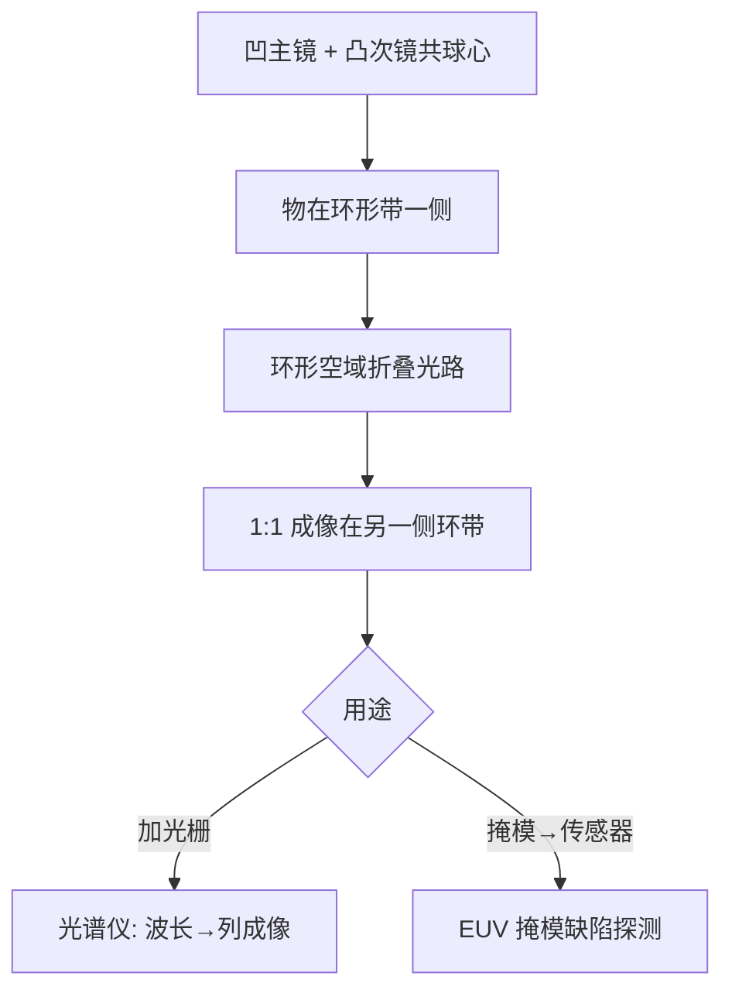
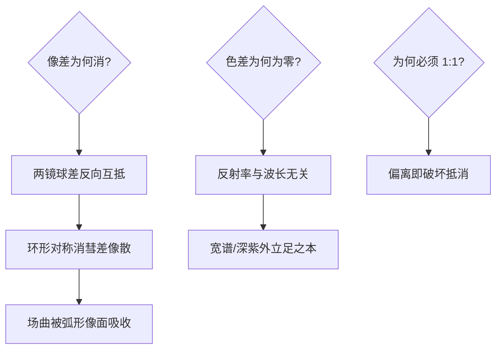

# Offner 中继成像

环形镜绕着环形像走：Offner 用两块同球心的球面镜，把「场曲」这个大反派直接请进了系统设定。

<footer>—— 据 Offner 专利 US 3,748,015 (1973)；光谱仪器与 EUV 探测成像的应用文献</footer>

[波带片光学](/litho/zone-plate-optics)用衍射救场，本课的替代路线是反射几何：**Offner 中继**——共球心的凸/凹双球面镜组成的 1:1 中继成像系统。它像差极低、色差为零、结构极简，是光谱仪、EUV 掩模探测与早期投影光刻实验的经典选择。本课不做反射镜镀膜的一般理论。

## 问题

折射透镜的两宗罪在深紫外与宽光谱场景爆炸：色差（折射率随波长变）与材料吸收（193nm 以下石英吃光）。反射镜天然无色差、无吸收——但单球面镜的球差与彗差让离轴成像一团糟。缺口：**一个用两块普通球面镜就几乎消尽像差的成像系统**。Offner 的洞察：不要矫正场曲，让物面与像面共处同一个球面。

术语翻译：Offner 单元 = 凸面次镜（convex secondary）置于凹面主镜（concave primary）的曲率中心附近，两者共球心；环形视场（annular field）= 物/像位于以共同球心为圆心的圆弧带上，像差在此带上自消。

数字实例：典型参数——主镜曲率半径 R1=300mm、次镜 R2=150mm（约 R1/2）、放大率 1:1。在 20mm 宽的环形带上，波前误差可压到 λ/50 以下；同参数单球面镜的边缘球差则比波长大百倍——两块普通镜子的差距全在几何布局。

## 方法

布局三步：主镜（凹）+ 次镜（凸，凸面朝主镜）共球心安置；物放在环带一侧、像 1:1 成在环带另一侧；工作光束在两镜间的环形空域折叠传播。使用变体：作为**光谱仪成像镜**（光栅 + Offner 把不同波长成像到探测器不同列，Offner-Chrisp 型是手机光谱模块的常见配置）；作为**投影中继**（掩模-晶圆 1:1 投影，早期投影光刻与 EUV 掩模缺陷探测（MARS 类工具）用它把掩模图案成像到传感器）。

直觉类比：像「同心圆跑道」——物与像站在同一条圆弧跑道的两端，光沿着跑道内侧反弹两下正好跑到像的位置；因为物、像、镜共一个球心，「跑偏」的像差在几何上没有发生的余地。

## 机制

消像差机制：整个系统的对称性是「关于共同球心的同心性」——主镜产生的球差被次镜反向球差精确抵消（两镜球差符号相反、大小由曲率比调配），彗差与像散因环形视场的对称位置同消，场曲则以「像面本来就是弧面」的方式被吸收——把反派写进剧本就没有反派。色差机制：反射率与波长无关，零色差是「天生」的，这正是它在宽谱（光谱仪）与深紫外（EUV 检测）立足的根。残留像差：环形带有限宽度内的像散与高阶球差随带宽增加，放大率偏离 1:1 会破坏完美抵消——Offner 几乎总在 1:1 附近工作就是这个原因。

常见误区：把 Offner 当「望远镜」——它是中继（relay）系统，物像 1:1 且都在有限远；另一误区是「球面镜随便放都行」——次镜必须放在主镜曲率中心附近，偏移几个毫米像差立刻抬头，它的「简单」是布局严格意义上的简单。

## 边界

视场边界：像质保证只存在于环形带内，带外无解——大面积成像靠扫描（物/像沿环带扫过），这也是 Offner 光谱仪「推扫」成像的由来。放大率边界：1:1 附近的小偏离（±10%）可调，大倍率直接换系统。它没有成为主流光刻投影光学的原因：1:1 意味着掩模与晶圆同尺寸——掩模做不到晶圆级的精度，缩小投影（4:1，现代步进与扫描机）才是量产路线；Offner 退守检测、光谱与特殊成像。与[掩模缺陷的 EUV 探测](/litho/actinic-blank-inspect)的呼应：Actinic 检测需要 EUV 波长的成像光学，Offner 类双镜系统是当前 actinic review 工具（如 Lasertec ACTIS）的光学骨架候选。

直觉类比：Offner 之于投影光刻像「等身镜」——照出来跟你一样大（1:1）；镜子照人无色差、无畸变（反射几何），但你不能指望镜子把人变小（无缩小倍率），所以「拍照比人小四倍」的现代照相机（缩小投影光刻）成了主流，等身镜留给了「要看原尺寸细节」的质检台（掩模检测）。

## 小结

- Offner = 共球心凸/凹双球面镜的 1:1 环形成像中继。
- 消像差靠同心对称性互抵，场曲被弧形像面吸收；零色差天生。
- 1:1 限制让它让位缩小投影，退守光谱仪与 EUV 掩模检测。
- 出处：Offner US 3,748,015；Attwood 教材；Lasertec ACTIS actinic 检测技术资料。
