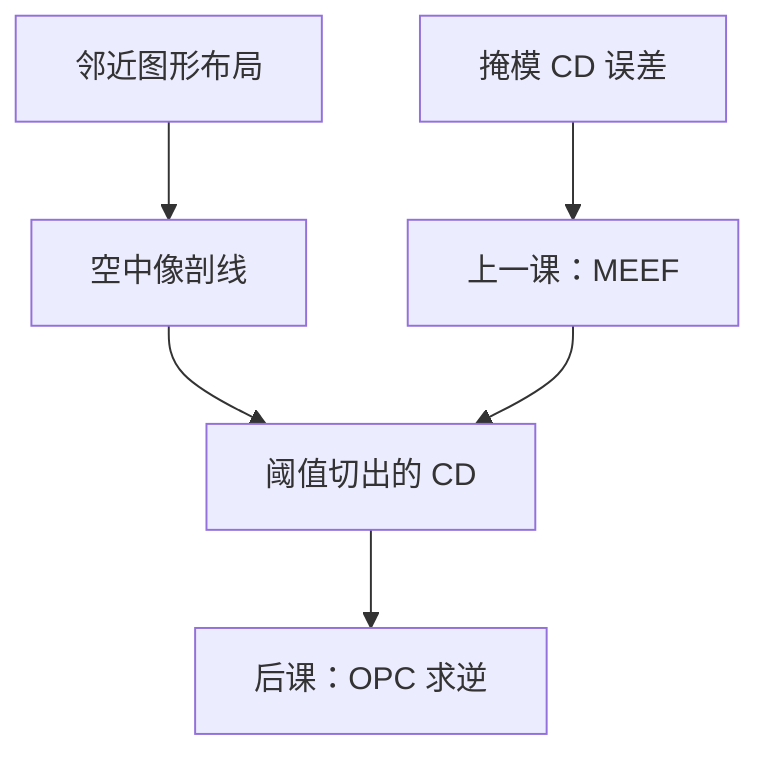

# 光学邻近效应

同一条设计宽度，放到密栅里和放到空地上，空中像就不是同一条剖线；邻近图形改的是像，不是事后才出现的修版口令。

<footer>—— 据 Mack 对光学邻近效应（OPE）与 iso–dense 偏置的论述整理</footer>

[上一课](/litho/meef)把掩模 CD 误差怎样被放大成晶圆 CD 写成 MEEF。缺口是：就算掩模零误差、MEEF 已知，**画出来的邻居**仍会改空中像——孤立线与密线、线端与拐角，印出的不是同一套偏置。本课钉光学邻近效应（OPE）。怎么在掩模上求这个邻域算子的逆，留给后面的 [OPC](/litho/opc)，这里不出场。

## 问题

MEEF 是导数：掩模边动一点，晶圆 CD 动多少。它默认「周围图形已经定了」。产线真正先撞上的是：周围图形本身在变。部分相干照明下，邻线的衍射级在瞳面重叠不同，[空中像](/litho/aerial-image-contrast)的 $I_\mathrm{max}$、$I_\mathrm{min}$ 与边缘斜率一起变。同一条 1:1 画的线，密节距往往更瘦或更胖（看照明与 $k_1$），孤立线走另一条 Bossung。缺口因此是邻域对像的前向作用，不是再报一次掩模公差。

二维更狠。线端缩短、拐角圆化、窄缝桥连，都是光学直径（数个 $\lambda/\mathrm{NA}$）里开口布局的结果。把它们叫做「胶没显干净」，会把光学低通误诊成轨道事故。

### 邻近不是一层本地偏置

某点的强度依赖周围一个光学直径内的全部开口，而不是只依赖「这条边该加几个纳米」。一维 iso–dense 偏置只是 OPE 的切片；SRAM 拐角、通孔阵列的对角邻居，用一条偏置表盖不住。本课只要求承认：空中像是邻域函数。修正表与模型基循环是后课的逆问题。

OPE 主要是光学的；胶扩散与刻蚀微负载会再叠一层「工艺邻近」。本课默认先把空中像邻域钉住。把三层效应合成一个「经验偏置」会让后课 OPC 不知道该修掩模、胶还是刻蚀。

## 方法

量测上，画一组变节距的线栅（或变环境的孤立线），同一剂量、同一焦点下量 CD，得到 CD–pitch 曲线。这就是产线说的邻近曲线。照明一换（圆瞳改环形、偶极），曲线的峰与禁戒节距跟着换——因为它读的是空中像，不是掩模画线。一维上最常被点名的切片是 iso–dense 偏置：同一画线宽度，孤立与密栅印出的差。它只是曲线上两个点，不能代替整条 through-pitch，更不能代替线端缩短。

模拟上，固定光源与瞳，用已经讲过的 TCC 把掩模邻域算成 $I(x)$，再在同一阈值上切 CD。不必在这里重推 Hopkins。比较「只有目标线」与「加上左右邻线」的两条剖线，差就是 OPE 的光学项。MEEF 仍可以在每个节距上再求一次：邻近既改名义 CD，也改那条导数。CD–pitch 是一维身份证；换 $\sigma$ 或换偶极取向，禁戒节距跟着移动，说明动的是瞳面里哪些级次进得去，而不是胶批次。

### 本课停在前向

可以谈「密线要画多一点才能印到目标」，那只是为了读懂曲线的斜率。真正的全芯片预畸变、助条、碎片，属于 OPC。本课若开始排规则表，就会把计算光刻整节提前做完，并让人以为 OPE 是软件功能。

## 机制

投影透镜丢掉超出 $\mathrm{NA}$ 的级次，掩模频谱的高频进不了像面。孤立线的频谱宽，能量散在通带内外；密栅的能量集中在有限几级。照明 σ 决定哪些级能进瞳、级间如何相干叠加，于是同一画线宽度对应不同的调制与 ILS。低 $k_1$ 时通带更挤，OPE 幅度涨——这与上一课 MEEF 在低 $k_1$ 变大是同一条光学穷途，但一个是对掩模误差的灵敏度，一个是对设计邻域的响应。

线端是二维衍射：两端的光「漏」进暗区，等强度轮廓往回收。拐角同样。胶还没出场，空中像已经圆了。后课的酸扩散会再糊一截，但禁止把线端缩短全部写成 CAR。

助条（SRAF）也是邻域开口：晶圆上印不出来，却改目标线的空中像与焦深。本课只承认「邻域里多一个开口，剖线就会变」；放置规则留给 OPC。

禁戒节距是 OPE 曲线上窗口最瘦的那些 pitch，不是「印不出任何东西」的同义词。换照明可以挪走禁戒，却往往把另一段节距推下悬崖。这是后课 SMO 的动机，本课只指出曲线不是单调的。

## 边界

本课不写 OPC 迭代、不写 SRAF 放置、不写 MRC。也不把某代节点的 iso–dense 纳米差当成所有 λ/NA 的常数。电子束写掩模另有一套电子邻近（PEC），与晶圆侧 OPE 不是同一算子。

OPE 曲线必须声明：照明、NA、胶、剂量、量的是 ADI 还是刻蚀后。把刻蚀微负载画进「光学邻近」会让镜头背锅。波长一换，光学直径与通带一起换，邻近曲线要重测——[波长台阶](/litho/litho-wavelengths)会改这条曲线的横轴，不在本课预支光源史。MEEF 仍按节距各报各的：邻近最大的 pitch，往往也是掩模误差最被放大的地方，两课的曲线要叠着看，仍不要合成一个「经验纳米」。

## 小结

- OPE 是邻近图形改空中像；MEEF 是掩模误差的放大率。两者常一起涨，不是同一件事。
- 量的是 CD–pitch 与二维线端/拐角，不是一条本地偏置。
- 低 $k_1$ 时光学直径里塞进更多邻居，OPE 成为一阶。
- 换照明会挪禁戒节距；那是后课 SMO 的动机，不是本课的修版。
- OPC 是后课对这个邻域算子求逆；本课只承认前向。
- 出处：Mack, *Fundamental Principles of Optical Lithography*。
