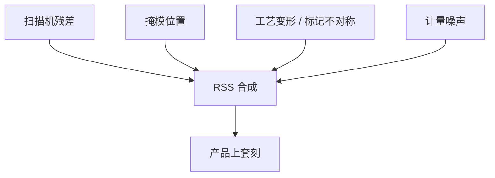

# 套刻预算分解

产品上那一个纳米数，是扫描机、掩模与工艺各交一截再合成的；不分解就只会去拧工件台。

<footer>—— 据 Levinson 对 overlay 误差源的划分，以及 ASML 对 on-product overlay 预算的公开讲义整理</footer>

[上一课](/litho/litho-overlay)已经把对准与套刻分开，并指出贡献来自设备、掩模与工艺。缺口是：还没有一张能加减的预算——哪些项可校正、哪些项只能平方和，单机规格怎样叠成产品上套刻。本课做分解。[双工件台](/litho/twinscan-dual-stage)怎样加密网格，是下一课的产能架构，不在本课重讲传感器商标。

## 问题

口语里的「套刻 3 nm」往往是产品上残差的某个统计。上一课警告过：单机、匹配、产品上不是同一个数。缺口接着是：产品上那一包，能不能拆成扫描机指纹、掩模写误差、晶圆变形与计量噪声，从而决定该买机台、改掩模、还是改薄膜应力。不拆，所有超差都会被送到扫描机应用工程师那里。

ASML 公开材料把 on-product overlay 写成设备项与工艺/掩模项的组合：有的系统误差进高阶校正环，残差才进 $3\sigma$。把已经能校正的镜头加热当成「机台做不到」，会高估硬件缺口；把标记不对称当成「再买一台更准的」，会低估工艺。

### 可校正与不可校正

线性放大、旋转、平移，以及若干场内/场间高阶项，曝光前可以按网格扣掉。预算里要单列「校正后残差」。扫描同步、不可建模的高阶畸变、掩模随机写入、刻蚀引起的标记伪位移，校正环吃不掉。混在一个 RSS 里而不声明哪些已扣，数字会看起来永远差一截。

匹配套刻（两台机混跑）要把两台的指纹差加进预算，不能只用单机单卡盘的演示值。产线混跑 DUV 与 EUV 时，还要单独的交叉匹配项。

## 方法

工程上把套刻矢量场的残差按来源记账，独立项用平方和（RSS），已知相关项先合并再进 RSS。典型三块：

- **扫描机**：工件台与编码器、扫描同步、镜头畸变与加热、对准传感器噪声与残余。单机 overlay 规格主要罩这一块（在受控标记上）。
- **掩模**：写位置误差、掩模加热与夹持变形、pellicle 应力。$4\times$ 缩比把掩模上的纳米除以四落到晶圆，但 MEEF 式的「位置放大」在套刻上通常仍按几何缩比，不要把 CD 的 MEEF 直接抄过来。
- **工艺**：薄膜应力导致的晶圆翘曲与面内变形、刻蚀/CMP 造成的套刻标记不对称、前层参考的稳定性。这一块往往在产品上大于新手对「台子」的想象。

计量本身占一项：套刻机的精度与标记质量。预算必须写清是 IBO 还是衍射套刻、量的是光刻后还是刻蚀后标记——后课计量会展开，本课只要求占一格。场内（intra-field：镜头、掩模、扫描同步）与场间（inter-field：晶圆网格、工件台、工艺翘曲）也要拆行：前者换照明或换掩模会动，后者换工艺层会动。混成一个 $3\sigma$ 会让你同时去拧镜头加热和薄膜应力。

## 机制

套刻是层间相对位置。扫描机项通过曝光瞬间的坐标把图形放下；掩模项把 reticule 上的位置误差缩放到晶圆；工艺项把「你以为对准了的标记」相对器件图形挪走，或把整片网格弯掉。LELE 两次曝光的相对位移直接改节距，预算要按那一层的图形策略加严，不能套用植入层的配额。

校正环减少系统项的均值，不消灭随机与未建模高阶。镜头加热随产率与照明模式变，稳态指纹与第一批片不同，预算要含瞬态。晶圆热与浸没水的瞬态变形同样。把某一天的最佳校正配方当成物理下限，会在换层、换照明时超差。RSS 默认项之间不相关；工艺翘曲与对准网格若同源（同一应力场），应先合成再进 RSS，否则会重复记账或漏相关。

不要把产品规格书上的单机 overlay 与芯片两层之间的套准排在同一张「谁更准」的表里。定义不同，预算的输入就不同。ASML 公开讲义强调的正是 on-product 与 tool overlay 的差别。

## 边界

本课不给出「7 nm 必须 2 nm 套刻」的换算，也不把某次 SPIE 演示的分解百分比写成所有厂的宇宙常数。具体纳米配额由工艺包与设计规则定。不要发明 arXiv 来「证明」RSS 公式——它是误差合成的工程惯例，Levinson 与设备公开讲义都这么用。

下一课的双工件台改变的是「测量点够不够、要不要占曝光时间」，不改变本课三块的物理定义。扫描同步作为扫描机项的一部分，细节在步进器/扫描机课之后还会再拆狭缝。

分解的目的是选执行器：机台指纹进校正环，掩模进写件与 pellicle，工艺项进薄膜与标记设计。一张不分解的 $3\sigma$ 只会把所有人派去拧工件台。

## 小结

- 产品上套刻 = 校正后的扫描机 + 掩模 + 工艺 + 计量，独立项 RSS。
- 先扣可校正系统项，再谈硬件是否够准。
- 工艺标记不对称与晶圆变形不能靠换机台完全消掉。
- 单机、匹配、产品上、交叉匹配，各进预算的不同行。
- 场内与场间要分行：换照明动前者，换工艺层动后者。
- 出处：Levinson, *Principles of Lithography*；ASML overlay / on-product overlay 公开讲义与产品说明。
