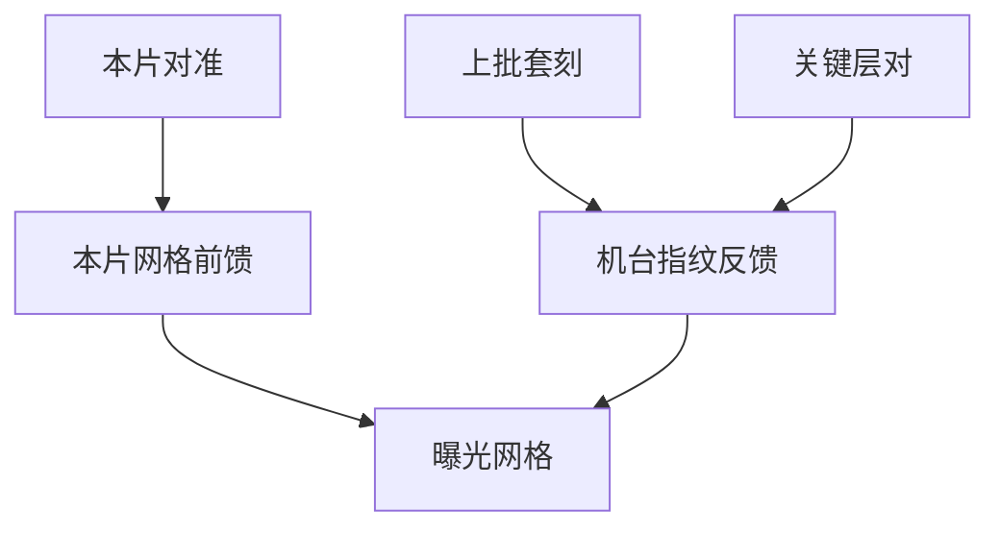

# 套刻控制回路

套刻回路把对准读数和套刻计量变成下一场的网格；它控的是层对层位移，不是 CD，更不是把光学热点补进平移项。

<footer>—— 对照 ASML 对 overlay control / holistic lithography 的公开论述</footer>

[上一课](/litho/spc-control-chart)把残差判异写清。缺口是套刻这条环的专用执行器：场间线性、场内高阶、扫描偏扭。[套刻 Overlay](/litho/litho-overlay) 与预算课已定义量；本课钉回路，高阶场内项如何开，留给[下一课](/litho/high-order-field-correction）。

## 问题

回路输入：对准（曝光前，本片）、套刻计量（曝光后，常是上批或本批抽样）。输出：扫描机网格校正、有时掩模台。前馈：本片对准看见的晶圆膨胀/旋转。反馈：上批套刻残差更新机台指纹。两者混用时要避免把对准噪声写进长期指纹。

缺口是**时间与对象**，不是再选 DBO。关键对准树决定量的是哪一对；回路必须按对配置，不能全厂一张 overlay APC。混机（后课 tool-to-tool）时，指纹要分机存储。

### 不要用平移去补光学

CD 热点、镜头像差、加热引起的场内 CD 不对称，不是套刻回路的活。用 overlay 平移去「对齐」一个失焦的孔，会让整场器件错位。 holistic 叙事里 CD 与套刻是耦合预算，但执行器仍要配对。

计量到曝光的延迟内，卡盘热和批次温度会变。回路模型应含「过期读数」的降权，而不是假装网格冻结。

## 方法

配置：每关键对独立控制器、限幅、与抽样点数匹配的项。曝光前对准做本片前馈；曝光后套刻做机台/产品反馈。与 YieldStar 一类机内计量：缩短延迟，仍要抽样计划。与重工：套刻失败是否剥胶重曝，属分派课，但回路应标记「不可用指纹」。

 holistic lithography 的公开叙事把 CD 与套刻放在同一预算里，但扫描机上仍是两套执行器。本课要求两套环的状态机分开，只在预算报表上相加。

## 机制

网格是多项式（或扫描仪等价项）作用在场坐标上。对准给本片系数的测量；套刻给「器件对」的事后真理。标记–器件偏置是慢变量，可进反馈，不可当本片噪声。热瞬态使同一批前后片系数滑移，R2R 节拍要细于热时间常数，或在批内做分段。

本片对准前馈与上批套刻反馈键在同一关键对上。用平移项去补失焦孔，会把整场器件错位。

## 边界

回路不修设计规则冲突。不重写高阶多项式全文（下一课）。不把 ASML 未公开的控制带宽写成数字。

后课默认：套刻按层对闭环，对准前馈 + 计量反馈。下一课只开抽样支撑得住的场内高阶项。

## 小结

- 套刻回路配对网格执行器，按关键对分实例。
- 本片对准前馈，事后套刻反馈指纹。
- 禁止用平移项去补 CD/焦点问题。
- 出处：ASML overlay control 公开论述；holistic lithography 公开叙事。
