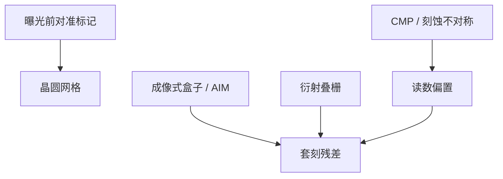

# 套刻标记与衍射套刻

套刻量的是两层标记的相对位移，不是器件图形本身；成像式盒子与衍射光栅读的是不同的光学不对称。

<footer>—— 据 ASML 对套刻计量的公开论述，以及 Levinson 对 overlay mark 的产线说明整理</footer>

[上一课](/litho/cd-sem-scatterometry)把线宽从 SEM 与散射测量里读出来。缺口是位置：工艺窗口合格的线条，若相对下层偏了几十纳米，器件仍然死。[套刻 Overlay](/litho/litho-overlay) 在分辨率课序里已经定义过 overlay 与对准的差别；本课补的是标记长什么样、成像式（IBO）与衍射式（DBO）各量什么。长程杂散光如何抬空中像底座，留给[下一课](/litho/flare-and-stray)。

## 问题

对准传感器在曝光前读晶圆标记，套刻计量在曝光（往往还要刻蚀）后读两层标记的差。两者都可以是光栅或盒状结构，但目的不同：一个喂扫描机网格，一个验收残差。缺口因此是标记作为计量物体——它被 CMP、薄膜和刻蚀改得不对称时，读数会偏，看起来像机台套刻，根子在工艺。

成像式套刻（盒中盒、条中条、AIM 一类）用显微镜看内外图形的中心差。衍射套刻（DBO）用两层叠栅，读 ±1 级强度差或相位，对位移敏感、对某些工艺噪声更稳，但模型同样怕不对称。

### 划片槽标记不是电路

标记放在划片道，尺寸远大于器件 CD，为的是光学对比和工艺鲁棒。它不自动代表热点处的套准：镜头残差、晶圆变形的高阶项，会让槽内标记与芯片内图形之间出现差。加密采样（双台已经买过时间）是为了拟合这张差，不是为了把标记做得更像晶体管。

单机套刻、匹配套刻、产品套刻仍是三个数。本课的标记技术改变的是怎么读产品上的那一个，不把设备规格书改写成良率。

## 方法

IBO：采集内外轮廓，算法找中心。对焦、照明波长、标记对比受膜层影响；多层金属后对比会垮，要换色或换结构。DBO：叠栅周期选定，使衍射级进计量光瞳；位移变成左右级不平衡。ASML 公开材料里的衍射套刻与多色对准，都是让标记在工艺堆栈上仍可读。

工艺不对称：一侧侧壁被刻蚀风吹斜、CMP 碟形，等效于标记「中心」搬家。缓解是优化标记设计（对不对称不敏感的空间频率）、多波长、以及把标记附近的薄膜图形密度设计得对称。不能靠把扫描机 overlay 规格再拧一纳米来消掉系统性不对称。

### 与 CD 光栅的边界

OCD 垫是周期光栅，DBO 也是光栅，物理量不同：一个反演 CD/侧壁，一个反演层间位移。可以共用区域设计，不可共用拟合目标。上一课的模型误差会污染 CD，本课的不对称误差污染 overlay，两条校准链。

## 机制

成像式把套刻写成实空间中心差，受光学分辨率与算法阈值限制，对低对比标记噪声大。衍射式把套刻写成傅里叶级的差，对小位移线性灵敏，但对两层栅的形状差（占空比、侧壁）同样灵敏——那部分不是位移。多层膜的有效光学中心可以不在几何中心，于是「光学套刻」与「电学套刻」再差一截。验收要以产品电学或专用电学套刻垫为最终，光学标记是在线代理。

### 对准网格与套刻残差不是一张图

曝光前对准把晶圆网格喂给扫描机；曝光后套刻量测验收残差。两套标记可以共用光栅家族，但波长、膜层可见性和采样点往往不同。把对准残差直接叫 overlay，会漏掉曝光到量测之间的工艺变形。LELE 必须另定义「第二次相对第一次」的标记层级，不能默认用与前层金属相同的那套盒。

场内多点拟合高阶（放大、旋转、扫描偏扭）。标记太少，翘曲拟合不足；太多，划片槽与产能吃紧。双工件台加密的是对准采样；套刻量测密度是另一笔账。

## 边界

本课不重写工件台编码器，不重写 LELE 的节距对套刻的公式——那两课已经存在。也不把某种 DBO 商标写成唯一量产方案。标记占用划片面积，与 SRAM 密度争的是硅，不是光学分辨率。下一课的 flare 会给全场加一层缓变剂量，间接改 CD，对套刻标记对比也有影响，但 flare 不是位移传感器。

对准波长与套刻计量波长可以不同。薄膜在某一色上透明、在另一色上对比好，是选色的理由，不是「光学套刻可以代替电学」。跨机台匹配还要把两台的标记滤波和算法锁成同一套，否则匹配套刻里会混进计量差。

DBO 的叠栅周期通常远大于器件节距，为的是让 ±1 级进计量光瞳。它不测量 $k_1$ 极限下的线宽，只测量层间位移。

## 小结

- 套刻读的是标记相对位移；IBO 看中心，DBO 看衍射不对称。
- 工艺引起的标记不对称会假扮成机台 overlay。
- 划片槽标记是代理，加密采样拟合芯片内残差。
- CD 光栅与套刻光栅不可混用拟合目标。
- 杂散光下一课，本课不展开长程散射。
- 出处：Levinson, *Principles of Lithography*；ASML 对 overlay 计量与对准传感器的公开说明。
