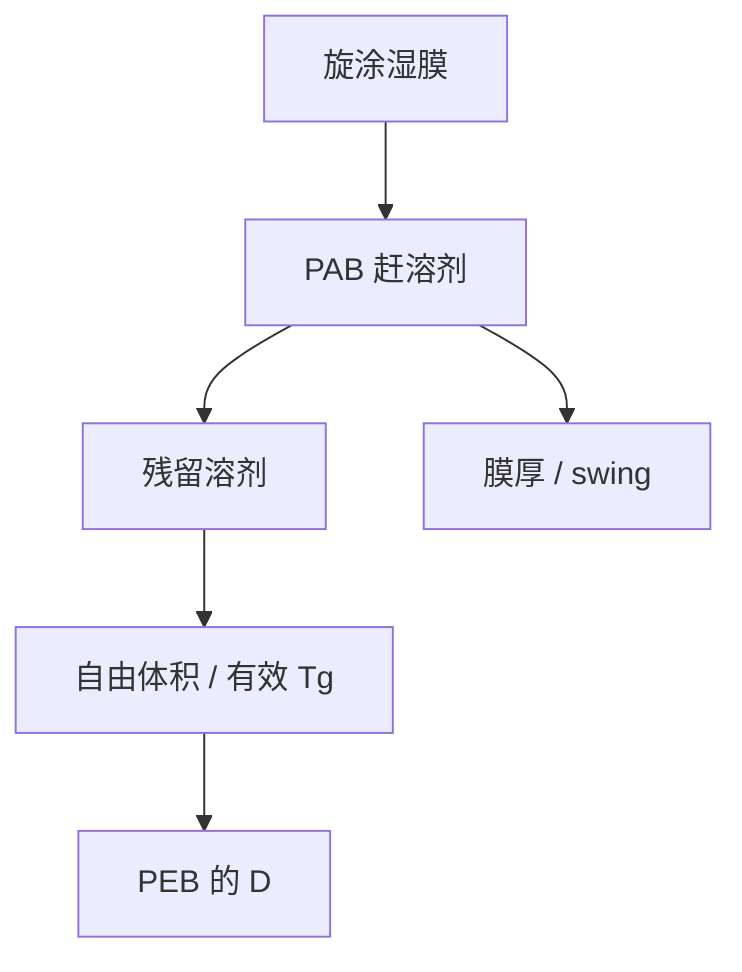

# PAB 与溶剂残留

前烘要赶的是溶剂，不是酸。残留溶剂当增塑剂：自由体积涨，同一 PEB 下酸走得更远，膜厚与 swing 也一起挪。

<footer>—— 据 Mack 对软烤 / PAB 与残留溶剂的论述整理</footer>

[上一课](/litho/resist-shelf-life)写了桶里和等待中的时间。缺口是涂完之后立刻、曝光之前那一步：post-apply bake（PAB，软烤）。主干轨道还没写到本补层的烘箱细节；[PEB 温度](/litho/peb-bake)已经禁止把两个烘混成「热剂量」。本课钉 PAB 与溶剂残留。胶与底层怎样粘住，留给[下一课](/litho/underlayer-adhesion)。

## 问题

旋涂留下大量溶剂。PAB 把它降到可重复的残留水平，同时初步松弛应力、定膜厚。残留高：有效 $T_g$ 低，$D$ 大，LWR 核胖，回流窗口提前打开；残留低到过烘：膜致密、有时起皮、灵敏度掉、黏附变差。缺口是把溶剂分数写成 PEB 扩散系数的前置，而不是再讲一次催化时钟。

膜厚随溶剂离开而减薄，swing 工作点移动。剂量环锁不住这件事——薄膜课已经说过 swing 不是剂量环的对象；本课指出执行器是 PAB，不是扫描机。

### PAB ≠ PEB

PAB：无酸催化任务（CAR 上酸还没出生）。PEB：酸已经在，温度同时开增益与扩散。把 PAB 设成 PEB 温度「顺便省一步」，会在曝光前就把膜的自由体积和黏附做坏，且对 DNQ 与 CAR 都没有催化收益。

溶剂梯度沿 $z$ 往往顶部先干、底部后干。底部增塑更久，footing 或黏附失败会像光学离焦。先查烘，再查焦。

## 方法

旋钮：热板温度、时间、是否真空、升降温。表征：称重或光谱残留、膜厚、折射率、$E_0$、$\ell$ 代理（LWR）、swing 曲线是否锁在目标厚。跨片均匀性与 PEB 热板同样进 CDU：PAB 指纹跟涂胶单元 ID 走。

与[自由体积](/litho/tg-free-volume)联合：PAB 是产线控制自由体积的手段；树脂 $T_g$ 是材料上限。只拧 PEB 去补 PAB 不足，等于用催化时钟去修增塑，LWR 与灵敏度一起透支。

## 机制

溶剂分子占据自由体积并增塑链段。赶走它们，$D$ 下降，酸在后烘里跳得少。赶得太狠，链段被冻在过密的玻璃里，PAG 运动也受阻，产酸效率微降。Mack 把软烤写成显影与 PEB 可重复性的前提：同一套 $R(m)$ 参数默认某一残留；残留一漂，看起来像 $n$ 和 $m_\mathrm{th}$ 变了。

环境湿度在 PAB 后仍可回吸，尤其薄胶。氮或受控湿度轨道是保 $T_g$ 的一部分，不是奢侈。

上层涂层 / TARC 另有溶剂，PAB 曲线要按栈重做。不要把单层胶的软烤抄到三层栈。

## 边界

不写某胶的 90 °C / 60 s 当宇宙常数。轨道课会写热板硬件；本课只写溶剂物理。下一课黏附：溶剂走光之后，极性与底层表面能决定还贴不贴——过 PAB 可以让黏附变差，那是边界，不是本课把黏附理论写完。

## 小结

- PAB 赶溶剂、定厚与自由体积；PEB 才催化。
- 残留溶剂增塑，抬 PEB 的 $D$ 与回流风险。
- 膜厚变化移动 swing；执行器是烘箱不是剂量环。
- 沿 $z$ 的干燥梯度会扮离焦与 footing。
- 出处：Mack 对 soft bake / 残留溶剂。
