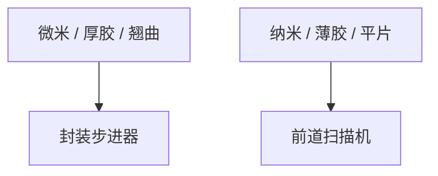

# 封装用步进器

封装步进器买的是大矩形场、长焦深和翘曲行程；NA 故意低，好让厚胶和重建晶圆活在窗口里。

<footer>—— 对照 packaging stepper（大视场投影）与前道扫描机的规格分工</footer>

[上一课](/litho/display-litho)给出米级 FPD。缺口是 IC 厂封装线仍用「像步进器的机器」，但规格对着 RDL 而不是 MMP。本课钉封装用步进器。混合键合把对准精度再收紧，留给[下一课](/litho/hybrid-bonding-alignment）。

## 问题

Ultratech/Veeco、Canon、SUSS 一类封装投影：场可达数厘米见方，NA 低，对准行程大，适应翘曲。分辨率典型在微米。与前道 4× 扫描机比：不是同一光学合同，掩模倍率与尺寸也不同。错买高 NA 前道机去印厚胶，DOF 不够；错买封装机去印 M0，分辨率不够。

缺口是**规格对尺度**，不是品牌。与 LDI 的选择：掩模步进器对重复图形产能好，直写对多品种好——对照无掩模课。

### 重建晶圆

Fan-out 重建后芯片位置有统计误差，步进器要对准实测格子，而不是设计直角。面板课的 die shift 在圆片重建上同样存在。

有的「封装扫描机」仍来自前道供应商的衍生平台。看规格表：场、NA、焦深、基板，不要看商标是否眼熟。

## 方法

选型矩阵：最小线宽、胶厚、基板、wph、套刻。与前道匹配：凸点对焊盘的套刻预算来自封装机，不是来自 EUV。工厂布局：封装机通常不在同一光刻黄光间等级，颗粒规格不同。

## 机制

低 NA → 大 DOF、低分辨率，正好厚胶。大场 → 少拼接、但畸变要在大场内控。这是投影光学的另一工作点，不是失败的高 NA。

## 边界

不给某型号 NA 表当唯一。不把所有 bump 光刻当同一机。下一课键合对准可能用红外，不一定用这台步进器。

后课默认：RDL 用大视场低 NA；下一课 Cu–Cu 键合对准是另一套精度与传感器。

## 小结

- 封装步进器工作点是大场、低 NA、大 DOF，服务厚胶与翘曲。
- 与前道机、LDI、FPD 机都不同合同。
- 重建晶圆要对实测格子。
- 出处：packaging stepper 规格分工通称。
