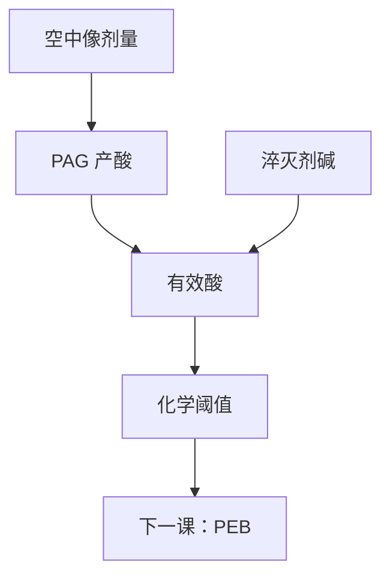

# PAG 与淬灭剂

PAG 决定酸从哪出生、生多少；淬灭剂决定酸走多远之前被收掉、阈值钉在哪。两个浓度是一对，不是两个独立的「越好」。

<footer>—— 据 Ito / Willson 化学放大思路，以及 Mack 对产酸–中和阈值的表述整理</footer>

[上一课](/litho/car-resist)把 CAR 写成 PAG 产酸、PEB 催化脱保护。配方里已经点名淬灭剂，但只承认「阈值不完全由光学 $I_\mathrm{th}$ 决定」。缺口是把产酸剂与碱淬灭写成一对旋钮：加载、量子产率、中和当量。PEB 温度怎么同时改增益与扩散，留给[下一课](/litho/peb-bake)。

## 问题

CAR 的潜像在曝光结束时是酸的空间分布。酸从 PAG 来：典型 DUV 用鎓盐，吸收（或经敏化）后放出强酸。同一空中像，PAG 加载高、产率高，酸图亮；加载低，要靠加剂量或下一课加 PEB 时间来凑脱保护。缺口不是再讲一遍催化循环，而是：酸图的幅度与暗区漏酸，由谁压住。

淬灭剂（碱）在膜里预置一个酸的汇。未曝光区里漂进来的酸、以及环境胺之外的「配方内」中和，都走这个汇。暗区溶速能否保持足够低、阈值剂量 $E_0$ 钉在哪，首先是 PAG 与淬灭剂的当量差，其次才是光学 $I$。

### 阈值是化学的，然后才是光学的

简单图像：有效酸 $\approx$ 生成酸 $-$ 淬灭剂。生成酸随剂量近乎线性（低剂量、无漂白极限时），于是存在一个剂量门槛才打得过碱。光学对比决定门槛附近酸图有多陡；淬灭剂决定门槛的高度。把 $I_\mathrm{th}$ 写成镜头规格，会把配方当成玻璃。

环境胺（T-topping）是额外的、从表面进来的淬灭。它让顶部阈值升高、出现 T 形剖面。配方内淬灭剂可以提高抗污染能力，却同时抬 $E_0$。上层涂层管的是这件事，不改 PAG 的定义。

## 方法

工程旋钮：PAG 种类（酸强度、体积、吸收截面）与质量分数；淬灭剂种类与分数；有时还有光可分解淬灭剂，曝光区把碱自己拆掉，暗区仍留着——本课只承认有这种不对称，不写分子式。摩尔比比重量百分比更接近化学当量：同一 wt% 换一种分子量更大的 PAG，产酸数会变。吸收必须落在曝光波长：193 nm 上聚合物本身已经吸收，把全部吸收算进 PAG 会高估产酸。

表征：测 $E_0$、衬度、暗侵蚀随 PAG/淬灭剂比的变化；用同一光学、只改这一对，CD 与 LWR 会一起动。后课扩散长度 $\ell$ 会把淬灭剂写成缩短酸程的项；本课先把它写成阈值与暗区安全裕量。环境稳定性实验（延迟 PEB、暴露于胺）是淬灭剂是否够的判据之一，不要只用灵敏度一张图签核配方。

### 增益与泄漏

PAG 多，灵敏度好，扫描可以快。暗区 PAG 也会被杂散光、flare 微弱产酸，淬灭剂不够就会起雾、掉暗区厚度。一对浓度必须联合标定。Ito / Willson 的放大解决的是「光子少、反应要多」；淬灭剂解决的是「放大之后暗区不能也亮」。

## 机制

光子（DUV）直接或经能量转移把 PAG 打成酸。酸在 PEB 里当催化剂，直到被淬灭或扩散离开。亮区中心淬灭剂先被耗尽，催化全速；边沿是产酸与淬灭的争夺带，阈值轮廓就在这条带上。加淬灭剂：争夺带变窄、有效 $\ell$ 下降（下一课展开）、灵敏度下降。这是 RLS 三角在配方上的具体旋钮，本课先记下「一对」，不写 LWR 谱。flare 与杂散把暗区剂量从零抬起时，淬灭剂就是暗区的保险丝；光学课的杂散光在这里变成化学库存够不够。

酸体积大、淬灭快，模糊小、往往更不敏。酸体积小、扩散快，相反。种类选择与加载是同一预算的两个轴，不能只报「PAG wt%」。

负胶 CAR 用酸催化交联，淬灭剂仍在收酸，只是「留下」的是曝光区。本课默认正性脱保护 CAR，与上一课同一工作点。

## 边界

本课不写 EUV 二次电子产酸的截面表，不写金属氧化物团簇。也不把某篇配方的 5 wt% PAG 写成所有 ArF 层的标准。Ito 早期实验剂量不是今日浸没的工艺点。

下一课的烘箱几摄氏度，会把本课钉住的当量差再乘一个 Arrhenius 因子——化学库存与热时钟要分开调。出气与镜头污染跟 PAG 挥发性有关，那是配方卫生，不改「产酸对淬灭」的定义。

## 小结

- PAG 写酸的出生与产量；淬灭剂写中和与化学阈值。
- 有效酸是二者之差；光学 $I_\mathrm{th}$ 不能单独当规格。
- 加淬灭通常抬 $E_0$、抑制暗区与环境胺，并缩短后课的酸程。
- 加载必须联合标定，灵敏度不是无条件目标。
- 环境胺是额外淬灭；配方内碱提高抗污染，同时抬 $E_0$。
- 摩尔比比 wt% 更接近当量；193 nm 聚合物吸收不可算进 PAG 产率。
- flare 抬暗区剂量时，淬灭剂是暗区保险丝。
- 出处：Ito &amp; Willson 化学放大；Mack, *Fundamental Principles of Optical Lithography*。
