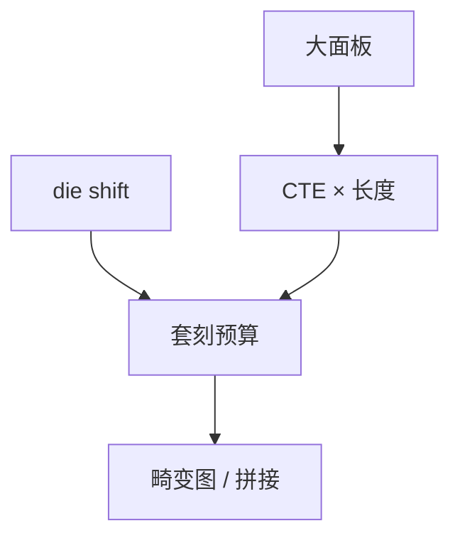

# 面板级封装光刻

矩形大板比 300 mm 圆片便宜摊面积，但膨胀、翘曲和套刻在几十厘米上积分，光刻从扫描机问题变成基板问题。

<footer>—— 对照 panel-level packaging（FOPLP）光刻与畸变的公开讨论</footer>

[上一课](/litho/laser-direct-write-packaging)选了封装工具族。缺口是基板从圆变方、变大。本课钉面板级封装光刻。显示面板更极端的场，留给[下一课](/litho/display-litho）。

## 问题

FOPLP 一类用大面板做 fan-out，面积经济好。光刻挑战：面板膨胀与过程热循环、局部翘曲、真空或机械夹持均匀性、拼接多场、套刻到重建芯片的真实位置（die shift）。步进器或扫描投影要有大行程与畸变校正，不是更高 NA。

缺口是**大尺寸畸变**，不是 k1。把面板当「大晶圆」，夹持与热模型都错。

### Die shift

贴片位置误差是封装套刻的一部分，光刻只能补测量到的部分。混合键合课会在更严的 nm 上再遇对准；面板级通常更松，但面积放大后仍可超差。

面板材料（玻璃、有机）的 CTE 与硅不同，多层套刻随温度定义走。计量要声明温度。

## 方法

计量：全板栅格、温度补偿。曝光：分步拼接 + 畸变图。工艺：低温、对称结构减翘曲。与产能：大板一张等于许多圆片面积，但良率按板，一块报废损失大。

## 机制

热应变 ∝ CTE × ΔT × 长度。长度从 300 mm 到 500–600 mm 量级，同样 ΔT 的位移按比例涨。光学畸变校正是多项式，板的真实变形可能含局部贴片团，需栅格而不是低阶。

## 边界

不点名某代面板尺寸当唯一标准。不把面板良率写成逻辑晶圆良率模型直接套用——缺陷经济学不同。

后课默认：大板套刻是基板物理学；下一课显示把板做得更大、CD 更松。

## 小结

- 面板级光刻的墙是膨胀、翘曲、die shift，不是 NA。
- 应变随长度放大；校正需要全板栅格。
- 面积经济与整板报废风险同时存在。
- 出处：FOPLP / panel-level 光刻公开讨论。
