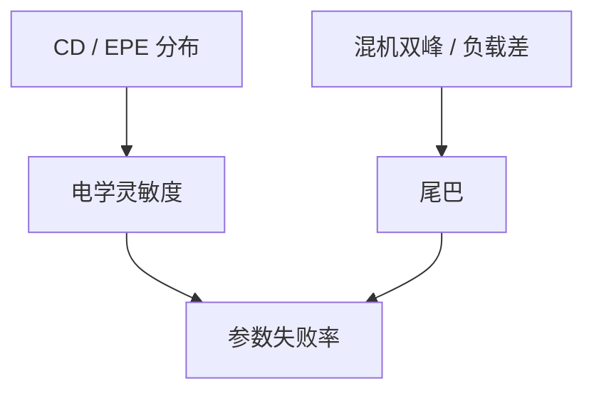

# 参数良率与 CD 分布

缺陷为零仍可能参数死：栅长、via 电阻、匹配对的 CD 分布让时序或漏电出格。这笔良率吃的是分布尾巴，不是颗粒计数。

<footer>—— 对照参数良率与 CD 控制；Levinson 对 CDU 与电学的衔接</footer>

[上一课](/litho/yield-learning-curve)把缺陷学习画完。缺口是电学分布：均值 CD 在规格内，尾巴上的管芯时序失败。[CDU](/litho/cdu-etch-bias) 与 [EPE](/litho/edge-placement-error) 已有纳米账；本课钉参数良率。可靠性与潜在图形缺陷，留给[下一课](/litho/reliability-patterning-defects）。

## 问题

参数良率：性能/漏电/匹配对规格。驱动量包括栅 CD、fin 宽度、via 电阻（开口 CD + 填充）、金属电阻（槽 CD）。分布来自镜头、胶、刻蚀负载、CMP、机台差。EPE 尾巴让 via 覆盖变电阻尾巴。缺陷检测全绿时，参数仍可红。

缺口是**把 CDU 地图换成电学失败率**，不是再定义 3σ。SRAM 失配、逻辑关键路径对 CD 敏感函数不同，全局加剂量可能救平均、害匹配。

### 规格是电学的，代理是 CD

把 CD 规格当神圣，可能过严（浪费窗口）或过宽（参数死）。应以电学灵敏度标定 CD 规格，并分层：均值进 APC，方差进能力（匹配、负载、随机 LER）。LER 器件课已有；参数良率把阵列失配算进去。

刻蚀密度斜率是参数良率的布局项：同一芯片上 SRAM 与逻辑均值差，不是随机 σ。

## 方法

映射：CD 分布 × 灵敏度 → 参数失败率。数据：电学 WAT/探针分 bin、对位到场坐标。动作：减方差（匹配、负载 dummy、OPC 分区），而不是只钉均值。与随机：via 打开是缺陷良率；via 偏小是参数——分类要靠复检+电学。

灵敏度来自器件或电路仿真，但要用硅上分 bin 校准，避免模型过敏感。Levinson 把 CDU 接到电学；本课要求这根线可画在场坐标上，从而认出边缘场和混机双峰。

## 机制

失败率 $\approx P(|\mathrm{CD}-\mathrm{target}| \gt  \mathrm{spec})$ 经电学函数扭曲。非高斯尾巴（边缘场、双机混流）主导。机台对套刻把 via 电阻分布拉宽。APC 切均值不切混流双峰——dedication 或匹配才切双峰。

混机双峰和负载均值差都在尾巴里，不是随机 σ。减方差比只钉均值更能抬参数良率。

## 边界

不写器件紧凑模型全文。不把未公开的 $V_t$ 数字当文献。功能缺陷与参数要分 bin。

后课默认：参数良率看分布尾巴与布局均值差。下一课有些「参数」其实是可靠性潜伏的图形缺陷。

## 小结

- 参数良率吃 CD/EPE 分布与电学灵敏度，检测全绿仍可死。
- 减方差（匹配、负载、dedication）比只钉均值更关键。
- 布局均值差不是随机 σ。
- via 打开是缺陷账，via 偏小是参数账，分类靠复检加电学。
- 出处：Levinson 对 CDU 与电学；参数良率通称。
