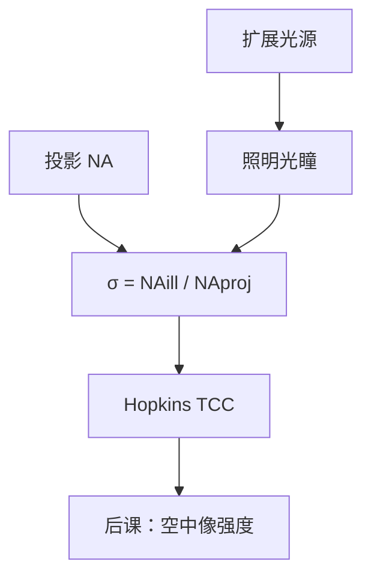

# 部分相干照明

投影光刻既不是完全相干的单平面波，也不是完全非相干的扩展源；部分相干因子 $\sigma$ 描述照明光瞳相对投影 $\mathrm{NA}$ 填了多大一圈。

<footer>—— 据 Hopkins 部分相干成像与 Mack 对 $\sigma$ 的产线定义整理</footer>

[上一课](/litho/lens-na)把投影物镜收成截止 $\mathrm{NA}/\lambda$ 的光瞳。缺口是：光瞳可以被照明填满、填一圈、或只点亮轴上一点，成像传递完全不同。本课引入部分相干——照明孔径与投影孔径之比 $\sigma$——以及 Hopkins 的传递交叉系数。空中像强度如何写成对比度，留给[下一课](/litho/aerial-image-contrast)。偶极与四极的图形选择，是更后面的离轴照明课，本课不提前做 RET 目录。

## 问题

完全相干（$\sigma\to 0$）时，掩模衍射级以确定相位干涉，某些孤立图形对比极高，但旁瓣、环带伪影和焦深行为都差，而且点光源用不满准分子功率。完全非相干时，强度相加，传递函数是光瞳的自相关，密图形的调制掉得很快。产线照明落在中间：扩展源在照明光瞳上占一块有限区域，晶圆上的强度是许多互不相干的入射方向各自相干成像之后的非相干叠加。

缺口因此是给「光源有多大」一个相对投影 $\mathrm{NA}$ 的无量纲数，而不是开始画偶极。没有 $\sigma$，后课无法说清为什么同样的镜头、同样的掩模，换照明对比度会变。

### σ 是填充比，不是相干时间

时间相干由光谱宽度决定，空间（横向）相干由源的角大小决定。光刻口语里的部分相干几乎总是后者。定义

$$
\sigma=\frac{\mathrm{NA}_\mathrm{illumination}}{\mathrm{NA}_\mathrm{projection}}.
$$

$\sigma=0.3$ 是较小填充，偏相干；$\sigma=0.9$ 接近填满投影光瞳。环形照明则用 $\sigma_\mathrm{in}$–$\sigma_\mathrm{out}$ 两个半径，仍是同一套归一。不要把激光器的时间相干长度和 $\sigma$ 写成一个旋钮。

$\sigma$ 用投影 $\mathrm{NA}$ 归一，因此浸没换了像方 $n$ 之后，同样的物理照明角对应的 $\sigma$ 会变。写工艺时必须同时写 $\mathrm{NA}$ 与 $\sigma$，只报其中一个没有意义。

## 方法

Hopkins 把部分相干成像收成双频积分：物体频谱的每一对频率 $(f,g)$ 乘传递交叉系数 $\mathrm{TCC}(f,g)$，再反变换得到强度。TCC 是照明光瞳与两个错位投影光瞳的重叠积分。照明形状（圆、环、四级）全部进 TCC，掩模只进物体频谱。这就是为什么照明可以在不换镜头玻璃的情况下改有效传递。

计算上，现代 OPC 用和差相干分解或 TCC 的本征展开，把部分相干强度写成少数几个相干核的平方和。本课不讲算法，只承认：部分相干不等于「无法计算」，它有确定的双线性核。

### 常规圆照明是默认，不是最优

填充一个圆盘是最老的约定，对孤立与半密图形折中。密线栅在圆照明下走三束（零级与正负一级），离焦时三级相位失配，对比掉得快。把能量挪到轴外，变成两束成像，是离轴照明的动机——本课只指出圆照明的三束机制，把光瞳图案的工程选择留给 RET。

Köhler 照明把源成像到光瞳：晶圆上每一点看到的是同一套入射角集合。光刻扫描机的照明都按这个接口设计，$\sigma$ 才是光瞳平面上的几何量。

## 机制

每个源点发出的是空间相干的场，在掩模上产生一套确定的衍射级，经投影光瞳滤波后在晶圆干涉。不同源点之间没有稳定相位差，它们的强度相加。源越大（$\sigma$ 越大），参与叠加的入射方向越多，传递越接近非相干极限。源太小，系统接近相干，对掩模缺陷和部分空间频率过于敏感。

互相干函数在物面上的相关宽度与照明角成反比。相关宽度比图形周期宽时，相邻开口会相干干涉；窄时，开口近似独立发光。部分相干就是把这根相关长度调到与关键节距同一量级——既要干涉出暗线，又不要让全场锁定成一张死板的相干图。

### 偏振仍未进入

本课的 TCC 仍是标量版本。高 $\mathrm{NA}$ 下 s/p 偏振的干涉效率不同，矢量 TCC 才是完整模型。那是[矢量成像](/litho/vector-imaging)的缺口。先把 $\sigma$ 钉死，避免后课把偏振损失误写成「$\sigma$ 选错了」。

## 边界

$\sigma$ 不决定波长，也不决定胶的 $\gamma$。光源形状优化（SMO）把 $\sigma$ 从标量升级成二维光瞳像素，仍是部分相干框架，不是新物理。本课禁止后课再解释「什么是部分相干」：它就是照明光瞳相对投影光瞳的填充，强度由 TCC 给出。后课只补：空中像对比如何读、离轴图案如何选、矢量修正如何进 TCC。

## 小结

- 投影光刻默认部分相干；$\sigma$ 是照明 NA 与投影 NA 之比。
- 强度是互不相干源点各自相干成像后的叠加；Hopkins TCC 是双线性核。
- $\sigma$ 描述空间相干，不是激光线宽。
- 圆填充是折中；轴外光瞳留给 RET，不在本课展开。
- 标量 TCC 尚未含偏振。
- 出处：Hopkins 部分相干成像；Mack, *Fundamental Principles of Optical Lithography*；Goodman 对互相干与 Köhler 照明的讨论。
