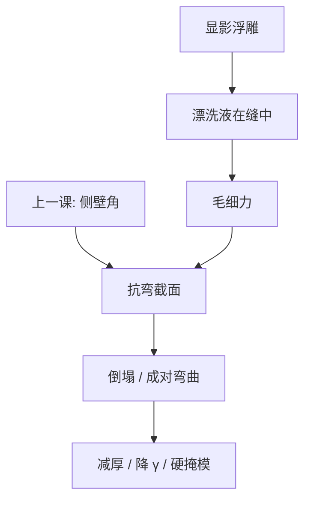

# 图形倒塌

显影后的线在漂洗干燥时被毛细力一对一对拉倒：浮雕已经合格，力学还没有；侧壁再斜，力矩更大。

<footer>—— 据 Mack 与 Levinson 对 pattern collapse 与显影后毛细力的论述整理</footer>

[上一课](/litho/sidewall-angle)把剖面角钉成锥或倒锥，并指出刻蚀看见的是斜面。缺口是：角还没交给等离子体之前，漂洗液的表面张力已经可能把相邻线拉塌。本课钉图形倒塌。金属氧化物胶与 CAR 的分叉，留给[下一课](/litho/euv-resist），不在这里换化学家族。

## 问题

侧壁角解释的是几何。倒塌解释的是显影–漂洗–干燥这段湿法：线之间的缝里留下液体，弯月面的毛细压差把两根线往一起拉。力随表面张力 $\gamma$、接触角和缝宽变，力臂随胶高 $H$ 变。高深宽比 $H/W$ 一旦越过材料能承受的弯矩，线就并、断或贴到衬底。顶视 CD 在倒塌前可以完全在规格里。

把所有桥连写成光学 OPE 或剂量过了，会漏掉干燥这一步。把倒塌写成「胶太软」而不报深宽比与缝宽，又会漏掉几何。上一课的倒锥（倒八字）让根更细，同样毛细力下更容易折——角是力学前置，不是另一堂光学课。

### 倒塌发生在液膜离开的时候

曝光、PEB、显影溶蚀可以结束得很好。事故点常是漂洗水（或溶剂）从缝里退出：最后弯月面扫过线高。超临界干燥、表面活性剂漂洗、换低表面张力液体，改的都是这一步，不改空中像。

计量上倒塌像桥连或局部 CD 爆炸。要与真光学桥连拆开：看它是否成对出现、是否沿干燥气流方向有指纹、降低胶厚或加表面活性剂是否立刻消失。

## 方法

工程杠杆分三组。几何：减胶厚、加硬掩模把深宽比预算交给下面的膜、放宽最窄缝。力学：提高膜模量（交联、负胶、金属骨架）、避免倒锥、改善黏附。毛细：降 $\gamma$、改接触角、控制干燥速率。Mack 与 Levinson 都把倒塌放进抗蚀剂工艺窗，而不是放进镜头 NA。

量测：专门的倒塌剂量/焦点矩阵——窗的一边往往不是 CD 出规格，而是成片贴线。报告深宽比、缝宽、漂洗配方，否则「某胶抗塌」不可比。

### 与 CDU 的关系

倒塌是灾难性失效，不进普通 CDU 的 $3\sigma$。但临界缝宽附近，未完全倒塌的线已经弯，CD 均值会偏，像一截虚假的疏密偏差。分析要看剖面和成对弯曲，不要只调剂量。

## 机制

两根线夹一缝，液体接触线形成弯月面，压差量级 $\sim\gamma\cos\theta/S$（$S$ 为缝宽）。压力作用在侧壁上，等效横向力随高度积分。线像悬臂或两端约束的梁，最大应力在根部——倒锥把根削细，应力集中。干燥方向若不对称，成对线会往同一侧倒，缺陷图出现方向性。

EUV 薄胶减轻深宽比，却把黏附和底层抬上来：根若在界面脱黏，塌的是整根拔起。后课金属氧化物胶用更高模量和更薄膜换抗塌，付的是沾污与涂布缺陷。本课先把毛细力学钉住，换胶只是换模量与厚度工作点。

表面活性剂漂洗会改接触角和残留，也可能改 CD。抗塌工艺必须重新标定阈值模型，不能假设空中像没变所以 OPC 不用动。

## 边界

本课不写某供应商抗塌漂洗的牌号，不给「安全深宽比 = 3」这类假常数——材料、缝宽、干燥方法一起变。干法刻蚀中的线倒是等离子体与应力的另一类倒塌，对象已是硬掩模或器件膜，不在显影毛细账里。

下一课换 EUV 记录介质时，抗塌会作为薄胶的动机再出现，但机制仍是本课这条力。不要把金属胶的抗塌写成「没有毛细」。漂洗液一旦换成有机溶剂或加表面活性剂，$\gamma$ 与接触角一起变，CD 与倒塌窗必须重测，不能假设只改了力学、没改阈值。

## 小结

- 图形倒塌是显影后毛细力拉倒高深宽比浮雕，常在干燥瞬间发生。
- 侧壁倒锥削弱根部，是上一课角的力学后果。
- 杠杆：减厚、硬掩模、模量、降 $\gamma$；不是先拧 NA。
- 成对弯曲不要误诊成光学桥连或疏密偏差。
- 抗塌漂洗改 $\gamma$ 也会改 CD，阈值模型要重标定。
- EUV 薄胶减轻深宽比，根部脱黏仍是毛细力，不是「没有倒塌」。
- 出处：Mack, *Fundamental Principles of Optical Lithography*；Levinson, *Principles of Lithography*。
