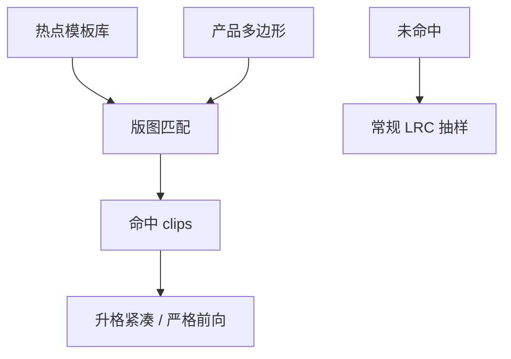

# 图形匹配

全场不必处处解成像：长得像已知杀手的邻域，用模板匹配就能先标红，严格前向留给匹配不上的新物种。

<footer>—— 对照 DRC 图形匹配、热点库与 clip 检索在计算光刻签核中的公开用法</footer>

[上一课](/litho/lfd)要求库在模型反馈下冻结。缺口是全芯片仍会生长出库表没枚举完的二维组合：布线器 jog、填充、SRAM 周边。本课钉图形匹配（pattern matching）：用已标定的坏/好模板扫描版图。[工艺窗口鉴定](/litho/pwq) 下一课才把硅上实验矩阵接到这些候选上。

## 问题

全芯片紧凑仿真贵，[上一课的算力账](/litho/full-chip-simulation-cost)已经写明。许多热点却是重复拓扑：同一 tip-to-tip、同一 via 覆盖、同一 SADP 切线邻域。把历史 LRC 失败 clips、PWQ 失败点和失效分析截面收成模板库，在新版图上做几何或拓扑匹配，复杂度远低于再卷积一次 TCC。

缺口是**检索合同**，不是再定义 PV-band。匹配漏报会把杀手送进磁带；误报会把 LRC 队列塞满。模板必须带工艺版本：换胶、换 NA、换分解，旧杀手形状会位移。

### 匹配不是 DRC 间距检查

DRC 问的是边距是否大于某数。匹配问的是「这一团邻域是否同构于已知失效」。同间距、不同邻域密度，光学与刻蚀响应可以完全不同。只跑间距表会漏掉「合法但已知会死」的 clips。

模板要声明容差：边位移多少仍算同一类。容太松，误报；容太紧，换一次 OPC 配方就全部失配。

## 方法

库：失败热点、边缘通过、刻意 variate 的拓扑。表示：边段图、密度指纹、或学习嵌入（下一课才把预测当主路径，本课先几何）。扫描：层次化——先规则预筛，再匹配，再对命中 clips 升格仿真。与 [MRC](/litho/mask-rule-check) 的关系：MRC 管掩模可写；匹配管晶圆可印。两者模板不要混用。

新节点冷启动时模板少，匹配只能当辅助；量产后模板是资产，要版本控制，与 OPC 模型同发。

命中列表要进 LRC 队列优先级，而不是另开一张无人认领的热点表。与 PWQ 的接口是双向的：硅上新杀手回写模板，匹配才越用越准。DRC 图形匹配传统提供几何引擎；光刻侧必须给每条模板贴上失效模式和过程角。假阳性要回写「已否决」模板，否则同一 jog 每个产品都升格仿真，算力账从另一头爆。

## 机制

几何匹配在变换（平移、有时旋转/镜像，通常不含任意缩放）下找同构。光刻杀手往往有特征尺度（最小节距、切线宽度），缩放同构通常不成立——这与纯 DRC 的线性缩放直觉相反。匹配命中后仍要仿真，因为模板捕获的是拓扑风险，不是当前剂量下的纳米数。

匹配命中率随 OPC 改版漂移：边被修过之后，旧模板几何对不齐。模板应允许「拓扑同构、边位移在容差内」，并在每次 OPC 版本发布时回归。

## 边界

匹配不证明「未命中即安全」。不把某商业 pattern matcher 的召回率写成物理常数。EUV 随机桥连往往没有稳定几何模板，不能单靠匹配扫掉。

后课默认：已知拓扑可被廉价标出；下一课用硅上 PWQ 矩阵验证这些候选在真实窗口里是否真死。

## 小结

- 图形匹配用历史杀手模板预筛全场，仿真留给命中与新物种。
- 模板与工艺版本绑定，容差是合同。
- 未命中不是绿灯；随机失效尤其不在几何库里。
- 出处：计算光刻热点库与 pattern matching 签核通称；DRC 图形匹配传统。
