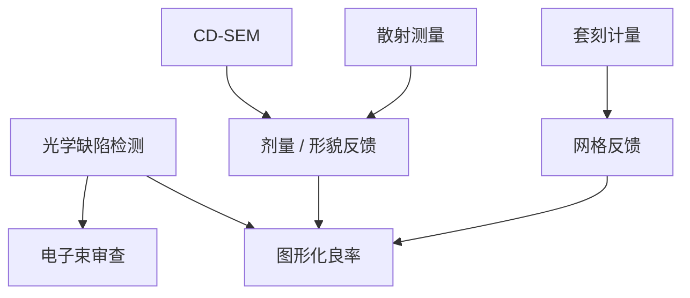

# 图形化检测设备

扫描仪写出潜像，刻蚀留下边；能不能出货取决于谁看见缺陷、谁量 CD、谁量套刻。检测与量测是不同的合同，公开舞台上 KLA 一类把几类工具拆开卖。

<footer>—— 对照公开的晶圆检测 / 量测工具类别：缺陷检测、电子束审查、CD-SEM、套刻与散射测量</footer>

[上一课](/litho/resist-vendors)点名胶厂。缺口是：胶的缺陷和 CD 并不由胶厂的桶来裁决，而由晶圆厂的检测与量测机台。本课钉图形化相关工具类别及公开分工，不写国产机的片/小时，也不把份额表发明出来。[CD-SEM 与散射测量](/litho/cd-sem-scatterometry)、[套刻标记](/litho/overlay-marks)已经讲过物理量；这里补的是设备角色，不是再推一次边缘算法。

## 问题

图形化良率有两类问题：随机或系统缺陷（颗粒、桥、缺孔、残胶），以及合格边上的 CD / overlay 飘。前者要**检测**（inspection）：尽快在整片或抽样场上找到异常。后者要**量测**（metrology）：在专用垫或热点上给出数字去控剂量和网格。口语「KLA 一下」把两类吞并，采购和瓶颈会写错。

公开分工大致是：宽带等离子体或激光扫描做亮场/暗场缺陷检测；电子束做审查与部分高速检测；CD-SEM 看局部形貌和 LER；光学套刻（成像或衍射）向量化位移；散射测量给周期垫的平均剖面。ASML YieldStar 把套刻与散射测量放在计量产品线；Hitachi High-Tech 等以 CD-SEM 公开；应用材料 SEMVision 一类做电子束审查。名单是角色，不是排行。

### 检测灵敏度不是分辨率 $k_1$

光学检测的波长和光斑服务于发现异常，不必印器件节距。电子束检测更接近器件尺度，更慢。把检测机写成「又一台光刻机」，会去比 NA。

掩模厂的检验（上一课序）和晶圆检测不是同一台合同。Lasertec 等在 EUV 掩模检验上的公开角色，不要和晶圆宽带等离子体混名。

## 方法

按层设抽样：显影后检测抓涂胶与曝光缺陷，刻蚀后抓转印缺陷。热点审查用电子束。APC：OCD 或 SEM 抽样喂剂量，套刻计量喂网格。工具配方（色、偏振、算法阈值）与胶、膜堆绑定，换胶等于换检测食谱——上一课的供应商切换会打到这里。

不要用未公开的国产检测 wph 去规划产能。公开可写的是类别是否存在、成熟制程是否已有国内光学检测产品；吞吐数字缺出处就留空。

### 与扫描机内传感器的边界

扫描机内有对准、调平、剂量计，那是曝光控制。KLA 一类通常是独立计量岛或离线岛，抽片更密、算法更重。YieldStar 可以靠近产线，仍是计量产品，不是第二套投影物镜。本课不把 ORION 写成缺陷检测。

## 机制

光学检测把异常写成相对裸片或相对晶粒的差；灵敏度与噪声、膜层对比有关，会漏掉与背景同色的缺陷，也会把薄膜噪声报成缺陷。电子束以分辨率换速度。量测把物理量接到控制环：平均 CD 稳态，套刻吃热与对准残差。两类机制合起来才构成「图形化是否可出货」，扫描仪 wph 只保证潜像写得完。

EUV 缺孔的尾部必须电子束或电学，光学平均不到泊松。检测策略要按上一课孔层的统计来，而不是按金属线栅的颗粒检测来。

「图形化检测」不含探针电测与终测。那些是另一条良率链，缺陷检测只是前段代理。

## 边界

禁止编造中科飞测、精测等国产工具的吞吐或灵敏度规格。可以承认公开新闻里存在成熟制程检测产品，数字一律不造。本课不重写胶化学，不重写掩模厂 STARlight。附录文献对照从下一课序开始，不插入这条主干的工具清单。

出处：KLA、ASML YieldStar、Hitachi CD-SEM、电子束审查等公开产品类别说明；晶圆检测与量测的产线分工。不使用无出处的国产 wph。

## 小结

- 检测找缺陷，量测给 CD/overlay 数字，合同不同。
- 公开角色：光学检测、电子束审查、CD-SEM、套刻、OCD；KLA 等按类别出现。
- 换胶换膜等于换检测食谱。
- 不写无出处的国产工具吞吐。
- 主干图形化课序到此；文献附录另开。
- 出处：各厂公开工具类别；不编造份额与 wph。
