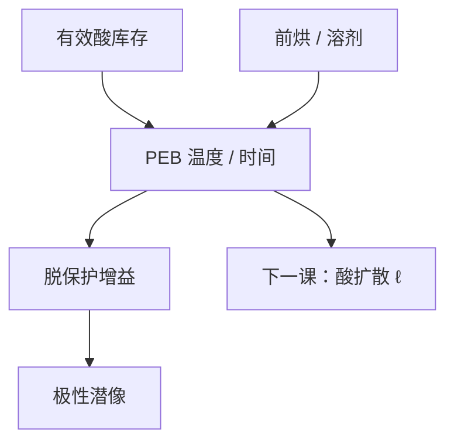

# PEB 温度

后烘是同一段热过程的两面：温度升高，脱保护跑得快，酸也走得远。轨道烘箱因此是光刻的一部分。

<footer>—— 据 Mack 对 PEB 作为增益与扩散时钟的讨论，以及 Ito 对催化脱保护的表述整理</footer>

[上一课](/litho/acid-amplifier)（酸放大器）。把酸的库存写成 PAG 与淬灭剂的当量差。缺口是热时钟：曝光之后、显影之前的后烘（PEB）温度与时间，决定这些酸来得及催化多少次脱保护、以及——下一课才展开的——走多远。本课钉 PEB 温度。酸扩散长度与 LWR 的核，留给[下一课](/litho/acid-diffusion-lwr)。

## 问题

CAR 在曝光结束时只有酸图，极性大多还没翻。Ito / Willson 的增益发生在 PEB：酸催化保护基脱落，聚合物变碱溶。上一课把阈值钉在「有效酸打过碱」；没有足够的 $T$ 与 $t$，即使得分够，反应也积不够。缺口因此是烘箱，不是再加一勺 PAG。

温度差几摄氏度，同一张空中像的 CD 可以走出规格。原因是脱保护速率大致 Arrhenius，对 $T$ 极敏感。产线把 PEB 热板均匀性当成 CDU 的一项，与扫描机剂量环并列——上一课程的剂量闭环管光子，本课的热板管化学时钟。

### 增益与扩散尚未拆开

同一段热同时加速反应与加速酸的随机行走。本课允许说：升温 → 更敏、轮廓更糊的方向。定量的扩散长度 $\ell$、以及它怎样进 LWR，是下一课的符号。不要在这里给「所有 ArF 层 5 nm」这种核。

PEB 延迟（曝光到上热板之间的等待）会让酸挥发、被环境胺额外淬灭，剖面出现 T-top。延迟控制与热板温度是两条规，不要把延迟超差写成「PEB 温度漂移」。

## 方法

旋钮：热板设定温度、时间、升温斜率、跨片与片内均匀性。表征：固定光学，扫 PEB $T$，画 CD 与 $E_0$。斜率 $\mathrm{dCD}/\mathrm{d}T$ 是这一层的热敏感度，必须进轨道规格。时间与温度不对易：低温长时间与高温短时间可以凑相近的平均脱保护，却给出不同的扩散核——这正是为什么下一课必须把 $\ell$ 单独写出，本课禁止用「热剂量」一个数把两面折死。前烘（PAB）改残留溶剂与自由体积，间接改本课的有效速率，但它不是催化时钟；混用两个烘的设定会让故障隔离失败。

控制：热板多区、测温晶圆、忌把第一片与稳态片当同一工作点。PEB 之后才显影；把显影液温度的漂移当成 PEB，会拧错执行器。

### 与上一课的联合标定

PAG/淬灭剂比改变化学库存；PEB $T$ 改变库存被用掉的分数和空间铺开。只拧温度来追灵敏度，等于在下一课的模糊核上透支。只加 PAG 不加温，可能 $E_0$ 下来了，暗区泄漏却先到。配方与热板要成套冻结进工艺包。

## 机制

热板把膜升到设定温度，酸在聚合物自由体积里催化。保护基脱落使极性翻转；正胶曝光区随后可溶。温度高，单位时间内周转次数多，等效灵敏度上升。同时酸的扩散系数上升，边沿的酸更早进入暗区——轮廓外推、NILS 在潜像上下降。这就是「同一旋钮两面」。Mack 把 PEB 既当增益、又当模糊，本课只钉温度是公共执行器。Arrhenius 形式只用来强调对 $T$ 的陡，不在这里标定活化能数字：那随聚合物与酸种类变，抄别人的 eV 会把烘箱规格写错。

片内热不均匀变成 CD 的慢空间变化（跨场、跨片），看起来像剂量环失锁。要用测温与剂量传感器对拍：热板指纹随热板 ID 走，剂量指纹随扫描方向走。

193 nm CAR 对 PEB 尤其敏感，几摄氏度是纳米级 CD。不要把 i 线 DNQ 的硬烘经验直接抄成 PEB 规格：那一层化学没有这条催化时钟。

## 边界

本课不写扩散方程，不报 LWR 功率谱，不把某胶数据表的 110 °C / 60 s 写成宇宙常数。EUV 金属氧化物的后烘不一定是酸催化，后课换胶时要重声明。显影衬度 $\gamma$ 是再后面的课：PEB 先把潜像准备好，$\gamma$ 再切。

轨道缺陷、烘箱气流，属于设备卫生，不改 Arrhenius 的定义。下一课默认本课的 $T$ 已经是一个被控制的数，再把它翻译成 $\ell$。

片内热指纹与扫描剂量指纹要对拍隔离：前者跟热板 ID 走，后者沿扫描方向。不要用剂量环去补烘箱。

## 小结

- PEB 温度与时间是 CAR 的催化时钟，也是扩散的公共旋钮。
- $\mathrm{dCD}/\mathrm{d}T$ 必须进轨道规格，与扫描机剂量环分开隔离。
- 前烘改溶剂，PEB 改催化；PEB 延迟是第三条规。
- 低温长时与高温短时平均脱保护可近、扩散核不同。
- 扩散长度与 LWR 核是下一课，本课不给纳米常数。
- 出处：Mack, *Fundamental Principles of Optical Lithography*；Ito 对化学放大后烘催化的讨论。
