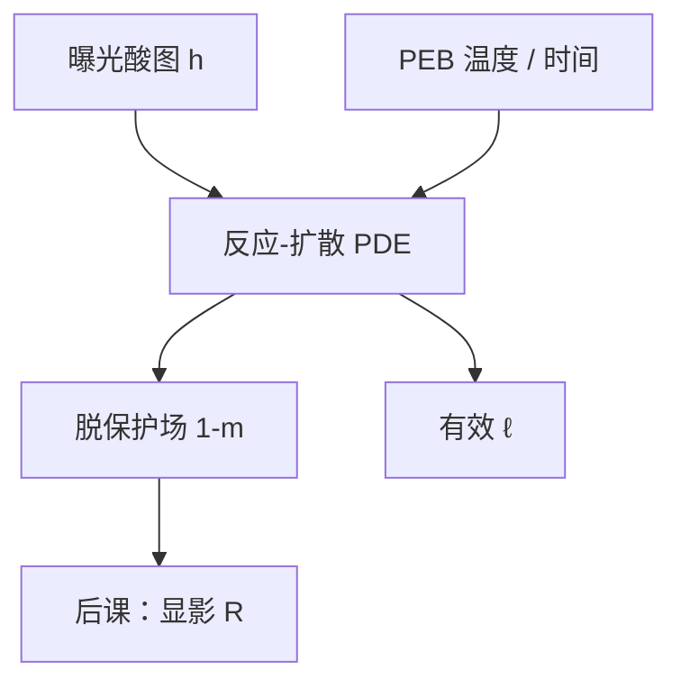

# PEB 反应扩散模型

后烘不是把酸图乘一个增益常数：酸边走边催化，脱保护场是反应–扩散方程的解，不是曝光结束时那张快照。

<footer>—— 据 Mack 对 PEB 反应–扩散与催化脱保护的论述整理</footer>

[上一课](/litho/exposure-kinetics-acid)把曝光停在生成酸 $h(x,z)$。[PEB 温度](/litho/peb-bake)已经说明热板是增益与扩散的公共执行器；[酸扩散与 LWR](/litho/acid-diffusion-lwr)已经把扩散长度 $\ell$ 写成模糊核。缺口是把这两面收成一组方程，而不是再报一次烘箱设定。本课钉 PEB 反应–扩散。淬灭剂如何作为汇出现在方程里，留给[下一课](/litho/quencher-neutralization)。

## 问题

曝光结束时保护基大多还在。PEB 期间酸浓度 $h$ 满足扩散，同时以某种速率消耗保护基分数 $m$（此处 $m$ 是仍被保护的比例，不要与 Dill 的 PAC 分数混名）。紧凑形式常写成

$$
\frac{\partial h}{\partial t}=\nabla\cdot(D\nabla h)-k_q h q+\cdots,\qquad \frac{\partial m}{\partial t}=-k_a h\,m
$$

一类：第一式是酸的输运与反应损失，第二式是催化脱保护。$D$ 随温度 Arrhenius 上升，于是「升温更敏」和「升温更糊」是同一组解的两个读出。

缺口不是再讲 CAR 循环，而是：平均场模拟器（PROLITH 族）解的是这组 PDE，OPC 紧凑核只保留其稳态后果——一颗宽度 $\sim\sqrt{Dt}$ 的模糊。把紧凑核当成「没有反应–扩散」，会在标定换 PEB 时找不到该动哪一项。

### 增益与模糊必须同一次积分

只积分脱保护、把 $h$ 钉在出生点，会高估衬度、低估 $\ell$。只卷积高斯、不让 $m$ 被催化消耗，会让酸永远存在、暗区被走穿。实验室 FEM 对 PEB 时间的敏感，来自这次联立，不是来自剂量环。

$D$ 可以依赖自由体积与残留溶剂，后课 [Tg](/litho/tg-free-volume) 与 [PAB](/litho/pab-solvent) 会改系数。本课先把方程形态钉住，不把某胶 5 nm 扩散写成常数。

## 方法

工程模型：指定 $D(T)$、催化速率 $k_a(T)$、时间 $t_\mathrm{PEB}$，以上一课的 $h$ 为初值。输出是脱保护场 $1-m$，送给显影速率。表征：固定光学，扫 $T$ 与 $t$，看 CD 与 LWR——与热板课同一组实验，本课要求拟合时同时报 $D$ 与 $k_a$，禁止只用「热剂量」一个数。

[酸扩散与 LWR](/litho/acid-diffusion-lwr) 的高斯核是 $k_a\to\infty$、无淬灭、常系数 $D$ 时的近似。有限催化与消耗会让有效核更短、形状非高斯。紧凑 OPC 仍可用高斯，但换 PEB 必须重校准，不能只改光学 TCC。

## 机制

酸做随机行走，每一步有一定概率让附近保护基脱落。亮区 $h$ 高，$m$ 掉得快；边沿 $h$ 低，脱保护抢在酸被耗尽或走掉之前。扩散把亮区酸送进暗区，把暗区尚未中和的碱（下一课）送进来，等值面外推。Mack 强调：PEB 既是化学时钟也是空间低通，本课把这句话写成可积分的场。

片内温度不均匀等于本地 $D$ 与 $k_a$ 不同，CD 指纹跟热板走——热板课已经要求与剂量指纹对拍。反应–扩散模型是那次对拍在方程里的位置。

负胶 CAR 把「脱保护」换成交联动力学，扩散项仍在。不要把正胶的 $k_a$ 抄到交联胶上。

## 边界

不在这里展开淬灭剂的双分子速率——下一课补 $k_q h q$。不写 LWR 功率谱，谱是随机单元的题目；平均场 $\ell$ 只提供那张谱的化学低通。也不把 SAMPLE / PROLITH 的某一版离散格式写成物理定律。

EUV 金属氧化物的后烘往往不是酸催化 PDE，本课默认正性 CAR。换胶族等于作废 $D$ 与 $k_a$。

## 小结

- PEB 用反应–扩散把酸图变成脱保护场；增益与 $\ell$ 同一次积分。
- 紧凑高斯核是这组 PDE 的工程近似，换 PEB 必须重校准。
- $D(T)$ 与 $k_a(T)$ 禁止折成单一「热剂量」。
- 淬灭作为汇，下一课写入方程。
- 出处：Mack, *Fundamental Principles of Optical Lithography*（PEB 反应–扩散）。
