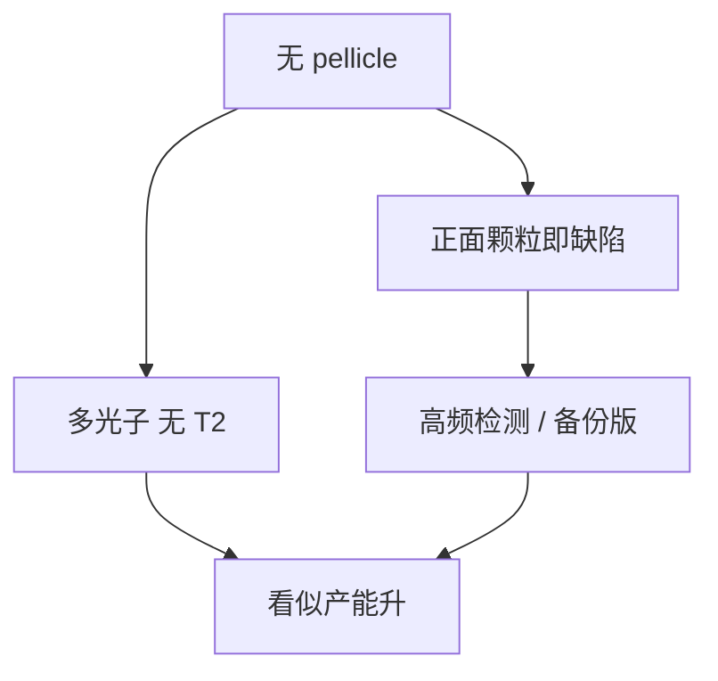

# 无薄膜运行的风险

早期高功率或膜不可用时，有过无 pellicle 跑关键层。颗粒直接落在多层上，打印阈值就是缺陷规格，检测频率变成产能税。

<footer>—— 对照 ASML 对 pellicle 导入前后策略的公开叙述；不要写成推荐工艺</footer>

[上一课](/litho/pellicle-lifetime)把膜写成消耗品。缺口是膜还扛不住功率、或破膜率不可接受时：有人选择无薄膜运行。本课钉风险账。胶如何吸收 13.5 nm、能涂多厚，留给[下一课](/litho/euv-resist-absorption）。

## 问题

寿命课的更换和破膜联锁，前提是膜在。无膜：双程吸收消失，瞬时光子变多，产能和随机项看起来变好；颗粒防护降为零，正面缺陷寿命由搬运和腔内产尘决定。早期 NXE 量产公开讨论过关键层无 pellicle、靠高频掩模检测和有限曝光次数的阶段。膜成熟后，无膜变成高功率过渡或特定层的例外，而不是默认。

缺口是把这条例外的风险写清楚，而不是重写 pellicle 光学。背面颗粒在无膜时仍然存在；正面再叠加硬缺陷，两面同时裸。

无膜不是「省一张膜的成本」。掩模检测、报废、机台开盖和良率尾部通常更贵。本课记账，不推荐。

## 方法

若必须无膜：收紧机械手与吸盘产尘、缩短掩模在机时间、提高光化或 succedent 检测频率、关键层用备份版。剂量可以因 $T^2$ 消失而加快扫描，但随机效应若仍要高 $D$，速度优势被吃回。氢和 EUV 直接打在吸收体和帽上，表面化学与有膜时不同，碳生长和氢损伤地图要重资格认证。

与修复：无膜便于随时修，但缺陷发生率更高，修复队列变产能瓶颈。

### 腔内产尘随功率不一定下降

无膜常被当成高功率过渡：膜先扛不住。功率升高，台热、氢剥离和胶出气可能增加产尘，正面裸露的打印率上升。于是「为功率而摘膜」与「功率制造更多颗粒」打架。过渡策略必须同时收紧产尘和检测，不能只享受 $T^2=1$。

## 机制

离焦抑制没了：物镜把掩模面成像到硅片，颗粒在物面，尺寸超过打印阈值就成重复缺陷，整批晶圆同位置坏。这与膜上颗粒的模糊斑本质不同。腔内产尘来自台运动、氢致剥离、胶出气凝聚，无膜时这些源直达多层。功率越高，热梯度越大，产尘可能不降反升——与「无膜为了扛功率」的动机打架。

High-NA 打印更小缺陷，无膜窗口比 0.33 更窄。膜若仍不达标，矛盾会转到源功率与膜材料，而不是长期无膜。

## 边界

本课不把胶的吸收系数和薄膜厚度写完，下一课才从记录介质吸收接着。不重写 DUV pellicle 标准。无膜过渡必须写检测频率和备份版，不能只写「源功率暂时更高」。出处：ASML pellicle 导入叙事；EUV 颗粒打印；寿命课。

## 小结

- 无膜换光子、付重复缺陷和检测税；不是稳态成本最优。
- 正面裸露改变帽层化学资格；背面风险并不消失。
- 下一课：硅片侧胶要吸收多少 13.5 nm 才能成像。
- 出处：ASML；pellicle 原理与寿命课。
