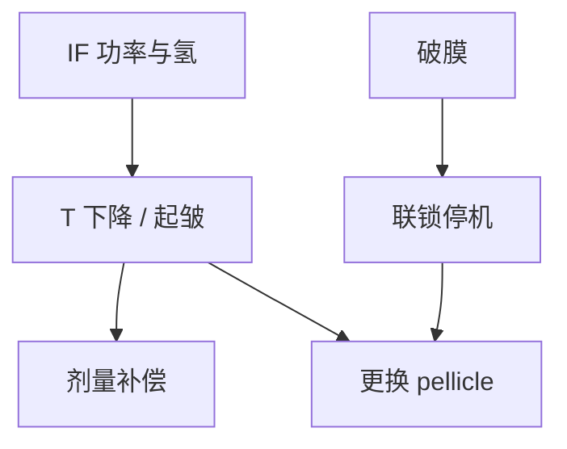

# 薄膜寿命与更换

pellicle 的合同是透过率、皱纹和破膜率随脉冲累积而变。寿命到点必须更换，不是把 DUV 有机膜的年计寿命搬过来。

<footer>—— 据 ASML 对 EUV pellicle 功率、透过率与更换的公开讨论</footer>

[上一课](/litho/euv-mask-repair)把版面缺陷修到光化可过。缺口是版上那张膜：[EUV pellicle](/litho/euv-pellicle) 已经写过双程 $T^2$ 和热；本课钉寿命与更换节奏。无膜硬跑的风险，留给[下一课](/litho/pellicle-free-risk）。不重写 DUV 薄膜安装产线。

## 问题

修复课假设图形面可接近。装上 pellicle 之后，再修要先揭膜，产尘和破膜风险上升。更日常的是：膜在数百瓦级热流和氢、EUV 下老化——透过率掉、均匀性变、应力致皱、最后破。破膜碎片落在多层上，比从未装膜更糟。功率路线往 500 W、1 kW 走，膜的吸收功率密度先于版本身到达极限。

缺口是把 pellicle 当消耗品记账：何时换、换的时候机台停多久、透过率漂移如何进剂量。不是再论证「要不要膜」。

DUV pellicle 更换周期可以很长。EUV 膜的寿命与源功率绑定，必须按层别和 IF 瓦数分层，不能写一张全厂年历。

## 方法

监测：在线或下机测平均 $T$、空间指纹、热鼓包干涉图、破洞检测联锁。阈值：剂量补偿加不到、CD 指纹超 SPC、或破膜风险不可接受时更换。物流：膜框与掩模台、机械手兼容，拆装在特定洁净流程，背面颗粒课的接触点约束同样适用。

CNT 等高透过路线的公开目标是扛更高功率、更长寿命；资格认证仍以扫描机气体与功率为准，不能只用可见光 $T$。更换时的剂量配方要重标定，因为新膜 $T^2$ 不同。

### 透过率漂移要进剂量环，不要只进日历

平均 $T$ 慢降，剂量环可以加扫描时间或源功率。空间指纹和皱纹环补不了，CD 图会先于平均剂量越界。更换判据因此是指纹 SPC，不是「满多少天」。功率爬坡试验必须单独做寿命，250 W 合格不代表下一档 IF 仍合格。

## 机制

吸收功率加热膜，真空中靠辐射和框导热。温度循环疲劳、氢刻蚀某些成分、EUV 断键，使应力和孔隙率变，$T$ 和相位指纹变成时间函数。OPC 静态层修不了这张时变图。破膜是应力或热点超过强度，碎片尺寸足以打印。联锁必须快过下一场扫描。

寿命用脉冲数或曝光场数代理，必须声明功率。250 W 下的寿命不能外推到未过滤的 1 kW。

## 边界

本课不把「无 pellicle 策略」写成推荐，下一课才写风险。不重写 [薄膜安装与检验](/litho/pellicle-mount-inspect) 的 DUV 厂流程。更换是计划停机，破膜是故障停机，稼动账必须分开。出处：ASML EUV pellicle；Bakshi 膜热与透过；pellicle 原理课。

## 小结

- EUV pellicle 是功率相关消耗品，透过率漂移进剂量，破膜是灾难项。
- 更换与揭膜修复绑定，要进稼动计划。
- 下一课：不装膜时颗粒与产能怎么权衡。
- 出处：ASML pellicle 公开材料；Bakshi。
