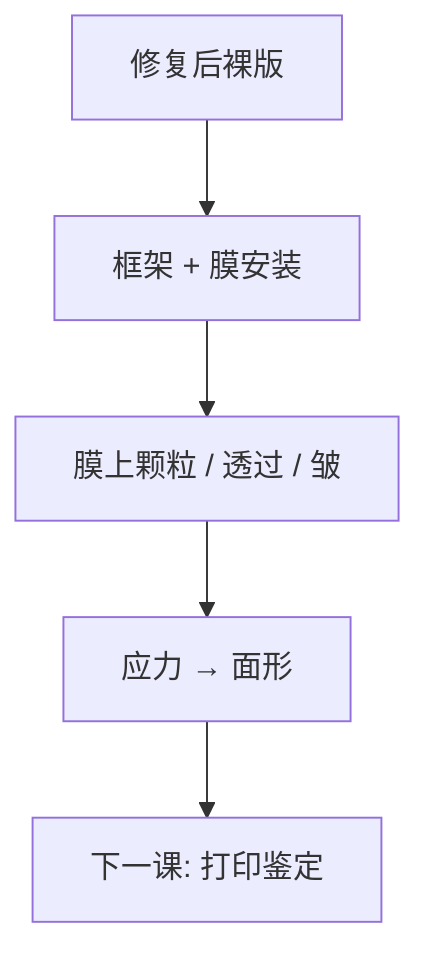

# 薄膜安装与检验

Pellicle 把颗粒移到离焦面；安装本身引入框架应力、密封与透过率指纹，必须当作掩模的最后一道图形化。

<footer>—— 对照 DUV pellicle 安装惯例；EUV 膜见 ASML pellicle 公开材料与 Bakshi</footer>

[上一课](/litho/mask-repair-ebeam)把可修缺陷补完。缺口是上机前还要罩膜：DUV 有机膜成熟，EUV 膜是另一份热与透过合同。本课钉安装与检验。装好后如何用空中像鉴定打印，留给[下一课](/litho/aims-mask-qualification）。

## 问题

[EUV pellicle](/litho/euv-pellicle) 已讲膜的光学与热。本课站在掩模厂：框架对准有效区、胶粘或机械固定、气密、膜皱与颗粒、安装后复检。DUV 膜透过率高、热负荷低，主要风险是破膜、胶挥发污染与安装颗粒。EUV 膜透过率进入剂量，皱与热鼓包进入全场 CD——安装站是这张指纹的源头之一。

缺口是**机械合同**，不是再推导双程透过率。把 pellicle 当「配件」，会漏掉：装完再修缺陷往往要拆膜，周期翻倍。

### 无膜运行是另一种安装决策

EUV 曾有无 pellicle 跑关键层的阶段：检验频率与报废率换掉膜风险。那是 fab 策略，仍要在本课登记：无膜则安装检验变成「裸版颗粒图 + 搬运协议」。

框架挡掉一圈有效区。MDP 作业框必须与可安装 pellicle 的窗口一致，否则条码或阵列被框遮住。

## 方法

安装后：颗粒检验（膜上与膜下，光学条件不同）、透过率/均匀性（EUV 更关键）、密封、外观皱纹。DUV 可用专用 pellicle 检验机；EUV 还要考虑膜在真空与氢环境的后续寿命——寿命课已有，本课只把「安装合格」定义为上机起点。

与配准：框架应力可轻微弯版，配准与焦面要在安装后再抽检，不能只用未装膜数据出货。

## 机制

膜在离焦面，颗粒的打印阈值大幅提高；膜自身的厚度与折射率不均匀是在焦光束里的弱相位/吸收物体，会留下缓慢 CD 指纹。安装张力不均 → 皱 → 局部角与透过变化。EUV 双程放大这份不均匀。扫描热使膜鼓包随时间变，OPC 吃不掉时变项。

## 边界

安装不消除空白多层缺陷。破膜率与寿命不在本课用数字承诺。不把 DUV 有机膜的安装扭矩抄到 EUV CNT/SiN 膜上。

后课默认：出货状态含 pellicle（或明确无膜协议）；下一课用 AIMS 问「这块版在扫描机波长下怎么印」。

## 小结

- Pellicle 安装是最后一道会改指纹的工序：应力、透过、颗粒。
- 有效区与框架必须在 MDP 阶段就对齐。
- 装膜后配准/焦面可能变化，需复测。
- 出处：DUV pellicle 安装惯例；EUV pellicle 公开材料与 Bakshi 膜讨论。
