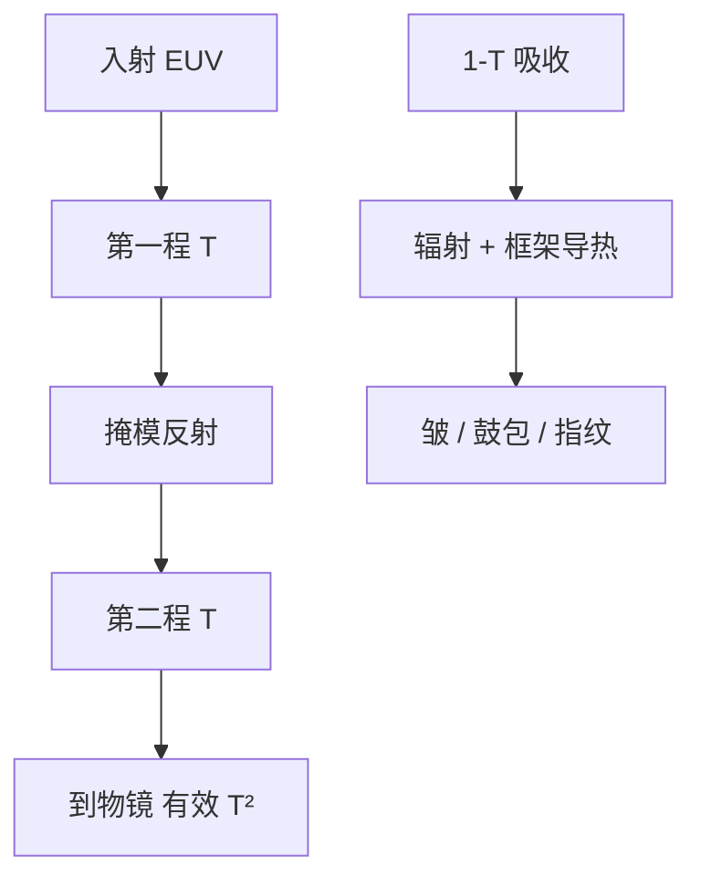

# 薄膜透过率与热

Pellicle 的合同先写单程透过率，再写双程 $T^2$ 和真空里那份吸收功率往哪里散。

<footer>—— 改写自 ASML 对 EUV pellicle 透过率目标与高功率热负荷的公开材料</footer>

[上一课](/litho/euv-pellicle)把膜的角色钉成离焦挡颗粒。缺口是：同一张膜是光路里的两层吸收体，又是真空里几乎只能靠辐射和框架导热的热源——透过率与热负荷必须写成同一份规格，不能只报「有膜」。本课钉 $T$、均匀性与热。埋进空白版的相位缺陷，pellicle 挡不住，留给[下一课](/litho/euv-mask-defects)。

## 问题

照明进掩模前过膜一次，反射后再过一次。单程透过率 $T$ 时，带内有效透过是 $T^2$。ASML 公开的第一代量产叙述在约 80% 单程量级（双程约 64%），后续目标走向 90% 以上（双程 81%）。差的那一截直接吃 [IF 功率预算](/litho/euv-power-throughput)，或逼扫描降速，随机效应变差。

热是第二项。膜吸收 $P_{\mathrm{abs}}\propto(1-T)$ 乘上双程几何里的入射功率。NXE 把 IF 往 250 W 级及以上推时，掩模平面的功率密度足以把超薄膜烫到应力极限：起皱、鼓包、局部 $T$ 漂移，颗粒离焦量与 CD 指纹一起变。透过率规格若不附带热边界，高功率下会自己作废。

### 平均值不如均匀性毒

全场平均 $T$ 可以用剂量补偿。中心与边缘差 1%，扫描场就有系统 CD 图，OPC 很难完全吃掉，因为热变形还随功率和时间变。规格因此同时写平均 $T$、空间均匀性、寿命（脉冲/能量负荷）和破膜率。破膜比无膜更糟：碎片落在多层上。

有机 DUV pellicle 的透过率数字不能抄到 13.5 nm。EUV 膜是无机超薄膜或 CNT 一类稀疏网络；公开目标从约八成单程走向九成以上，以匹配更高源功率。

## 方法

光学上把膜当弱振幅/相位物：厚度图进波前，皱纹进焦面。CNT 等路线用孔隙降低吸收截面，并沿管网导热，公开目标是更高 $T$ 与更高热导，而不是改离焦几何。资格认证必须在接近扫描机的氢与 EUV 负荷下做，可见光透过率不够签字。

热路径：真空对流可忽略，散热 = 辐射 + 框架导热。预热、扫描占空比、功率爬坡进工艺窗口。氢自由基会刻不兼容材料，膜必须与 [DGL](/litho/euv-hydrogen-dgl) 化学共存。High-NA 掩模侧角度和功率密度更高，角透过率与热要按 EXE 光瞳重写，半场并不让膜面积减半到可以随便加厚。

### 剂量环怎么看见膜

源必须多供约 $1/T^2$ 的带内光子，硅片 $D$ 才维持。膜老化 $T$ 下降时，环加功率，热负荷进一步升——与收集镜脏了加激光是同一类正反馈。检测「膜还在、有没有破洞、均匀性有没有漂」是联锁，不是可选项。

## 机制

离焦防护与吸收是同一张膜的两面：间隙保证颗粒像斑低于打印阈值；厚度/材料保证 $T$ 与力学。加厚提高破膜阈值、降低 $T$，热吸收却可能上升（若 $1-T$ 变大），窗口是薄而不破、透而能热导。CNT 网络把「连续薄膜」换成稀疏导体，吸收截面下降，但均匀性与氢环境可靠性要另证。

局部缺陷（膜上颗粒、厚度台阶）若离焦不够，仍印软缺陷。pellicle 把掩模硬缺陷大部分转化成可换膜问题，不把热指纹取消。功率每次上台阶，热审一次——公开材料不声称「某年之后膜的问题已彻底解决」。

不要把 pellicle 吸收的瓦数写成某一个发明值。公开能写的是：IF 数百瓦量级传到掩模平面、双程吸收、真空散热困难。具体膜上的瓦与温度是厂内负荷，本课不编。

## 边界

本课不选供应商，不写未公开的厚度纳米数。无膜跑关键层在研发仍可能出现，量产逻辑层把膜当默认。后课默认：说到 EUV 剂量余量，先乘 $T^2$，再问随机。掩模三维阴影在吸收体里，膜的皱在框架上，OPC 主要补前者。

出处：ASML pellicle 透过率与热负荷公开材料；Bakshi 对 EUV 掩模防护。下一课转向空白版里 pellicle 挡不住的坑包。

$T=0.90$ 仍扔掉约两成双程光。膜永远是产能税，只是颗粒风险税通常更贵。比较要放在同一张 P–dose–TPT 账上。

## 小结

- 有效透过率是双程 $T^2$；公开目标从约 80% 单程走向 90% 以上。
- 吸收功率在真空里靠辐射与框架导热，高功率下皱与破是寿命极限。
- 均匀性与热变形造成动态 CD 指纹，平均剂量补不掉。
- 氢环境必须与膜兼容；加功率补 $T$ 会加重热。
- 下一课写镀膜时埋进空白版、膜挡不住的相位缺陷。
- 出处：ASML pellicle 公开材料。
