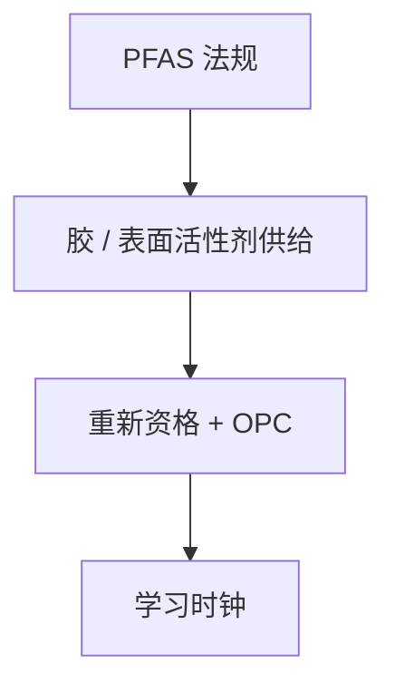

# PFAS 与光刻胶管制

光酸发生剂与表面活性剂常含氟烷基；PFAS 管制若一刀切，先进胶配方会先于光学碰到法规墙。

<footer>—— 对照半导体光刻中 PFAS 用途与 2020s 监管讨论的公开产业/SPIE 叙述</footer>

[上一课](/litho/supply-chain-single-source)谈工具集中。缺口是材料许可。本课钉 PFAS 与光刻胶管制。代工如何在法规与工具约束下选节点路径，留给[下一课](/litho/foundry-roadmap-compare）。

## 问题

化学放大胶的 PAG、猝灭剂、表面活性剂、底部抗反射，不少属于广义 PFAS 讨论范围。监管（欧盟等）若限制制造与进口，供应链会像工具一样窄。替代配方必须重新做窗口、随机、缺陷、与 OPC 版本——学习曲线时钟重启。

缺口是**法规进 PDK**，不是再讲酸扩散。把胶当无限可购的化学品，规划会漏项。

### 不要把化学点名写成禁令清单

具体物质与豁免随法域与年份变。本课钉机制：先进节点胶高度依赖含氟功能，替代有周期。不把某公司退出当全球停产的完成时。

湿法与管线里的表面活性剂同样受关注，不只是涂在晶圆上的那一微米。

## 方法

跟踪：法规范围、豁免、时间表。工程：替代 PAG 的资格矩阵（E0、LER、随机、金属污染）。版本：胶换即模型换。与出口管制并列进风险登记，对象不同。

## 机制

含氟基团提供酸强度、透明度、表面能，是配方自由度。去掉它们不是改浓度，是改一类化学。资格周期以年计，与节点爬坡重叠则直接进良率学习。

## 边界

不提供法律意见。不发明未公布的禁令日期。不把所有氟化学当同一监管对象。

后课默认：材料许可是约束；下一课代工路线在工具、材料、节点名下如何分叉。

## 小结

- 先进胶与湿法含 PFAS 讨论对象；管制会重启资格与 OPC。
- 替代不是调浓度，是换化学自由度。
- 与工具集中并列，进风险登记。
- 出处：光刻 PFAS 用途与监管的公开产业/SPIE 讨论。
