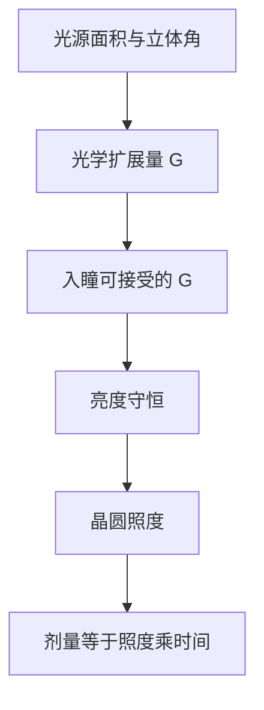

# 亮度、照度与光学扩展量预备

亮度沿无损光路守恒；光学扩展量把光源面积与立体角绑在一起，限制能耦合进光瞳的功率，开大 NA 并不能无中生有地造光子。

<footer>—— 据 Born &amp; Wolf, Principles of Optics 对辐射度学与 Lagrange 不变量的整理</footer>

[上一课](/litho/geometric-aberration-tour)说明真实透镜有像差。本课不重列 Seidel。缺口是：光源有多亮、晶圆上能有多少功率、为何大孔径与高通量会打架？后课光源收集、匀光与扫描速度，都要碰辐射度与 étendue。

## 问题

[光阑、光瞳与视场](/litho/stop-pupil-fov) 决定角度范围，但不保证有足够光子。曝光要的是剂量（能量/面积）；剂量 = 照度 × 时间。若光源的光学扩展量大于系统能接受的量，多出来的亮度进不了瞳，功率被丢掉。没有亮度、照度、étendue 三个词，无法读「源–光瞳–晶圆」链上的功率瓶颈。缺口是几何辐射度，不是再修一阶像差。

### 亮度不是照度

照度 $E$：单位面积接收的功率。亮度 $L$：单位面积、单位立体角的功率。同一光源，用大立体角去收，照度可以变大，亮度在无损折射下不变。把「更亮」和「晶圆上更亮」混用，会以为加大 NA 总能按立体角线性涨剂量；光学扩展量守恒时，往往只是把同一批光子换一个锥角。

étendue $G\sim A\Omega$（面积 × 立体角）。近轴还有拉格朗日不变量 $n h \theta$。无损、无挡光时 $G$ 沿光路守恒。吸收、散射与挡光会减小可用 $G$。

## 方法

理想无损光路：亮度 $L$ 守恒（相对折射率变化时用 $L/n^2$ 的形式，本课先记「不能无中生有」）。像方照度大约 $E\sim L\,\Omega_{\mathrm{pupil}}$，$\Omega_{\mathrm{pupil}}$ 与 NA 相关。源侧 $G_s\sim A_s\Omega_s$；系统 $G_{\mathrm{sys}}$ 由入瞳大小与接受角决定。$G_s\le G_{\mathrm{sys}}$ 才能把源用满；否则必须整形、挡光或接受损失。

扫描狭缝把瞬时照明面积切小，étendue 预算要按狭缝而不是按全场算。照度够高才能在给定扫描速度下凑够剂量；速度又决定产能。于是源、瞳、狭缝、扫描是同一条功率链。本课只把链写清，不进入某一代光源的等离子体参数。

扫描曝光：狭缝内照度乘扫描速度得到线剂量。放大率 $|M|$ 把物方功率密度换成像方功率密度。本课只把账本写清，不进入光源等离子体物理。

辐射度量与光度学单位不同：本课用功率（W），不用流明。光刻剂量是能量密度，跟视觉明暗无关。

## 机制

准分子激光源 étendue 相对小，较容易填满高 NA 瞳。放电或激光等离子体类源 étendue 大，收集光学只能截一块，通量长期受限于此——本课给守恒逻辑，不把某代机台拆开。照明中继把源成像到光瞳，积分棒或微透镜阵列把照度匀开，使视场内剂量均匀；均匀度是视场课的功率版补充。

像差与挡光减小有效 $G$ 或局部亮度。本课把它们看成损耗项，不回头重做 Seidel 分类。下一课 [相干长度与光源带宽预备](/litho/coherence-length-prep) 问谱宽，与本课的「有多少功率」正交：窄带改善相干与色差，却可能丢掉源功率。

匀光之后，晶圆上要的是照度均匀，而不是源面长什么样。源的结构被中继与积分元件抹掉，只留下亮度与 étendue 是否匹配。若 $G_s$ 过大，多出来的是进不了瞳的光，会变成热与杂散光，不增加剂量。这就是「收集效率」在辐射度语言里的意思：不是源不亮，是系统装不下。

## 边界

本课几何辐射度；干涉条纹对比度另算。相干光的「亮度」要部分相干修正，下一课衔接。也不把 étendue 写成 CD。抗蚀剂要多少 mJ/cm² 是材料响应，本课只提供到达晶圆的照度语言。

杂散光与挡光会在守恒之外再吃一块功率，表现为有效亮度下降。后课默认：亮度沿无损光路守恒；剂量由照度与时间相乘；源–瞳耦合受 étendue 限制。

## 小结

- 亮度沿无损光路守恒；照度随接受立体角变。
- 光学扩展量 $A\Omega$ 限制源能进多少瞳；大 NA 不自动等于更多光子。
- 剂量 = 照度 × 时间；扫描通量与此绑定。
- 带宽与相干是下一课，与功率账本分开。
- 出处：Born &amp; Wolf, *Principles of Optics*；Hecht, *Optics*。
