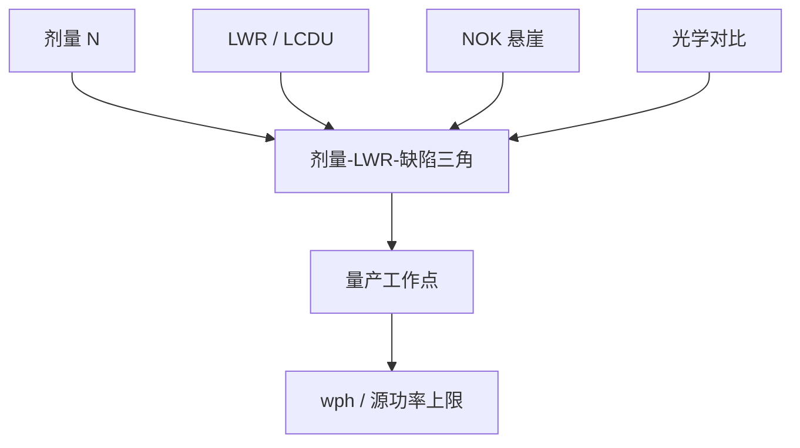

# 光子散粒噪声预算

平均 CD 合格并不等于这一层能出货；剂量、线宽粗糙与随机缺陷是同一张三角上的三个顶点，加一角通常要付另外两角。

<footer>—— 对照 De Bisschop 对 EUV 随机效应、LCDU 与印刷失效（NOK）的论述</footer>

[上一课](/litho/euv-stochastics)已经说明噪声从哪来：92 eV 光子计数少、化学离散、二次电子模糊，缺失孔与桥接是泊松尾而不是高斯 $3\sigma$。缺口是产线怎么把这件事收成一张**预算**：剂量加多少、LWR/LCDU 允许多少、缺陷率停在哪条悬崖上方。本课钉剂量–LWR–缺陷三角。单次 EUV 仍不够时要不要拆成双重，留给[下一课](/litho/euv-double-pattern)。

## 问题

随机课给出 $N$ 与 $1/\sqrt{N}$。工厂要的是可签核的数：某一层在目标 CD、目标节距上，缺孔或微桥的 NOK 概率低到计量能看见的 ppm–ppb，同时 LWR/LCDU 不吃掉电学余量，扫描速度还要活在光源功率里。三件事互相咬。加剂量，$N$ 升，一侧悬崖（常是断线或缺孔）后退，产能掉；对比或模糊改了，LWR 与另一侧悬崖（微桥、并孔）可能反向移动。

De Bisschop 把失效概率写成 NOK(CD)：某一尺寸变「太小」时概率陡升，称为随机悬崖。线栅有桥与断两条悬崖，中间夹着一条可走的通道；孔阵列有缺与并。通道宽度随节距、剂量、胶和照明变。缺口因此是给这条通道做预算，而不是再推导一次泊松。

### 均值 OPC 修不掉尾部

[OPC](/litho/opc) 拟合的是平均轮廓。悬崖是极值事件：局部光子或酸不够，一条线在百万条里断一次。把衬线加厚可以移动平均 CD，从而把工作点在 NOK(CD) 上挪一截，但若工作点仍贴着悬崖，加剂量或改胶才是预算手段。把「再跑一夜 OPC」当成随机问题的解，会漏记源功率与产率。

NOK 不是 LWR 的另一个名字。公开测量表明，失效概率与局部 CD 的关系，并不总是能从 LWR 或 LCDU 直接换算。预算表上要同时列粗糙度与缺陷，不要用一个 $3\sigma$ 代替悬崖。

## 方法

预算从计量开始：用 CD-SEM 或电子束检测把 NOK(CD) 画出来，再叠加 LCDU/LWR 与剂量。比较胶、照明、蚀刻前后，看哪一座悬崖在动。工程旋钮仍是随机课的四层——光学对比、胶、设计规则、计算——但本课把它们写成可加总的项：

- 剂量项：mJ/cm² 与扫描速度、pellicle 透过率、源功率在同一行。
- 对比项：NILS / 图像对数斜率，决定同样 $\Delta n$ 造成的 $\Delta\mathrm{CD}$。
- 设计项：目标 CD 相对悬崖的距离，冗余通孔、放宽最小孔。
- 产能项：wph 上限决定剂量上限，超过就换层策略（含下一课的双重）。

缺陷率对剂量极陡，量产停在悬崖上方而不是瑞利极限上。公开图常见「再加几 mJ，缺孔掉一个数量级」；那是预算语言，不是实验室一次漂亮 SEM。

### 把 LCDU 和 NOK 分列

LCDU 描述局部尺寸的散布，影响匹配与电学。NOK 描述印刷失败。NILS 往往更能预示 LCDU，却不必定能预示 NOK。因此计算光刻若只最小化 EPE，可能把层停在一条好看的均值轮廓、一座很近的悬崖上。随机感知的目标函数要把缺陷或至少把 NILS/剂量余量写进去。

## 机制

泊松给出局部剂量的相对涨落。显影是非线性阈值：涨落被切成 CD 散布，极端时切成开/关。NILS 大，同样相对涨落对应更小的 $\Delta\mathrm{CD}$，悬崖在 CD 轴上更远。剂量提高 $\bar N$，相对涨落下降，悬崖形状可以变，但不保证两条悬崖同时后退——De Bisschop 指出，提高剂量有时主要推开微桥一侧，对断线一侧帮助有限。三角的意思就是：没有单一旋钮能把三个顶点同时按到最小。

化学噪声与二次电子在 $N$ 已经很大时封顶，出现随机地板（floor）：再加剂量，缺陷不再指数下降。预算必须承认地板，否则会空烧光源去追一个物理上到不了的零缺陷。

「剂量–LWR–缺陷」不要理解成可以代数消去的等式。它是一张权衡图：选定胶与照明之后，你在曲线上选工作点。换胶是换一张图，不是在同一张图上自由滑动。

## 边界

本课不重算 92 eV，不选具体胶配方。悬崖位置随层别、蚀刻和检测灵敏度变，把某一 imec 演示的 ppm 写成工厂 D0 规格会越权。计量噪声要把设备方差从晶圆方差里分开，否则会加错剂量。High-NA 提高 MTF 但缩小目标面积，预算必须重做，不能继承 0.33 的 mJ 表。

后课默认：单次 EUV 的随机账已经按三角分配过；若工作点仍不可制造，才讨论双重曝光。

引用 De Bisschop 时写清：NOK 是印刷失效概率，不是平均 CD。只展示一张无缺陷 SEM，不能当作悬崖已经被取消。

## 小结

- 光子散粒预算是剂量、LWR/LCDU 与缺陷率的三角，不是单次泊松公式。
- 量产停在 NOK(CD) 悬崖上方；均值 OPC 只移动工作点，不取消悬崖。
- 加剂量、加对比、放宽 CD 是不同边，对两条悬崖的作用可以不对称。
- 随机地板限制「再加剂量」的回报；产能决定剂量上限。
- 出处：De Bisschop，EUV 随机效应与印刷失效（JMM / SPIE）公开论述。
