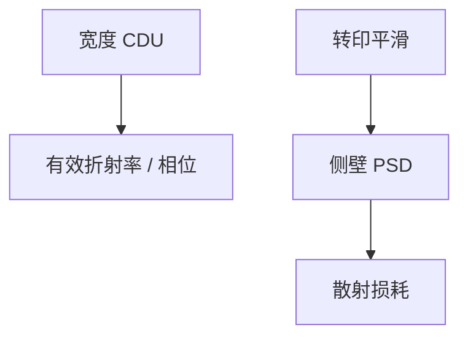

# 光子学图形化

波导损耗吃的是侧壁粗糙与宽度误差；NILS 与 LER 频谱在这里是光学损耗预算，不是 SRAM Vmin。

<footer>—— 对照硅光波导对线宽与粗糙度敏感的公开讨论</footer>

[上一课](/litho/hybrid-bonding-alignment)把 3D 电学对准收束。缺口是同一套硅工艺上的光子器件。本课钉光子学图形化。MEMS 厚胶与另一套规则，留给[下一课](/litho/mems-patterning）。

## 问题

硅光波导：宽度误差改有效折射率与相位；LER/侧壁粗糙散射损耗。单模条件把宽度钉在百纳米量级，可用浸没甚至较成熟节点，但**均匀性与粗糙**规格可能严过同节点的数字逻辑。电子束直写在研制上常见（面积小）。与逻辑共集成时，BEOL 金属与光子层的热与 CMP 互相污染窗口。

缺口是**损耗预算当光刻规格源**，不是密度。把光子当「松一点的金属层」，相位器件会失败。

### 不要重推成像

光子器件仍用投影或 e-beam，成像物理已在主干。本课只改目标函数：损耗、相位匹配、耦合器 CD。

光栅耦合器对周期误差敏感，有点像干涉光刻的周期，但通常仍用掩模投影一次印出。

## 方法

规格：CDU、LER 频谱（散射相关长度）、侧壁角。工艺：可能专用刻蚀减粗糙（LER 传递课的滤波器）。计量：光学损耗本身是最终量，SEM 是代理。与 DTCO：波导不能随便填 dummy 金属在旁边——光学串扰。

## 机制

瑞利散射型侧壁损耗随粗糙功率谱与折射率对比变。低频宽度误差进相位。这与电学 LER 进 Vth 同构：频谱加权不同。平滑刻蚀在光子上是一等杠杆。

## 边界

不把所有硅光当同一节点。不写 dB/cm 的万能数。本课不讲激光器外延。

后课默认：光子规格源是损耗；下一课 MEMS 规格源是力学与深宽比。

## 小结

- 光子图形化用 CDU 与 LER 频谱服务损耗与相位，不是晶体管密度。
- 同节点逻辑合格不代表波导合格。
- 刻蚀平滑在光子上是一等旋钮。
- 出处：硅光波导损耗与线宽/粗糙公开讨论。
