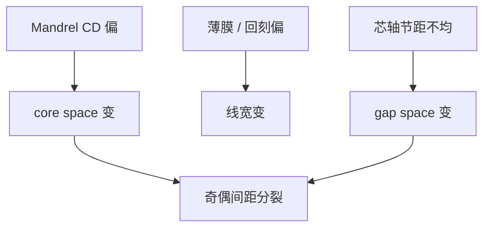

# 节距漂移

侧墙把节距劈成两套间隔：芯轴侧与间隙侧。两者一不等，奇数间距与偶数间距就裂开，电学上像周期被「走」了一步。

<footer>—— 据 SADP 计量对 pitch walking / odd–even space 的通称，以及芯轴–侧墙几何的误差传递</footer>

[上一课](/litho/mandrel-spacer)把 $W_m$、$P_m$ 与侧墙厚度 $t$ 写成理想几何，并区分 core 与 gap。缺口是上线后这两套 space 通常不相等：mandrel CD、薄膜、回刻脚型只要偏一项，奇数间隔与偶数间隔就分裂。这就是节距漂移（pitch walking）。切断掩模留给[下一课](/litho/cut-mask-dpt）。

## 问题

理想设计可以把 core 与 gap 画成同一个目标 space。计量上 CD-SEM 沿栅扫描，会看到交替的两种间隔。差值达到电阻、击穿或鳍宽度预算，阵列就是坏的——即使「平均节距」仍是 $P_m/2$，线宽均值也合格。LELE 的 $\delta$ 造成的也是相邻 space 一宽一窄；SADP 的 walking 不来自第二次线层 overlay，而来自芯轴与薄膜。

缺口因此是奇数/偶数误差及其计量，而不是再画一遍侧墙环。没有这项，切线课会把切偏和 pitch walking 混成一个 CDU。

### 平均节距合格不等于没有 walking

只报 mean CD 与 mean pitch，会把交替误差平均掉。SADP 计量必须分别报 core space、gap space，或显式报 pitch walking（两者之差或对目标的交替残差）。只对「每条线」做一次 CD 抽样，采样相位若总落在同一种 space 上，会系统盲。

口语里的 pitch walking 有时也包含 SAQP 多轮之后更复杂的多套 space。本课先钉双重：两套间隔。四重是同一思想的更多桶。

## 方法

控制旋钮：mandrel CD（光刻剂量、OPC、刻蚀偏置）主要推 core；沉积 $t$ 与回刻推线宽并轻微耦合两种 space；相邻芯轴的节距均匀性推 gap。补偿策略是把 mandrel CD 故意偏一点，使 core 与 gap 在刻蚀后对齐——这是校准，不是「自对准失败」。过度补偿会把线宽带出窗。

计量：CD-SEM 对交替 space 分桶；散射测量要有对奇偶敏感的模型，否则拟合出一个假的单一 pitch。场内、晶圆半径、开口密度都要抽样，因为薄膜加载随图形变。

### 与 LELE 套刻指纹拆开

LELE 相邻 space 差随扫描机 overlay 场内指纹变。SADP walking 随 mandrel CDU 与薄膜径向变，通常对套刻标记不敏感。拆源：看误差是否跟着对齐修正量走。跟着走的是 overlay；不跟着走而跟着 mandrel 剂量走的是 walking。

## 机制

一阶：正 spacer 下去芯轴后，core 随 $W_m$ 单调变，gap 随 $P_m-W_m$ 变。$t$ 增加则线变宽，两种 space 都变窄，但若脚型不对称，两边收窄量不同，仍引入 walking。SAQP 第二轮把上一轮的 walking 再当「芯轴」复制，误差结构更碎，设计上有时故意用后切或填补来藏，但计量桶数要加。

电性：一种 space 偏窄先击穿或先变成鳍桥；另一种偏宽先掉电流。所以 walking 是可靠性与失配问题，不只是「平均 CD 还在规格里」。

上一课允许把 core 与 gap 设计成相等。量产校准是用 mandrel 剂量和刻蚀偏置把两者拉齐，而不是假设 ALD 厚度均匀就自动对齐。阵列边缘微负载会留下一圈走步，计量 ROI 要声明是否含边缘。

不要用单次曝光 $k_1$ 去解释 walking。光学只约束芯轴能不能印；奇偶差在薄膜与芯轴 CD 上，瑞利公式里没有这一项。

## 边界

本课不把切线套刻写成 pitch walking：切偏的是线端位置，周期沿栅仍可以奇偶合格。下一课才把线切短。也不编 7 nm 鳍的 walking 纳米规格。公开讨论停在：SADP 必须分桶计量奇偶 space。

二维局部、线端附近的 spacer 环会让「奇偶」定义模糊，计量 ROI 要避开切区与阵列边缘，否则把几何过渡区当成 walking。

校正环若只用平均 CD 做 APC，会把 walking 锁死在一个不等于零的值。剂量拧到均值合格，奇偶差依旧。

## 小结

- Pitch walking 是 SADP 的 core / gap 不相等，表现为奇偶间距分裂。
- 旋钮主要是 mandrel CD 与薄膜；不是第二次线层 overlay。
- 计量必须分桶，平均节距会掩盖问题。
- 与 LELE 的 $\delta$ 指纹要拆源。
- 切断掩模下一课。
- 出处：SADP 计量对 pitch walking 的通称；上一课芯轴–侧墙几何。
