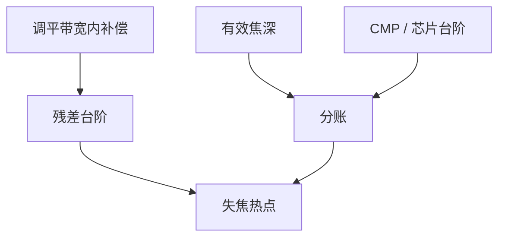

# 平坦化与焦深

瑞利焦深随 NA 平方收紧；晶圆上残留的台阶高度若不小于这笔预算，窗口在地形上先死，而不是在镜头上。

<footer>—— 对照瑞利焦深与晶圆形貌预算；Mack / Levinson 对 DOF 与晶圆平坦度的叙述</footer>

[上一课](/litho/cmp-topography)给出 CMP 地形。缺口是换算：这笔高度进不进本层焦深。[瑞利](/litho/rayleigh-litho) 与 [E–D 窗](/litho/ed-process-window) 已有 DOF 定义；本课钉平坦化预算，不重推 $k_2\lambda/\mathrm{NA}^2$。关键层对准如何在这张不平的饼上找网格，留给[下一课](/litho/critical-layer-alignment）。

## 问题

高 NA 浸没与 0.55 NA EUV 把可用焦深收到几十纳米量级（还要与随机窗求交）。晶圆翘曲、芯片台阶、胶厚变化、扫描机调平残差共享这笔预算。平坦化（CMP、旋涂、SOC）的价值是把地形的高频削到调平能跟、低频交给扫描机地图。剩余台阶 > 有效 DOF，则场内必有失焦热点，LRC 在理想平面上绿灯也没用。

缺口是**预算分账**，不是再定义焦点。把所有 CD 离焦敏感都怪 PEB，会漏掉未抛平的前层。

### 调平跟得上的频率

扫描机调平有空间带宽：场内多项式、狭缝方向平均。[焦点传感器](/litho/focus-sensor-topography) 已写。CMP 波浪若落在带宽外，就是不可补偿地形。平坦化目标不是「绝对平」，是谱落在可补带内，且峰峰值进 DOF 分账。

胶厚本身占焦深。薄胶省焦深、损选择比。平坦化与硬掩模、胶厚选择是同一笔账的三页。

## 方法

分账：镜头/扫描 DOF 规格 − 胶厚 − 预期台阶 − 调平残差 − 动态 MSD 一类 = 余量。测量：产品晶圆焦点残差图对 CD。动作：加强 CMP、改 SOC、场内焦点校正、禁大台阶设计（密度窗）。High-NA 半场拼接区若有台阶，拼接课的套刻之外还要焦点。

余量为负时，先减台阶或改胶厚，再考虑加剂量硬撑随机窗——后者会伤吞吐。Mack 的 DOF 定义仍适用；本课只把晶圆地形从「忽略项」改写成分账行。

## 机制

有效成像平面随局部高度走。失焦引入像差型对比损失（已有课），NILS 下降，随机窗先关。地形与剂量耦合：厚胶区摆动曲线不同，CD 指纹像「假照明不均」。APC 若用全场平均焦点去补局部台阶，会牺牲另一侧。

调平只吃带宽内的台阶；带外波浪直接进失焦热点。分账余量为负时，加剂量硬撑会先关掉随机窗。

## 边界

不发明某机台未公开的 DOF 纳米数。不重写镜头像差。晶圆翘曲的应力源下一门过程控制会再收，本课只把它当高度谱的一项。

后课默认：焦深分账含地形；不可补的频率必须先平坦化。下一课对准在起伏表面上如何仍把关键层套准。

## 小结

- 平坦化把地形谱推进扫描机可补带，并留给焦深分账。
- 高 NA 下台阶从次要项变成窗口杀手。
- 假 CD 指纹可来自胶厚地形，不是照明。
- 出处：Mack 焦深；Levinson 晶圆平坦度；ASML 调平公开论述。
