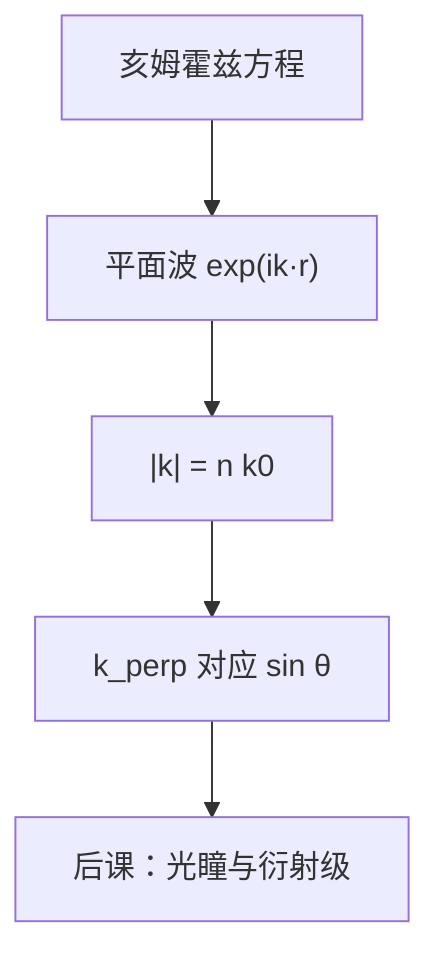

# 平面波与波矢

均匀介质里，相位只沿一个方向线性变化；波矢 $\mathbf{k}$ 给出该方向的波长倒数与传播指向。

<footer>—— 据 Born &amp; Wolf, Principles of Optics 对平面波与色散关系的表述整理</footer>

[上一课](/litho/maxwell-to-wave)从无源均匀介质推出波动方程，时谐场满足亥姆霍兹方程。本课不重推旋度恒等式。缺口是：方程的特解长什么样？波矢 $\mathbf{k}$ 如何把方向、波长与频率绑在一起？后课的衍射、光瞳坐标与空间频率，都默认平面波是「基」。

## 问题

亥姆霍兹 $\nabla^2\mathbf{E}+k^2\mathbf{E}=0$ 在无限均匀介质中最简单的解，是相位沿固定方向线性变化的场。若只停留在标量方程而不引入 $\mathbf{k}$，无法说清「斜入射」「离轴方向」「横向空间频率」这些后课符号从哪来。缺口不是再写一遍麦克斯韦，而是把特解写成平面波，并把 $|k|$ 与传播角绑死。

后一课程的 [单色波、折射率与光程](/litho/em-wave-index) 会把 $n$、光程与相位积分再钉一次。本课先在均匀介质里完成几何：$\mathbf{k}$ 的方向就是等相位面的法向。

### 波长与波数必须分开写

角频率 $\omega$ 固定时，$k=|\mathbf{k}|=\omega/v=2\pi/\lambda$。真空波长 $\lambda_0$ 与介质波长 $\lambda=\lambda_0/n$ 不是同一个数。口语里的「193 nm」几乎总是真空（或空气）标称值；介质里的振荡周期要除以 $n$。本课用 $k=n k_0$、$k_0=\omega/c$ 把这套约定先写进平面波。

波矢沿相位增加最快的方向。各向同性介质里坡印廷矢量与 $\mathbf{k}$ 同向。后课光瞳上的每一点，对应一组平面波方向，不是对应一个「光线颜色」。

## 方法

平面波（取电场某一 Cartesian 分量）：

$$
E(\mathbf{r},t)=\mathrm{Re}\bigl\{E_0\,e^{i(\mathbf{k}\cdot\mathbf{r}-\omega t)}\bigr\}.
$$

代入亥姆霍兹方程，得色散关系 $|\mathbf{k}|=k=n k_0$。等相位面是垂直于 $\mathbf{k}$ 的平面。沿 $\mathbf{k}$ 走 $\Delta s$，相位变 $k\Delta s$。对光轴 $z$ 成角 $\theta$ 的平面波：$k_z=k\cos\theta$，$k_\perp=k\sin\theta$。横向空间频率

$$
f=\frac{k_\perp}{2\pi}=\frac{n\sin\theta}{\lambda_0}
$$

是后课夫琅禾费衍射与数值孔径的入口。本课不展开角谱积分，只钉：任意单色场可以想成许多不同 $\mathbf{k}$ 的叠加，每个平面波带着自己的方向。

麦克斯韦还要求横波条件 $\mathbf{k}\cdot\mathbf{E}=0$。本课先承认电场在垂直 $\mathbf{k}$ 的平面内；两个正交分量如何命名，是下一课 [偏振：线、圆与椭圆](/litho/polarization-states)。

## 机制

有限孔径上的场不是严格单一平面波，而是一包 $\mathbf{k}$。投影物镜在瞳面选通一部分横向波矢，物面图形的每个空间频率分量按不同角度传播，再在像面叠加。这是后课衍射语言的几何骨架；本课不把成像积分写出来。

平面波也是理解折射的预备：界面两侧切向 $\mathbf{k}$ 连续（从而 $n\sin\theta$ 连续），法向 $k_z$ 随 $n$ 改变。下一课之后的 [菲涅尔系数](/litho/fresnel-coefficients) 都建立在这套分解上。没有 $\mathbf{k}$，斯涅尔定律只是几何口诀，没有波动来源。

## 边界

本课仍是均匀、无界介质里的特解。有限光束是许多 $\mathbf{k}$ 的窄包络；相干长度与带宽在 [相干长度与光源带宽预备](/litho/coherence-length-prep) 才讨论。也不处理导模、光子晶体等非均匀结构的离散谱。

标量写法暂时略去偏振椭圆。几何光线是 $|\mathbf{k}|$ 很大、包络缓慢时的极限；何时必须回到波动，见本课程末课。后课默认：提到「一个方向的单色光」，就是一个 $\mathbf{k}$；空间频率先写成 $n\sin\theta/\lambda_0$。

## 小结

- 平面波是均匀介质里亥姆霍兹的特解；$|\mathbf{k}|=nk_0=2\pi/\lambda$。
- 横向分量 $k_\perp$ 与传播角通过 $n\sin\theta/\lambda_0$ 进入后课空间频率。
- 任意场可分解为平面波叠加；光瞳即对 $\mathbf{k}$ 的选择。
- 横波条件留给偏振课；界面振幅比留给菲涅尔课。
- 出处：Born &amp; Wolf, *Principles of Optics*；Hecht, *Optics* 第 2 章。
