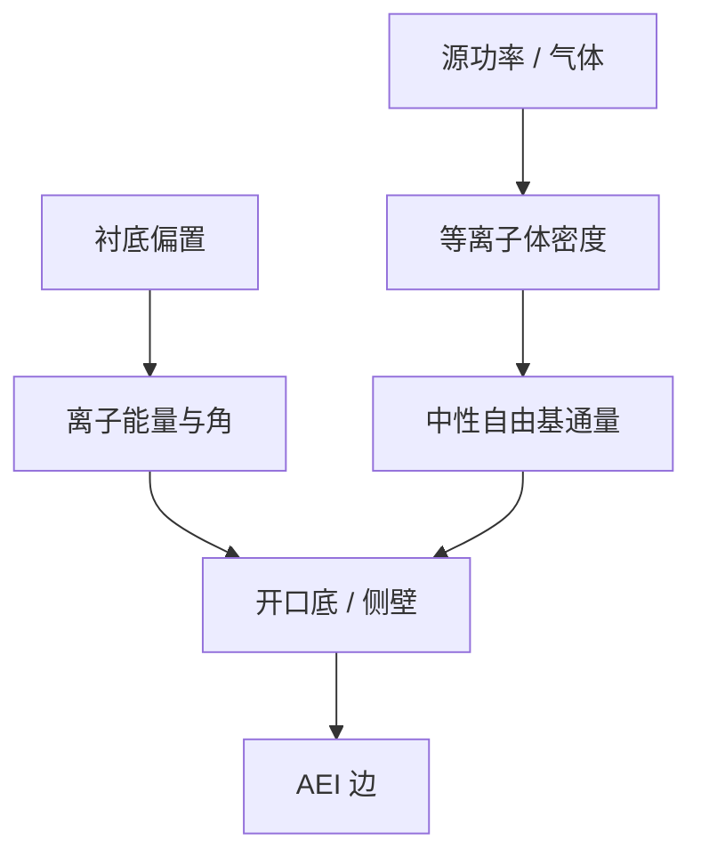

# 等离子体基础

胶浮雕只是有机掩模。把它变成介质槽和硅边的，是低气压放电里的离子与自由基，不是再一次投影光学。

<footer>—— 对照 Lieberman–Lichtenberg 等离子体放电基础；Coburn–Winters 表面协同</footer>

[上一课](/litho/metal-via-co-optimization)把金属–via 收成联立规则。缺口是转印：enclosure 的 AEI 值从腔体来，而仿真门的刻蚀核只是它的紧凑投影。本课起「集成、控制与良率」，钉等离子体基础。[RIE 转印](/litho/rie-pattern-transfer) 已写协同图像；这里补放电侧：物种、鞘层、偏置，供后课写选择比与钝化。选择比与 ARDE，留给[下一课](/litho/selectivity-arde）。

## 问题

电容耦合（CCP）与电感耦合（ICP）在产线共存：前者离子能量与密度耦得紧，后者可相对分开控密度与衬底偏置。鞘层把离子加速向晶圆，中性自由基靠扩散到达。图形化关心的不是等离子体物理全集，而是：到达开口的离子角分布、能量、以及中性通量——它们决定各向异性、损伤和速率。

缺口是**把腔体读成转印边界条件**，不是从麦克斯韦重讲电磁波。把「等离子体」当黑盒刻蚀按钮，APC 只能拧时间，无法理解为何换功率 CD 就走。

### 胶是消耗品电极

抗蚀剂同时是掩模和反应物：它被离子溅射、被氧/氟化学吃，产物进气相改变等离子体。薄胶使这层消耗成为 CD 预算。硬掩模课会把深度预算拆走；本课先承认放电「看见」的是胶与开口，不是版图。

偏置功率大致控离子能量，源功率控密度。拧错旋钮，损伤与选择比一起动。食谱是这对旋钮的合同，不是单一 RF 数字。

## 方法

工程量：源/偏置功率、气压、气体（Ar、CxFy、Cl/HBr、O2 等按层）、衬底温度。诊断（实验室）：Langmuir、OES、离子能量分析；产线更多靠 OES 与速率监控。与紧凑核的接口：核的密度项对应中性消耗与局部通量，短程项对应侧壁与角分布——校准仍用成对 ADI/AEI，本课只提供物理对应物。

EUV 薄胶使等离子体窗口更窄：能用来「修」CD 的过刻更少。

食谱窗口用代表开口矩阵而不是空白片：同一 RF，密线和孤立槽的离子角与中性消耗已经不同。Lieberman–Lichtenberg 给出放电语言；产线用 OES 和速率监控把语言接到每天的腔体，而不是每班重做 Langmuir。

## 机制

鞘层电压把离子准直到法向，气压升高碰撞增多、角变宽，各向异性下降。自由基不认方向，提供各向同性化学。Coburn–Winters 协同：离子协助表面反应，使侧壁（少离子）与底部（多离子）速率差出来。聚合物源气体在侧壁沉积，下一课钝化会展开；此处只把放电写成「离子 + 中性 + 沉积前体」三通量。

## 边界

本课不重写光学成像，不进入 LOB。不把某腔体未公开的速率表当自然常数。等离子体不稳定、打火、颗粒是良率项，后课缺陷再收。

后课默认：转印边界条件是离子角/能量与中性通量。下一课用它们定义选择比，并与已有 ARDE 课对接而不重写深宽比几何。

## 小结

- 图形化等离子体提供定向离子与各向同性自由基，鞘层决定角与能量。
- 源/偏置分控是食谱合同；胶同时是掩模和反应物。
- 紧凑刻蚀核是这些通量在边上的投影。
- 出处：Lieberman & Lichtenberg；Coburn–Winters；RIE 产线通称。
