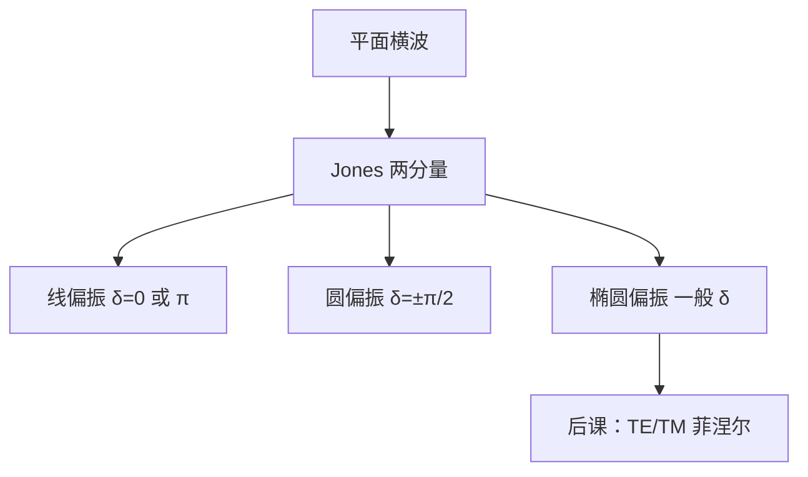

# 偏振：线、圆与椭圆

横波电场矢量随时间在垂直于传播方向的平面内描绘椭圆；线偏振与圆偏振是椭圆的两个特例，不是另三类光。

<footer>—— 据 Hecht, Optics 与 Born &amp; Wolf, Principles of Optics 对 Jones 矢量与偏振态的整理</footer>

[上一课](/litho/plane-wave-k)把平面波与波矢 $\mathbf{k}$ 钉死，并留下横波条件 $\mathbf{k}\cdot\mathbf{E}=0$。本课不重写色散关系。缺口是：垂直于 $\mathbf{k}$ 的平面里还有两个自由度，它们的振幅比与相对相位如何命名？后课 TE/TM 菲涅尔系数、照明偏振设置，都默认本课词汇。

## 问题

标量波动方程丢掉了一个指向。同一 $|\mathbf{k}|$ 下，线偏振、圆偏振、椭圆偏振在界面反射率与光栅耦合上完全不同。若只用一个标量振幅，无法解释为什么高 NA 下 s 与 p 要分开写，也无法读后课「偏振照明」在改哪一个分量。缺口是给电场两个正交分量一套最小语言，不是把光刻机的偏振控制器拆开。

### Jones 不是 Stokes 测光课

完全偏振、单色光用 Jones 矢量两复数就够。部分偏振、自然光、偏振度要用 Stokes 四参量与 Mueller 矩阵，那是仪器课。本课只建立 Jones，够读菲涅尔公式里的 s/p。把两者混成「偏振就是加一块偏振片」，后课边界条件会没有对象。

约定：沿 $+z$ 传播，$x$ 水平、$y$ 竖直。$E_x=E_{0x}e^{i\phi_x}$，$E_y=E_{0y}e^{i\phi_y}$。相位差 $\delta=\phi_y-\phi_x$ 决定椭圆取向与手性。时间因子仍用上一课的 $e^{-i\omega t}$。

## 方法

沿 $z$ 传播的平面波：

$$
\mathbf{E}(t)=\mathrm{Re}\bigl\{(E_{0x}\hat{x}+E_{0y}e^{i\delta}\hat{y})\,e^{-i\omega t}\bigr\}.
$$

线偏振：$\delta=0$ 或 $\pi$，合成矢量始终沿固定直线。圆偏振：$E_{0x}=E_{0y}$ 且 $\delta=\pm\pi/2$，端点描圆，手性由 $\delta$ 的符号决定。一般振幅与一般 $\delta$ 给出椭圆偏振；长轴倾角与椭圆率由三元 $(E_{0x},E_{0y},\delta)$ 共同决定，不必另造第四种「光」。

Jones 矢量 $\mathbf{J}=(E_x,E_y)^\top$（可差一个总相位）把态收成 $\mathbb{C}^2$。线偏振基 $|x\rangle=(1,0)^\top$、$|y\rangle=(0,1)^\top$；45° 线偏振 $\frac{1}{\sqrt{2}}(1,1)^\top$。偏振片与波片是 $2\times 2$ Jones 矩阵；本课不展开仪器，只保留「场是两分量相干叠加」。界面上把这两分量改写成 s（垂直入射面）与 p（平行入射面），下一课 [菲涅尔反射与透射](/litho/fresnel-coefficients) 各自乘不同系数。

## 机制

偏振是相干叠加：两个正交分量相位锁定时，合成矢量描椭圆；相位随机时变成部分偏振，本课不处理。反射与折射必须在入射面里分解，因为边界条件对切向 $\mathbf{E}$ 与切向 $\mathbf{H}$ 分别约束，s 与 p 满足的代数不同。高 NA 物镜边缘入射角大，$R_s\neq R_p$，标量成像与矢量成像的偏差从这里开始积累——本课只提供语言，不进入机台照明配方。

光刻物镜玻璃在设计上压低应力双折射，正是为了让进入晶圆的偏振态仍接近设计值。非常规晶体与磁光效应不在本课。标量衍射近似默认偏振效应可平均掉或次要；何时必须回到矢量 $\mathbf{E}$，见 [标量衍射的适用边界](/litho/scalar-diffraction-bound)。

## 边界

本课假定单色、完全偏振。部分偏振与光源去偏振在 [相干长度与光源带宽预备](/litho/coherence-length-prep) 与后课照明里处理。也不讨论椭圆率测量、补偿器标定。下一课把 s/p 的振幅比写成菲涅尔公式；布鲁斯特角与全内反射是再下一课。

后课默认：提到线、圆、椭圆，都是 Jones 两分量加一个 $\delta$；提到 s/p，就是相对入射面的分解。

## 小结

- 横波电场在垂直 $\mathbf{k}$ 的平面内；Jones 两分量加相位差 $\delta$ 描述偏振。
- 线、圆、椭圆是同一描述的特例，不是三种无关的光。
- s/p 分解为下一课界面系数做准备；仪器 Mueller 不在本课。
- 标量近似何时失效，留到本课程末课。
- 出处：Hecht, *Optics*；Born &amp; Wolf, *Principles of Optics* 第 1.4 节。
