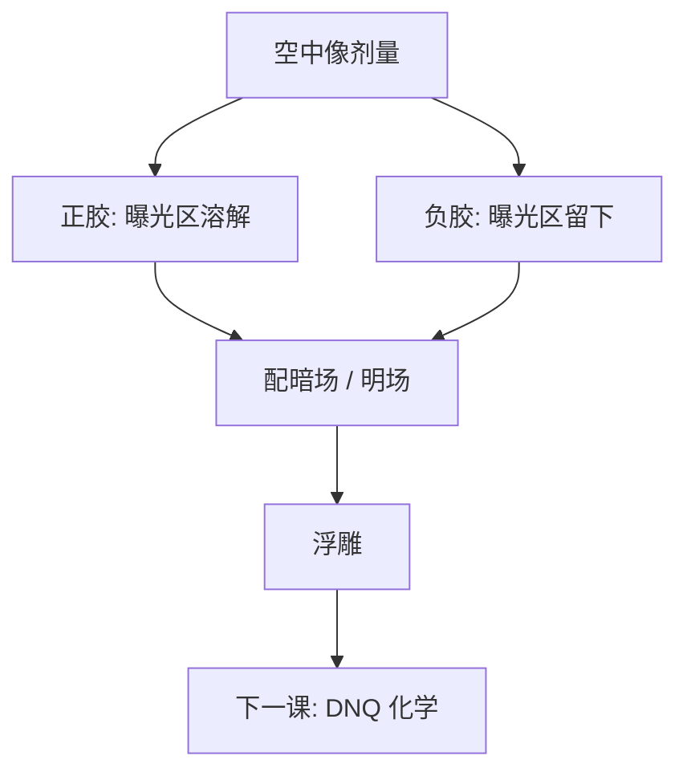

# 正胶与负胶

曝光区溶掉还是留下，是记录介质的极性：同一张空中像，正胶与负胶切出互补的浮雕，掩模明暗场要跟着换。

<footer>—— 据 Reiser 对光刻胶极性的表述，以及 Mack 对正负胶与明暗场的产线讨论整理</footer>

[上一课](/litho/focus-drilling)把成像与分辨率这门课收到走焦积分。扫描机写下的是剂量；缺口是记录介质如何把剂量切成浮雕——先钉极性，再谈具体化学。本课引入正胶与负胶。DNQ–酚醛从[下一课](/litho/dnq-novolac)写起，不要在这里提前做 i 线配方。

## 问题

走焦与剂量环解决的是能量如何落到晶圆上。胶要回答：哪些区域在显影后留下。正胶（positive tone）：曝光区极性变了或抑制剂被破坏，碱性显影液溶掉曝光区，留下未曝光浮雕。负胶（negative tone）：曝光区交联或网络致密，显影液溶掉未曝光区，留下曝光浮雕。同一空中像，两种极性给出互补图形。

缺口不是再讲一次狭缝积分，而是：层要的是「孔」还是「岛」，决定胶的极性与掩模是明场还是暗场。把所有层默认成正胶，会在孔层、切层上走冤枉路；把极性写成「先进等于负胶」，又会忽略 DUV 逻辑后段长期以正胶为主的事实。

### 极性不是先进指标

Reiser 把抗蚀剂科学写成感光聚合物的反应与溶解；正负是溶解行为相对曝光的符号，不是节点世代。Mack 强调还要配掩模色调：暗场掩模配正胶打孔，明场配正胶打岛，负胶则对调。色调选错，MEEF 与缺陷偏好一起换边。

「正性显影 / 负性显影」（PTD / NTD）说的是显影液相对有机溶剂的另一套色调，不要与本课的正胶/负胶分子机制混名。本课只钉曝光区溶还是留。

## 方法

选极性先问图形：要留下的是暗区还是亮区，缺陷是桥连更贵还是断线更贵，以及蚀刻要的是胶当掩模挡住哪里。正胶生态（显影、去胶、检测）在 KrF/ArF 上最熟；负胶在交联机械强度、某些孔与切层的亮区留下上有结构优势。EUV 金属氧化物胶多数走负胶工作点，那是后课化学，本课只承认极性可以跟化学家族绑定。

掩模：正胶 + 暗场 ≈ 曝光开口处开孔；正胶 + 明场 ≈ 曝光大面积、留下岛。负胶把这套对偶反过来。计算光刻的阈值模型要声明极性：同一张 $I(x)$，切「高于阈值溶掉」还是「高于阈值留下」，边的移动方向相反。

### 后课默认

说到 DUV 逻辑后段，默认正性 CAR，除非该层显式声明负胶或 NTD。说到「互补图形」，先问是换胶极性还是换掩模色调，两者可以互相替代一部分，但不能互相替代缺陷与侧壁的化学。

## 机制

正胶的典型路径是抑制剂破坏（DNQ）或保护基脱落（后课 CAR）：溶解速率随曝光上升。负胶的典型路径是交联：分子量上升，溶解速率随曝光下降。阈值附近，正胶的边在「刚好溶得动」的等剂量线上，负胶的边在「刚好交联住」的等剂量线上。光学 ILS 相同，边的噪声对剂量的符号相反：过曝让正胶孔变大、负胶孔变小（在孔层的常见配置下），这是后课曝光宽容度必须声明极性的原因。

侧壁与倒塌：负胶交联膜往往更硬，高深宽比有时更抗塌；正胶脱保护膜在显影液里更像溶蚀。这是后课图形倒塌的化学前置，本课只记下极性会改机械与表面能，不写毛细公式。

明暗场还改掩模缺陷偏好：暗场上的针孔变成晶圆上的多余曝光。极性选定之后，掩模检验规格要跟着色调走，不能沿用上一层的版。

## 边界

本课不写 PAG 分子、不写锡氧笼、不把某代接触孔「改用负胶」的新闻当普遍法则。也不讨论图像反转工艺（image reversal）的完整流程——那是正胶化学上再烘再曝光得到负像，属于特例，后课需要时再点名。

Focus drilling 摊开的是焦轴上的剂量叠加，极性仍然在显影这一步才出现；走焦不会把正胶变成负胶。产能会计里的剂量，对两种极性都是 $\mathrm{mJ/cm^2}$，灵敏度曲线形状不同，wph 账按该层 $E_0$ 走。成像课到此把「能量写下」交出来；化学课从极性开始，后课才进入 DNQ 与 CAR 的分子通道。

## 小结

- 正胶溶曝光区，负胶留曝光区；同一空中像切出互补浮雕。
- 极性要与掩模明暗场一起选，并声明给阈值模型。
- 正负不是先进指标；DUV 后段默认正胶，孔/切层可以另选。
- PTD/NTD 是显影色调，不要与正/负胶混名。
- 下一课从 DNQ–Novolac 进入具体正胶化学。
- 走焦不改极性；wph 按该层 $E_0$ 走，不按正负胶口号走。
- 出处：Reiser, *Photoreactive Polymers*；Mack, *Fundamental Principles of Optical Lithography*。
