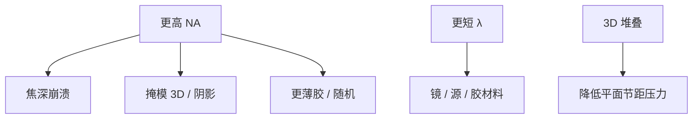

# Hyper-NA 之后的物理极限

再抬 NA 会继续削焦深、加厚掩模 3D 阴影、逼更薄胶；再缩波长碰到镜面、源与随机。极限是一张预算表的同时崩，不是单一瑞利等式的终点。

<footer>—— 对照 High-NA/Hyper-NA 讨论中的 DOF、mask 3D、随机与 6.x nm 设想；不重推分辨率公式</footer>

[上一课](/litho/fel-euv-source)说明源替代也不免费。缺口是投影光学这条主路的尽头怎么讲。本课钉 Hyper-NA 之后的物理极限，结束替代课序与本批课程。

## 问题

0.55 NA 已把半场、薄胶、anamorphic 掩模写进合同。再往上（公开讨论过的更高 NA）会：DOF 更薄（形貌课的台阶更致命）、入射角更大（掩模 3D 与吸收体阴影更毒）、胶更薄（选择比与随机更紧）、扫描机更大更贵。6.x nm（BEUV）设想改多层周期与源，材料与随机不会自动变好。3D 器件与键合把密度轴转到垂直，可能比再挤平面 k1 更经济——摩尔课的分母可以靠堆叠。

缺口是**多约束同时收紧**，不是再写一次 $k_1λ/\mathrm{NA}$。主干已教 DOF、随机、mask 3D；本课只把它们放到「再往下一代」的交点上。

### 不把极限当停工指令

物理墙移动成本函数，DTCO 可以选择停在某平面节距、改助推器、改 3D。极限课防止的是幻想「总会有下一档 NA」。

IRDS 红格与本课同构：没有已知解的格子，不是禁止研究，是禁止把格子当已交付。

## 方法

列预算：DOF vs 形貌、光子预算 vs 随机、掩模 3D vs 吸收体、资本 vs 交叉。任何新提案（更高 NA、BEUV、FEL、直写）必须同时过这张表。与良率：随机 p 与 $A_c$ 在更密节距上抬分母风险。

## 机制

成像系统把频率通带再打开一截，必然在 z 方向、角度方向、光子计数上付钱。这是傅里叶变换与泊松统计，不是某公司不愿意。垂直集成改变的是要印的平面节距需求，从而绕过而不是打破通带。

## 边界

不预言停在哪一代。不发明 6.x nm 量产时间。本课结束路线图门，不重开掩模制造。

后课若在附录：论文与型号对照这些墙，不插入主干。读者默认：平面光刻的下一档永远是多约束交，不是单参数。

## 小结

- Hyper-NA 之后同时碰到 DOF、mask 3D、薄胶随机与资本。
- 更短波长另开材料与源墙。
- 3D 堆叠可绕过而非打破平面通带。
- 新提案必须过整张预算表。
- 出处：High-NA 公开约束讨论；IRDS 需求红格定位；随机与 mask 3D 主干课的汇合。
