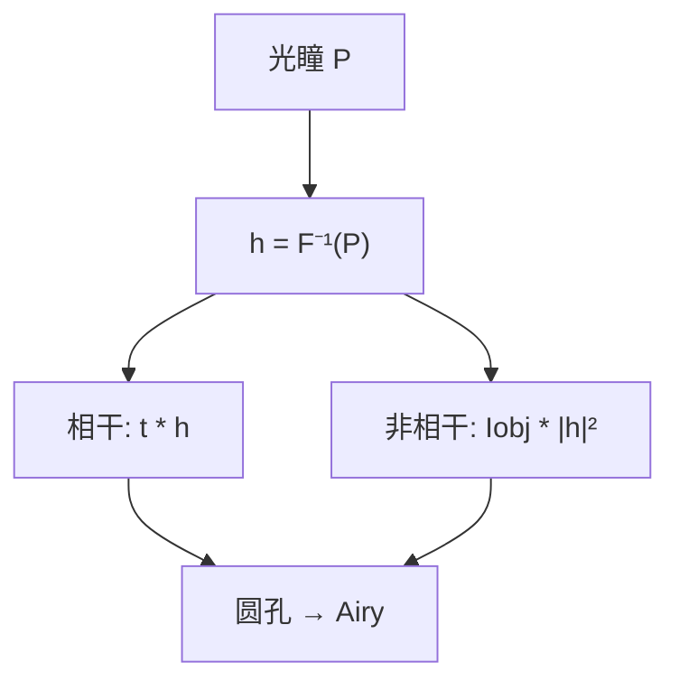

# 点扩散函数与 Airy 斑

圆孔光瞳的傅里叶逆变换是艾里斑；有限口径的全部糊边，先是这个核与物体的卷积，不是胶把边咬圆了。

<footer>—— Airy 圆孔衍射；Fourier 光学表述见 Goodman；显微镜两针孔读法见 Born &amp; Wolf</footer>

[上一课](/litho/sampling-theorem-imaging)把带限像放到了 Nyquist 网格上。缺口是：**连续核还没有名字**——频域的光瞳乘 $T$，空域就是点扩散与物卷积。本课钉 PSF 与圆孔的 Airy 斑。传递函数如何从核变出来，留给[下一课](/litho/ctf-otf)。不要把艾里第一暗环半径改写成产线 $\mathrm{CD}=k_1\lambda/\mathrm{NA}$。

## 问题

傅里叶对已经说 $\mathrm{circ}\leftrightarrow\mathrm{jinc}$。计算与计量仍常问：一个接触孔、一条孤立线，空中像的「光学直径」有多大。答案是振幅点扩散 $h=\mathcal{F}^{-1}\{P\}$（相干）或强度点扩散 $|h|^2$（非相干）。圆孔无像差时，$|h|^2$ 就是 Airy 斑：中心亮斑加一圈圈暗环。

缺口不是再证一次卷积定理，而是把这只核钉成后课二维图形的尺度：线端变圆、角被切、孔比线难，首先是因为核有宽度，其次才是胶与刻蚀。

### 相干核与非相干核

相干：$U=t*h$，$h\propto\mathcal{F}^{-1}\{P\}$。非相干：$I=I_\mathrm{obj}*|h|^2$。部分相干没有单只 PSF，但每个源点仍用同一只 $h$，只是物频谱相对光瞳平移。[Hopkins](/litho/hopkins-tcc) 把这些切片收成 TCC，本课不重写重叠积分。

Airy 斑的第一暗环约在 $0.61\,\lambda/\mathrm{NA}$（非相干强度、圆孔、空气）。这是显微镜里两斑刚可分辨的几何，见 Born &amp; Wolf。光刻产线式子带 $k_1$，见[瑞利课](/litho/rayleigh-litho)，本课不把 0.61 叫成 $k_1$。

## 方法

理想圆瞳、无遮拦、无像差：

$$
h(r)\propto \frac{J_1(2\pi r\,\mathrm{NA}/\lambda)}{r},\qquad
\mathrm{PSF}_\mathrm{inc}(r)=|h(r)|^2.
$$

$J_1$ 的第一零点给出暗环。有中心遮拦（某些 EUV 光瞳）或切趾，零点移动、旁瓣升高，仍叫点扩散，只是不再是教科书 Airy。离焦与像差进 $P$ 的相位，$h$ 变胖、旁瓣变形——机制在[离焦作为像差](/litho/defocus-as-aberration)，本课只承认核会变。

光学直径：核的有效宽度几个 $\lambda/\mathrm{NA}$。OPC 邻域、SRAF 是否印出、孤立孔的能量从哪来，都按这个直径截断，而不是按设计规则的「最小间距」截断。

### 落到上一课的网格

连续 Airy 在强度 Nyquist 上采样，旁瓣才不折叠。网格按节点名去取「每纳米一点」而不看 $\mathrm{NA}/\lambda$，会既浪费又可能仍采不足旁瓣。本课的核是连续对象；离散是上一课的接口。

## 机制

点物的谱是平的，光瞳切出一块圆，逆变换必是 jinc。扩展物等于许多点物的叠加：相干时场相加（干涉），非相干时强度相加。这就是「糊」的线性图像。[阿贝](/litho/abbe-imaging)用频谱语言说同一件事：通带外的高频回不来，空域就是核把锐边打斜。

两个邻近孔的像是两只核的重叠。重叠多少，下一课用传递函数读，再下一课用 Sparrow / Rayleigh 两种判据读。本课只提供单只核。

### 后课默认的接口

说到「光学糊了多少」，默认先问 $h$ 或 $|h|^2$ 的宽度，再问胶扩散。圆孔无像差时可以叫 Airy；有遮拦或 SMO 光瞳时叫「该光瞳的 PSF」，不要硬贴艾里暗环公式。

## 边界

标量圆孔 Airy 不含偏振、不含薄膜。高 $\mathrm{NA}$ 矢量沉积会让「有效核」随偏振与焦深变，定义仍是点物的像，数值不再是 $J_1$。也不要把 Strehl 比（有像差时峰值下降）在本课展开；那是核的峰值归一，见主干 Strehl 课。禁止用未公开的镜头「实测 Airy」表替代 jinc。

## 小结

- PSF 是光瞳的逆变换；圆孔给出 Airy（jinc / $J_1$）。
- 相干卷积场，非相干卷积强度；部分相干按源切片用同一 $h$。
- 光学直径几个 $\lambda/\mathrm{NA}$，是后课二维邻近的尺度。
- 0.61 是显微镜暗环几何，不是产线 $k_1$。
- 下一课：核的傅里叶伙伴——CTF / OTF。
- 出处：Airy；Goodman；Born &amp; Wolf。
