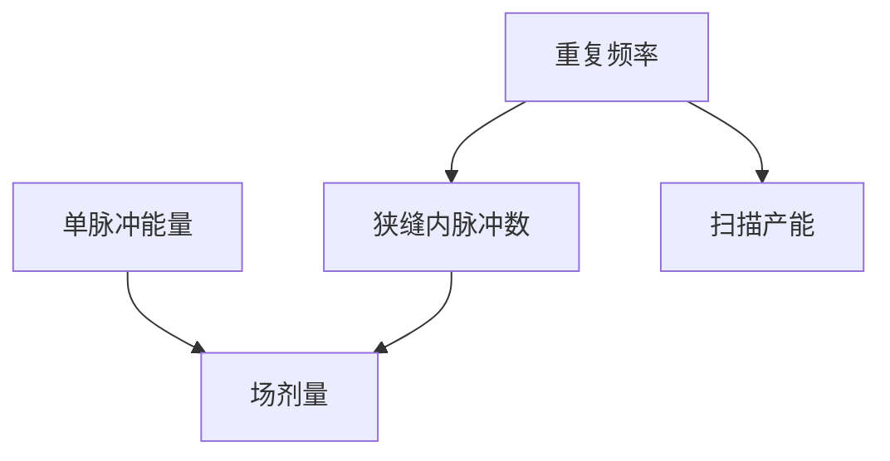

# 脉冲能量与重复频率

剂量是脉冲能量乘脉冲数；产能是重复频率乘扫描时间。两个数不能合成一个「激光功率」就结束。

<footer>—— 对照 [剂量控制](/litho/dose-control)、[扫描仪产能](/litho/scanner-throughput)</footer>

[上一课](/litho/laser-linewidth-narrowing)钉住带宽。缺口是能量怎么变成晶圆上的 mJ/cm²：单脉冲能量 $E_p$ 与重复频率 $f$。本课拆开这两项，不重写剂量传感器硬件（后课闭环）。

## 问题

平均功率 $P=E_p f$ 看起来够用，扫描时狭缝只看见有限脉冲数。$f$ 低则一场里脉冲少，剂量量化粗、斑纹平均差；$E_p$ 高则光学损伤与气体负担升。把「光源功率」写成一个广告数字，无法解释为何高剂量层要降速或加脉冲。

## 方法

剂量 $D \propto N E_p \times$ 照明透过率。扫描速度提高，$N$ 下降，必须升 $f$ 或升 $E_p$ 或加 [focus drilling](/litho/focus-drilling) 类的多次。脉冲能量稳定度进 CDU：脉冲间抖动直接是剂量噪声。本课只要求把 $E_p$ 与 $f$ 分列监控。

浸没头与工件台加速度限制扫描速度时，再升 $f$ 也灌不进更多脉冲——产能瓶颈会从激光挪到台。见后课工件台。

## 机制

每个脉冲在胶里是一次曝光增量。CAR 积分这些增量；若脉冲间隔与淬灭/扩散时间尺度相近，理论上有脉冲结构效应，量产上通常仍当剂量积分。损伤：高 $E_p$ 打镜头镀膜与 CaF₂。

## 边界

下一课气体寿命：维持 $E_p$ 的成本。剂量闭环硬件再后。

## 小结

- 剂量看 $E_p\times N$，产能看 $f$ 与扫描。
- 脉冲抖动是剂量噪声，不是「平均功率不够」。
- 出处：剂量与产能课；准分子运行通识。
