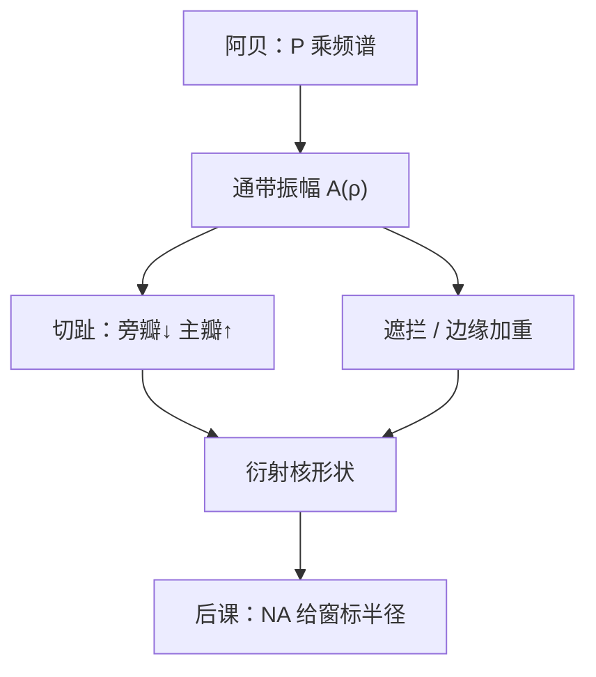

# 光瞳滤波与切趾

阿贝的光瞳可以不是砖墙：通带里的振幅沿径向再调制，旁瓣与主瓣一起改形状，这叫切趾，不是又一种缩比。

<footer>—— Born &amp; Wolf 对切趾的讨论；光刻光瞳滤波见 Mack, Fundamental Principles of Optical Lithography</footer>

[上一课](/litho/abbe-imaging)把成像收成物频谱乘光瞳 $P(\mathbf{f})$，并默认理想圆孔是硬切：通带内振幅为 1、带外为 0。缺口是：**通带内部的 $|P|$ 仍可以随光瞳坐标变**。相位留给后面的像差课；本课只动振幅。数值孔径如何把这扇窗的半径写成 $n\sin\theta$，留给[透镜与数值孔径](/litho/lens-na)。不要把切趾写成 RET 产品目录，也不要从 $k_1$ 起笔。

## 问题

硬切光瞳的相干点扩散是艾里一类核：中心瓣之外有环带。环带把能量送到不该亮的地方，相干旁瓣、孔周围的振铃都与此有关。若把 $|P(\rho)|$ 从中心向边缘逐渐压低（切趾），傅里叶核的旁瓣下降，主瓣变宽——分辨率与杂讯之间换权重。反过来，中心遮拦或边缘加重会抬高频、也抬旁瓣。缺口因此是光瞳上的**振幅滤波**，而不是再讲一遍「级次要进窗」。

阿贝已经允许 $P$ 为复透过率。本课把模与辐角拆开：模是切趾 / 遮拦 / 高斯衰减；辐角是离焦与 Zernike，后课再展开。

### 切趾不是衰减式相移掩模

相移掩模改的是物频谱 $T$，发生在掩模面。光瞳滤波改的是投影通道的 $P$，发生在傅里叶面。两者都能压零级或改权重，座位不同。把 attPSM 的透过率叫成切趾，会把物面与光瞳面搅在一起。

照明光瞳的整形（偶极、自由形状源）是源侧的 $S(\mathbf{f})$，不是投影 $P$。本课的滤波乘在成像光瞳上；源如何填窗，是部分相干课的 $\sigma$。

## 方法

写 $P(\rho,\phi)=A(\rho,\phi)\,e^{ikW}$。本课取 $W=0$，只设计非负振幅 $A$。常见工程形状：径向渐变（高斯或多项式切趾）、环形通带、中心遮拦。Born &amp; Wolf 把切趾当作衍射积分的权重；Mack 把它读成光刻里可插入的光瞳滤波器——用来改两束 / 三束的相对权重或压相干旁瓣。

相干成像：像场仍是 $\mathcal{F}^{-1}\{A\,T\}$，$A$ 不是砖墙时，等效核变胖、振铃变弱。部分相干时，$A$ 进入 Hopkins 的交叉系数，密图形的调制与孤立线的旁瓣被同一张 $A$ 牵动，不能只看艾里环。

### 能量与 NILS 一起搬家

压低光瞳边缘等于少收高频，NILS 通常下降，剂量轴变脆；压低旁瓣则孤立孔、线端更干净。中心遮拦相反：切掉靠近轴的低频通道，对比对某些节距上升，焦深与杂散行为另算。本课不选「最佳 $A$」；只要求后课写光瞳时允许 $|P|\neq\mathrm{circ}$。

镀膜均匀性、遮拦、pellicle 框架在光瞳上的阴影，都会变成非故意的 $A(\rho)$。计量上要把它与故意切趾分开，也与相位像差分开。

## 机制

硬切是矩形窗，频谱卷积出 sinc 环。切趾是把窗乘缓变包络，环的能量被打散，主瓣展宽——与信号处理里的窗函数同一件事，只是窗坐在光瞳上。光刻图形不是单点：周期级落在 $A(\rho)$ 的不同半径上，切趾等于给各级乘不同透过率，空中像的调制深度改了，阈值处的 ILS 跟着改。

故意滤波与像差不同：像差是相位，切趾是损耗或遮拦。两者相乘。把对比下降全部写成「像差变差」，会漏掉光瞳振幅这张图。

### 后课默认的接口

说到 $P$，默认可以带径向振幅，不只是 0/1。$\mathrm{NA}$ 仍未正式定义，窗的边缘下一课才变成合同上的 $n\sin\theta$；切趾是边缘以内的权重，不是把边缘搬家。

## 边界

本课不含可变形镜的相位图，不含 SMO 的源优化。也不要把 EUV 中心遮拦的几何面积当成已经切趾完毕：遮拦是 $A$ 的一种，反射镜相位是 $W$ 的一种。禁止编造未公开的光瞳透过率地图；教科书里的径向权重已经够说明机制。标量 $A$ 在高 $\mathrm{NA}$ 还要乘矢量投影，定义仍是「通带振幅可调制」。

## 小结

- 阿贝的硬切只是 $A=1$ 的特例；切趾 / 遮拦调制通带振幅。
- 旁瓣与主瓣此消彼长；各级落在不同 $\rho$ 上，调制被 $A$ 加权。
- 切趾在光瞳，相移掩模在物面，源整形在照明瞳，三处不要混名。
- 相位像差下一组课再写；$|P|$ 与 $W$ 相乘。
- 窗的半径由下一课的 $\mathrm{NA}$ 标定。
- 出处：Born &amp; Wolf, *Principles of Optics*；Mack, *Fundamental Principles of Optical Lithography*。
