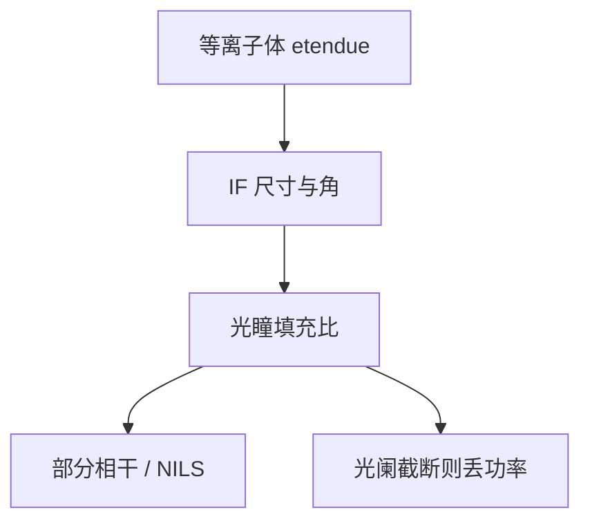

# 光瞳填充比

光源有尺寸和发散，光瞳只有那么大。填充比是 etendue 匹配：填太满，相干性差、对比掉；填不满，光子浪费在光阑上。

<footer>—— 对照 EUV 源–光瞳 etendue；ASML 对 pupil fill 与照明的公开讨论</footer>

[上一课](/litho/ring-field)把瞬时场收成弧。缺口是弧上每一物点对应的照明光瞳：等离子体和收集镜送来的 etendue，有多少能填进投影光瞳。具体开环形、极子还是 FlexPupil，留给[下一课](/litho/euv-illumination-settings)。

## 问题

环形场规定了物面几何。成像对比还取决于部分相干：光瞳填充比（pupil fill ratio, PFR）刻画源在投影光瞳里占的面积分数。LPP 等离子体不是点，收集椭球把它成像到 IF，IF 有有限尺寸和角分布。投影 NA 在掩模侧再被倍率缩小。etendue 不匹配时，要么源被光阑切掉（IF 功率浪费），要么填充过大（σ 太大，NILS 掉），要么填充过小（等效相干太强，斑纹和通过焦点摆动）。

缺口是 PFR 作为源与照明之间的合同，不是再画一条弧。收集镜变脏会改有效源形状，PFR 和 σ 图一起漂——清洗课的光瞳判据在这里变成成像量。

DUV 准分子经均光后可以近似均匀填瞳。EUV 的 IF 是二次源，填充受收集立体角和等离子体尺寸限制，不能当成无限可整形的朗伯灯。

## 方法

定义上，PFR 是照明在光瞳平面占用的通光面积相对完整光瞳的比；与传统 σ（外半径/NA）相关，但离轴极子、环照明要用面积比而不是单半径。设计：先按关键层 NILS 选目标填充，再反推 IF 尺寸和收集 NA 是否供得上。源变大有利于功率和稳定，不利于小填充的极子；源变小有利于 SMO 的激进光瞳，不利于 CE 和击中率。

计量：光瞳传感器看填充与均匀。剂量环只看积分能量会掩盖 PFR 漂移。SMO 换设置等于换 PFR 目标，必须确认源 etendue 仍覆盖，否则光阑吃光，产能暗中下降。

### etendue 守恒没有免费整形

照明可以把 IF 重成像、切光瞳，不能把相空间体积变小而不丢光。激进偶极要的是小填充、特定方位；源若天生填得更满，多出的 etendue 只能挡在光阑上，等于 IF 功率打折。功率路线加收集立体角，会直接顶高 PFR 下限，与 SMO 抢预算。

## 机制

部分相干成像里，源点互不相干，光瞳填充决定哪些衍射级对能干涉。填充增大，高频级的相干传递下降，解析力的「可用」部分变少，但斑纹和对准灵敏度往往改善。EUV 光子贵，既不能把功率扔在光瞳外，也不能为了 NILS 把填充收到源供不上。PFR 是这条刀刃。

收集镜径向 $R$ 不均等于给源加了一张渐变滤光片，填充形状畸变。磁场碎屑抑制或气锁挡板若挡掉一部分立体角，等效缩小 etendue，PFR 上限下降。功率路线加立体角，会直接顶到本课的匹配。

不要把 PFR 和「光源功率百分比」混为一谈。功率可以很高但填错地方；也可以 PFR 漂亮但带内瓦数不够。

## 边界

本课不罗列量产极子角度表，下一课才谈 EUV 照明设置。不重写 TCC 推导。PFR 合格而填充形状畸变，SMO 仍会失败——面积比不是 σ 图。出处：ASML pupil/illumination 公开讨论；Bakshi 源与照明；etendue 匹配通识。

## 小结

- PFR 是源 etendue 与投影光瞳的匹配，决定部分相干和有多少 IF 功率被光阑扔掉。
- 收集镜老化改变有效源形状，从而改变 PFR。
- 下一课在给定 PFR 预算下选具体照明。
- 出处：ASML；Bakshi。
