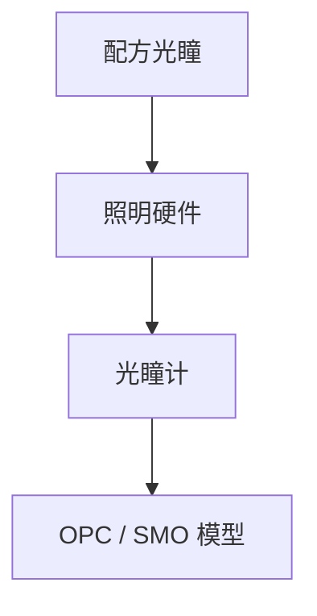

# 光瞳测量

配方写的环形 σ 是意图；光瞳计看到的才是进入物镜的角谱。SMO 没有计量就是开环。

<footer>—— 对照源计量 / pupil metrology；[FlexRay](/litho/flexray-pupil)、[SMO](/litho/smo)</footer>

[上一课](/litho/illumination-uniformity-slit)测场均匀。缺口是角向：部分相干与离轴照明活在光瞳。本课钉光瞳测量，不重推 Hopkins TCC。

## 问题

可编程光瞳会漂：镜子、积尘、通道失效。无计量时，偶极张角和 σ 外环只存在于配方文件。OPE 与 SRAF 对光瞳形状敏感，漂移表现为系统 CD 偏差，被误判成 OPC 模型过期。

## 方法

在照明光瞳共轭面用阵列传感器或扫描针孔重建 $I(\rho,\phi)$。指标：σ、环宽、偶极平衡、椭圆度、与目标图的 RMSE。进 SMO 闭环：测到的源才是计算光刻用的源，而不是 CAD 里的理想源。

掩模 3D 与物镜 NA 限制哪些角能进胶。光瞳计应报「离开照明」还是「到达晶圆」——两者差一层物镜与偏振。

## 机制

TCC 由源与光瞳共同决定。源计量误差线性进部分相干核。场均匀计量不替代光瞳计量。

## 边界

下一课剂量传感：标量能量闭环，不是角谱。两者都要，不能互相替代。

## 小结

- 光瞳计把照明从开环配方变成可校准角谱。
- SMO / OPE 必须吃实测源。
- 出处：源计量通识；SMO 与 FlexRay 课。
