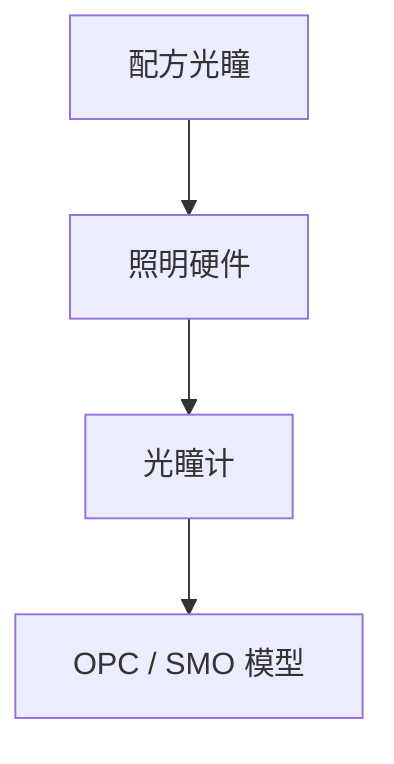

# 光瞳测量

配方写的环形 σ 是意图；光瞳计看到的才是进入物镜的角谱。SMO 没有计量就是开环。

<footer>—— 对照源计量 / pupil metrology；[FlexRay](/litho/flexray-pupil)、[SMO](/litho/smo)</footer>

[上一课](/litho/illumination-uniformity-slit)测场均匀。缺口是角向：部分相干与离轴照明活在光瞳。本课钉光瞳测量，不重推 Hopkins TCC。位置轴与角度轴正交：上一课管狭缝方向强度均不均，本课管每个方向上 σ 内外环、偶极张角与极平衡——两套账互不替代。

## 问题

可编程光瞳会漂：镜子、积尘、通道失效。无计量时，偶极张角和 σ 外环只存在于配方文件。OPE 与 SRAF 对光瞳形状敏感，漂移表现为系统 CD 偏差，被误判成 OPC 模型过期。

展开：可编程照明是数万面微镜拼出的软件图像，实现侧的漂移有三类——微镜倾角标定缓漂、个别镜单元卡死或失效、上游光学积尘把孔径边缘磨钝；偏振态再叠一层（[照明偏振](/litho/illuminator-polarization)）。落到成像上是几个可预算的症状：偶极两极失衡给出横竖线 CD 的系统偏差；σ 内外环漂移搬动 [iso-dense bias](/litho/iso-dense-bias) 与 Bossung 斜率（[Bossung 曲线](/litho/bossung-curve)）；辅助特征阈值随角谱漂，[SRAF](/litho/sraf-assist) 过印或欠印，热点被误报到 OPC 头上——模型被无端重标定，真正的源漂移还留在台上。

## 方法

在照明光瞳共轭面用阵列传感器或扫描针孔重建 $I(\rho,\phi)$。指标：σ、环宽、偶极平衡、椭圆度、与目标图的 RMSE。进 SMO 闭环：测到的源才是计算光刻用的源，而不是 CAD 里的理想源。

工程流程：机台内置光瞳填充传感器，按照明设置逐一取图；校准循环里把每个常用设置的 σ 内外环、极平衡、椭圆度与目标图 RMSE 记档，超限即触发微镜阵列再标定或上游除尘。计量结果直接写进模型库：[SMO](/litho/smo) 在实测源上优化，OPC 按机台实测源标定；做 [模型残差分析](/litho/model-residual-analysis)时先排除源漂移再怀疑模型，能省掉大半冤枉重标定。测量口径要统一：光瞳计报「离开照明」的角谱，「到达晶圆」还要过物镜与掩模三维，两套口径不能并表。

```mermaid
flowchart TD
  TGT["配方光瞳"] --> ILL["照明硬件"]
  ILL --> MEAS["光瞳计"]
  MEAS --> SMO["OPC / SMO 模型"]
```

掩模 3D 与物镜 NA 限制哪些角能进胶。光瞳计应报「离开照明」还是「到达晶圆」——两者差一层物镜与偏振。

## 机制

TCC 由源与光瞳共同决定。源计量误差线性进部分相干核。场均匀计量不替代光瞳计量。

写透一点：TCC 是源点加权的瞳函数自相关，源强度的小误差以 $\delta\mathrm{TCC}\approx(\partial\mathrm{TCC}/\partial S)\,\delta S$ 的形式线性进空中像——这正是源误差不需要重推理论、只需要计量与替换的原因。源误差还要分类：形状误差（σ、环宽、张角、极平衡）改成像对比与方向性偏置，能量误差归剂量闭环管，两路别混。极平衡偏差在成像上是有方向的偏置，正是它让横竖线在同一场里反向漂，是最容易被误认成镜片像差的源侧症状。

## 边界

下一课剂量传感：标量能量闭环，不是角谱。两者都要，不能互相替代。剂量闭环管总光子数，光瞳计管光子往哪个角度去；一边失控表现为 CD 整体漂，一边失控表现为方向性偏置与热点。

## 小结

- 光瞳计把照明从开环配方变成可校准角谱。
- SMO / OPE 必须吃实测源。
- 源误差经 TCC 线性进像，先查源再怪模型。
- 出处：源计量通识；SMO 与 FlexRay 课。
