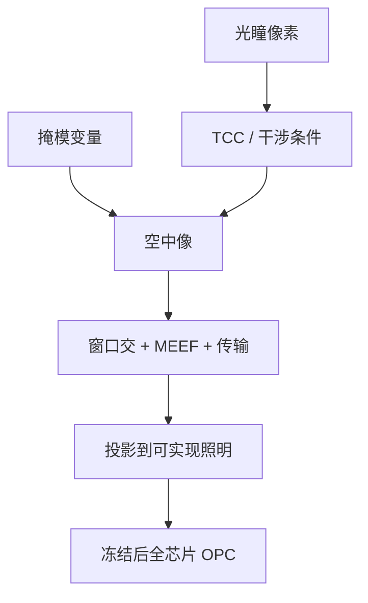

# 光瞳图优化

自由光源不是把瞳面调亮，而是把能量像素化地分配到能形成干涉的那些点上；花瓣图若不能被扫描仪实现，只是计算域里的最优。

<footer>—— 对照 ASML 对 SMO 与自由成形照明的公开论述</footer>

[上一课](/litho/smo)已经把 SMO 收成光源与掩模的联合逆问题：光瞳改 TCC，掩模在既定通带里修边。缺口是光源那一侧的表示。传统 RET 只在常规、环形、偶极、四极里选；自由光瞳把瞳面切成像素（或极坐标基），每个像素的强度成为优化变量。本课钉光瞳图。像差与波前如何再进协同，留给[下一课](/litho/smo-plus-wavefront)。

## 问题

部分相干成像里，光源上每一点对应一组倾斜照明。像素化之后，变量数从「几个 σ 和叶片角」变成几百到上千个瞳面自由度。可行集变大，二维逻辑与 SRAM 的窗口交才有机会同时活；可行集也变脏：扫描仪的柔性照明器有最小特征、能量效率、热负载和衍射光学元件的可制造性。优化若不管这些，会输出一张漂亮但照不出来的灰度图。

目标函数必须是一批关键 clips 的窗口交，而不是单条密线的对比冠军。某一像素变亮，可能抬高某一取向的 NILS，同时让正交取向的焦深崩溃。缺口因此是：在可实现光瞳上搜，而不是在任意 $L^2$ 函数上搜。

### 像素不是独立旋钮

相邻像素通过光学传递和照明器约束耦合。把 SMO 理解成「每个像素调一个百分比」会得到高频噪声光瞳，成形效率差、对对准误差敏感。工程上要平滑、对称（或按 EUV 阴影故意不对称）、以及最小孤岛尺寸。ASML 公开的自由光源能力，指的是照明器能逼近的那类图，不是任意位图。

光瞳图的坐标是照明瞳，不是投影物镜的成像瞳。两者相关但不是同一张图。把 SMO 输出直接当成波前校正图，会把下一课的自由度提前用错。

## 方法

典型参数化：笛卡尔像素、扇区、或 Zernike/极坐标基。优化在代表性单元、SRAM、孔与切层 clips 上跑，掩模用边碎片或粗像素，成本含 PV-band、MEEF、ILS，外加光源传输惩罚。收敛后把连续图投影到照明器可实现集合（叶片、DOE、FlexRay 一类柔性照明的公开能力），再冻结，全芯片 [OPC](/litho/opc) 或 ILT。

EUV 上 6° 主光线让水平/垂直不对称，光瞳图常常是取向相关的自由形状，再由设计规则限制允许节距。DUV 浸没已经证明自由光源能在不改 NA 时再挖一截 $k_1$；EUV 上这一截用来换更少双重，或给随机预算留对比余量。

### 从种子到可实现投影

从环形或偶极种子出发，比从白噪声瞳开始更稳，因为目标非凸。投影步骤不可省：计算最优与机台最优之间的差，要在硅上验证，不能只报优化器 loss。传输过低的光瞳会拉长扫描时间，把[光子预算](/litho/photon-shot-budget)的剂量上限往下拉——光瞳图因此也是产能图。

## 机制

Hopkins 的 TCC 由光源与瞳函数决定。改像素即改 TCC 的谱结构，空中像算子的本征方向跟着转。掩模变量通过这个算子映射到轮廓。联合优化在「光源可行集 × 掩模可行集」上走；光源是场级全局变量，所以只能在抽样 clips 上动光瞳，不能让每一标准单元拥有自己的光瞳。

MEEF 把掩模误差放大。某些高对比光瞳把 MEEF 抬到掩模厂接不住。光瞳图优化必须把 MEEF 与 MRC 放进成本，否则窗口数字好看，版写不出来。

宣传材料里的花瓣光瞳若没有对应的掩模协同和全芯片 OPC，只是照明器能力演示。评价要看冻结该光瞳之后全芯片的 PV-band，而不是 clips 上的对比度冠军。

## 边界

光瞳图优化不增加 NA，不缩短波长。它只在现有透镜通带里重新分配能量。未抽到的热区会在量产中冒出来，通常用 OPC 补丁，而不是每周改光瞳——光源一改，所有层 OPC 重放。计算量在定规则阶段，真正的 CPU/GPU 墙仍在全芯片修正。

后课默认：自由光瞳是像素化并可投影到照明器的那张图；下一课再把投影光学的波前自由度加进去。

比较两张光瞳要同时报：关键图形窗口交、MEEF、照明效率、以及换成该光源后 OPC 的掩模复杂度。

## 小结

- 光瞳图优化把照明能量像素化，改的是干涉条件，不是总亮度。
- 必须投影到扫描仪可实现集合，否则最优不可照明。
- 光源是场级变量，只在代表性 clips 上优化再冻结。
- EUV 阴影让自由光瞳取向相关；MEEF 与产率必须进成本。
- 出处：ASML 关于 SMO 与自由成形光源的公开方法。
