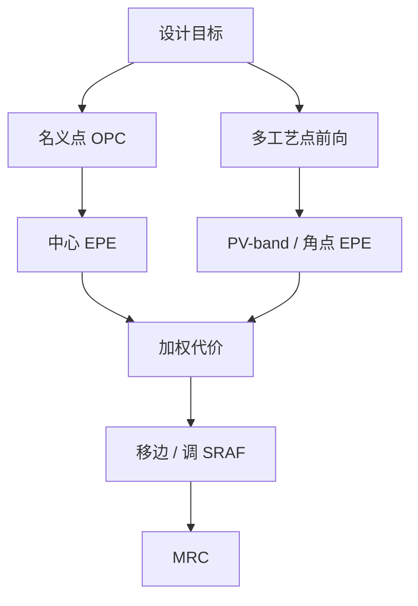

# 工艺窗口 OPC

名义剂量、名义焦点上的边放对了，窗口角上仍可能先死；修正必须在工艺矩形里同时成立。

<footer>—— 对照 Cobb 模型基 OPC 与计算光刻中对多工艺点 / PV-band 的公开论述</footer>

[上一课](/litho/rule-vs-model-opc)把规则表换成可迭代的成像模型，EPE 在校准过的前向里收敛。缺口是：那个前向默认钉在一个工艺点上。剂量、焦点、甚至光源微扰一扫，名义最优边会在角点炸窗。本课钉工艺窗口 OPC（PW-OPC / 多工艺点 OPC）。刻蚀如何再把轮廓挪一截，留给[下一课](/litho/etch-in-opc）。

## 问题

模型 OPC 的主循环最小化名义条件的边缘放置误差。光刻的合同却是工艺窗口：剂量与焦点在规格矩形内，CD、线端、孔都不越界。名义拟合把碎片推到中心点最优，角点上对比不足或旁瓣升起，PV-band（process variation band）吞掉套刻余量。规则 OPC 更没有「角点」概念，只有中心点标定。

Cobb 把全芯片迭代做成可能之后，计算光刻的下一步不是更碎的碎片，而是同一套模型在多个工艺点上求一个折中掩模。问题是向量目标：中心点 EPE、焦外 EPE、剂量边 EPE，有时还加光源误差，必须写成一个可加权的代价，而不是修完中心再「看一眼」窗口。

### PV-band 是轮廓包络，不是再报一个 CD

在焦点–剂量网格上模拟一圈，轮廓的并集就是 PV-band。带太宽，电学短路或断路；带歪，说明名义 OPC 把边推到了窗口的悬崖。PW-OPC 的目标是把这条带收进设计规则允许的管道，而不是让中心线贴着目标。

只报名义模拟 EPE，等于只报训练集 loss。签核要写清：哪些工艺点进了代价函数，PV-band 是否含胶与（尚未进入的）刻蚀。

## 方法

在碎片循环里，每次前向不只求名义空中像，而求一组工艺点（典型：焦外 ±、剂量 ±、或其子集）。每个碎片的移动使各点 EPE 的最坏值或加权范数下降，并仍受 MRC 约束。工艺点太多则全芯片算不动；太少则漏掉真正的角。工程是选能代表矩形顶点与已知禁戒节距的点。

SRAF 对窗口往往比主图形更敏感：助条在名义下印不出，焦外或过量下可能印出。PW-OPC 必须把 SRAF 打印风险当成工艺点约束，而不能只在中心点删助条。

### 与 SMO 的分工

[SMO](/litho/smo) 先选光源与设计规则，把窗口家族做大；PW-OPC 在给定光源下把每条边收到带内。没有 SMO 的 PW-OPC 会把掩模修成碎形去硬扛坏光源；没有多工艺点的 OPC 会把 SMO 做出的窗在全芯片上局部送掉。

## 机制

名义最优与稳健最优不是同一个掩模频谱。中心点爱用高频衬线贴拐角；角点需要更保守的对比，往往少一点锐角、多一点助条余量。投影透镜丢掉的级次在焦外更敏感，所以 PW-OPC 会自然抑制「只在正焦有用」的修正。

计算量近似按工艺点数倍增，因此要分层：热区多点，规则区少点；或用 PV-band 的包络近似代替全网格。GPU 加速的是同一物理模型的重复前向，不是换一个不稳健的代理。

Cobb 原文解决的是「全芯片模型迭代如何快」。多工艺点是这条路上的目标函数升级，不是另一门学科。不要把 PW-OPC 写成与模型 OPC 并列的商标。

## 边界

本课仍在抗蚀剂轮廓（或光学阈值）上谈窗口。刻蚀负荷、胶紧凑模型的内部参数，后两课才进循环。随机缺失孔不是均值 PV-band 能收住的，加再多工艺点也抹不平泊松尾。

不要发明某 EDA 供应商的内部代价函数名当课程标准。后课默认：说到 OPC 收敛，先问是中心点还是工艺矩形。

「窗口 OPC」不是把工艺窗口画进版图当装饰。它改的是掩模边，评价的是模拟带，签核仍要晶圆 FEM。

## 小结

- 模型 OPC 若只拟合名义点，角点 PV-band 会先死。
- PW-OPC 在多个剂量/焦点上求折中掩模，目标是包络而不是中心线。
- SRAF 打印风险必须当工艺点约束。
- 计算量随工艺点涨；热区加密、规则区减点。
- 出处：Cobb 模型基 OPC；计算光刻对多工艺点 / PV-band 的公开论述。
