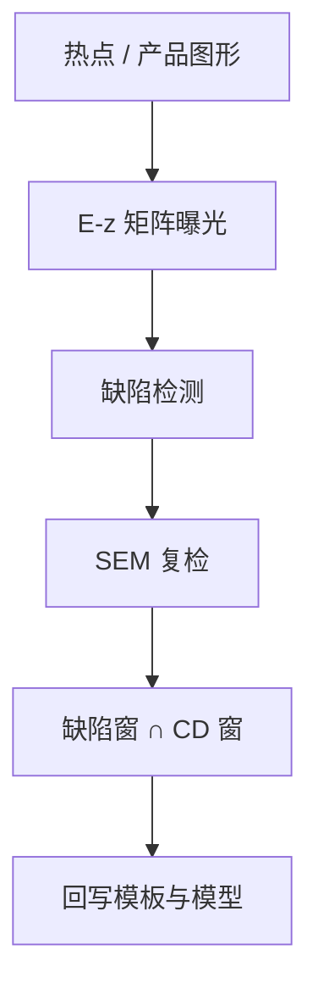

# 工艺窗口鉴定 PWQ

模型说窗还在，硅上未必还在。PWQ 把剂量与焦点故意拉到规格角，用检测而不是只靠 CD-SEM 平均，找出先死的那些场。

<footer>—— 对照工艺窗口鉴定（PWQ）产线通称；与 FEM / E–D 矩阵及缺陷检测的公开衔接</footer>

[上一课](/litho/pattern-matching)标出「长得像杀手」的 clips。缺口是实验：这些候选以及模型没见过的图形，在真实胶、真实扫描机上，窗口角是否先桥、先断、先掉孔。本课钉 PWQ（process window qualification）。全场模型签核的工具链，留给[下一课](/litho/lrc-orc）。

## 问题

[E–D 窗口](/litho/ed-process-window) 用选定 gauge 的平均 CD 切窗；[随机窗](/litho/stochastic-process-window) 用缺陷率切第二张窗。PWQ 是把后者做成品化：在产品或准产品版图上做焦点–剂量矩阵（或扫描机的 PWQ 序列），每场用缺陷检测扫桥连、断线、缺孔、残胶，再 SEM 复检。它回答的不是「某条线的 Bossung」，而是**这层产品图形在窗角会不会出系统缺陷**。

缺口是**鉴定协议**，不是再画一次均值窗。只在标称点做缺陷扫描，等于假设窗口矩形内部平坦——热点课已经否定这一点。

### PWQ 不是 FEM 的别名

FEM（focus-exposure matrix）常在测试芯片上量 CD。PWQ 强调产品相关图形 + 缺陷检测为主、CD 为辅。两者都动 $(E,z)$，但判决物不同：一个是纳米，一个是 killer 计数。把 FEM 的 CD 合格当成 PWQ 通过，会把稀疏二维失效漏掉。

PWQ 场是「故意做坏」的场，不能流到良率账里当普通废品。批次与分派要隔离，否则 APC 会把鉴定矩阵当成漂移去补。

## 方法

版图：产品关键层，或把热点 clips 嵌进 PWQ 掩模。矩阵：剂量、焦点（有时加套刻偏移）覆盖规格矩形及以外一圈，用来看见悬崖位置。检测：亮场/暗场光学扫全场，电子束补小缺陷。判决：缺陷密度对 $(E,z)$ 的等高线，与均值 CD 窗求交。与 [ADI/AEI](/litho/adi-aei) ：PWQ 常在 ADI 做，因为重工便宜；最终仍要抽 AEI，避免只鉴定胶上的窗。

匹配课的模板在这里被证实或证伪：硅上新杀手要回写模板库和模型残差。

矩阵不必是全规格的笛卡尔积：可先沿焦轴和剂量轴做十字，再在失败象限加密。Levinson 把工艺窗口写成可鉴定的面积；PWQ 把面积的判决物换成缺陷计数。扫描机公开的 PWQ 序列只是把这场鉴定编进曝光菜谱，不改变物理。矩阵规模受扫描机时间约束：角点必须含规格矩形顶点，中间点用来看悬崖斜率。缺陷检测配方与量产同一灵敏度，否则鉴定窗和出货窗对不上。

## 机制

离焦掉 NILS，二维线端和孔先掉；过剂量或欠剂量把桥/断推向相反方向。PWQ 检测看到的是这些失效的空间爆发，不是平均边的平移。扫描机序列把不同 $(E,z)$ 编进不同场，使一张版、一次过机完成矩阵——这是鉴定产能，不是日常曝光食谱。

缺陷窗与均值 CD 窗的交集才是量产停靠点。只交 CD 窗，会把随机桥连和二维失效留在规格矩形的角上——随机窗课已经警告过，PWQ 是它的产品化。

## 边界

PWQ 覆盖不了所有产品邻域，也不覆盖腔体老化后的刻蚀窗。不编造某节点「PWQ 零缺陷」的公开数字。EUV 随机需要更大统计，单次 PWQ 矩阵可能不够。

后课默认：硅上缺陷窗是模型签核的锚；下一课 LRC/ORC 用模型在全场近似这场鉴定。

## 小结

- PWQ 用产品图形的 $(E,z)$ 矩阵加缺陷检测鉴定窗口，不只靠 CD。
- 鉴定场必须与量产分派隔离。
- 新杀手回写匹配库与紧凑模型。
- 出处：PWQ 产线通称；Levinson 对工艺窗口与缺陷的讨论；检测工具公开方法。
