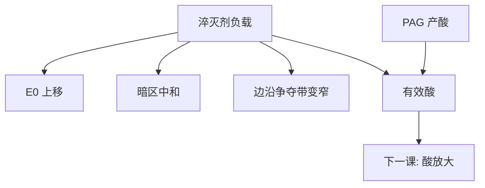

# 淬灭剂负载

碱不是「有或没有」：负载决定打过阈值要多少酸、暗区还能收住多少漏酸，灵敏度与模糊在同一根浓度轴上对调。

<footer>—— 据 Ito / Willson 化学放大思路，以及 Mack 对淬灭剂加载与阈值的表述整理</footer>

[上一课](/litho/pag-quencher)把 PAG 与淬灭剂写成一对旋钮，并停在「有效酸 ≈ 生成酸 − 碱」。缺口是把碱这一侧展开成负载：浓度怎么走 $E_0$、暗区与后课才出场的酸程。酸放大器是额外增益，留给[下一课](/litho/acid-amplifier)。PEB 温度仍不出场。

## 问题

上一课已经说明阈值首先是化学的。产线改配方时，却很少只问「加不加碱」，而是问加多少。淬灭剂负载（loading）是膜里碱的摩尔浓度（或与 PAG 的摩尔比）。负载升高：必须生成更多酸才能打过中和，清场剂量 $E_0$ 上移；暗区与 flare 产的那点酸被收得更干净；边沿争夺带变窄，后课扩散核等效缩短。负载太低：灵敏，但暗区起雾、环境胺一来顶部就被额外淬灭成 T-top。

缺口因此是浓度轴，不是再定义一次淬灭剂。把负载写成越大越好，会把扫描产能打穿；写成越小越好，会把暗区与延迟 PEB 稳定性交出去。

### 摩尔比先于重量百分比

换一种分子量更大的碱，同样 wt% 对应更少的分子数。签核用 PAG/淬灭剂摩尔比，或用「中和当量剂量」这种可测代理。193 nm 聚合物自身吸收不可算进产酸，负载实验必须固定光学栈，只改这一对。

环境胺是额外的、从表面进来的淬灭，不是配方负载的一部分。提高配方内碱可以抗污染，却把 $E_0$ 整根抬起来。上层涂层管表面胺，不代替本课的本体负载。

## 方法

工程上扫一条负载曲线：固定 PAG，变碱浓度，测 $E_0$、衬度、暗侵蚀、CD 与 LWR。通常看到：灵敏度变差、暗区变干净、iso–dense 与线端会动——因为阈值切点在空中像剖线上搬家。光可分解淬灭剂让亮区碱自己拆掉，负载的「暗区」与「亮区」不再同一浓度；本课只承认这种不对称，不写分子式。

与 PAG 联合：只加碱不加 PAG，酸图幅度不够，窗会先在密节距关上。只加 PAG 不加碱，增益高，漏酸。Ito 的放大解决光子少；负载解决放大之后暗区不能也亮——上一课的句子，本课变成一条可扫的轴。

### 后课默认

说到 CAR 配方，默认声明淬灭剂负载（或摩尔比），而不是只报「含碱」。酸程 $\ell$ 仍留给 PEB / 扩散课；本课只把负载记成缩短 $\ell$ 的化学库存，不给纳米数。

## 机制

曝光结束时酸浓度近似随剂量升。碱是预置的汇：浓度 $Q$ 把「有效酸」的零点从 0 挪到 $Q$。空间上，亮区中心 $Q$ 先被耗尽，催化全速；暗区酸永远低于 $Q$，脱保护接近零。边沿是 $Q$ 与产酸梯度的交战，负载高则交战区更靠亮区一侧、更窄。Mack 把这写成阈值与衬度的化学来源；光学 $I_\mathrm{th}$ 只是把这条化学零点映射回强度。

负载也改环境窗口：表面胺消耗顶部的酸，等效局部加 $Q$。本体 $Q$ 高，相对扰动小；本体 $Q$ 低，T-top 先出现。这不是轨道事故的全部，但是配方能买的那一截裕量。

EUV 上二次电子产酸，碱负载仍然是阈值，但事件稀疏，过高负载会把随机缺失推向更差的剂量。本课默认 DUV CAR；EUV 只警告不要把 ArF 负载表直接复印。

## 边界

本课不写某供应商的 wt% 表，不把 Ito 早期实验剂量当浸没工艺点。负胶 CAR 里碱仍在收酸，留下的是交联区，负载轴的方向相同、显影符号相反，不另开百科。酸放大器会在下一课把「生成酸」再乘一截，负载的零点还在，只是酸的来源变多，联合标定必须重做。

出气与镜头污染跟 PAG 挥发性更紧，跟无机碱负载不是同一卫生账。不要用加碱当抗出气处方。延迟 PEB 与环境胺实验是负载够不够的判据之一，不要只用灵敏度一张图签核——上一课已经要求过，本课把它绑在浓度轴上。

## 小结

- 淬灭剂负载是浓度轴：抬 $E_0$、收暗区、收窄边沿争夺带。
- 用摩尔比或当量剂量签核，不要只报 wt%。
- 与 PAG 联合标定；碱不是越大越好。
- 环境胺是额外淬灭；本体负载只买相对裕量。
- 酸放大器是下一课的额外增益，不改「零点是碱」的定义。
- 延迟 PEB 与环境胺实验要和负载曲线一起签核。
- 出处：Ito &amp; Willson 化学放大；Mack, *Fundamental Principles of Optical Lithography*。
