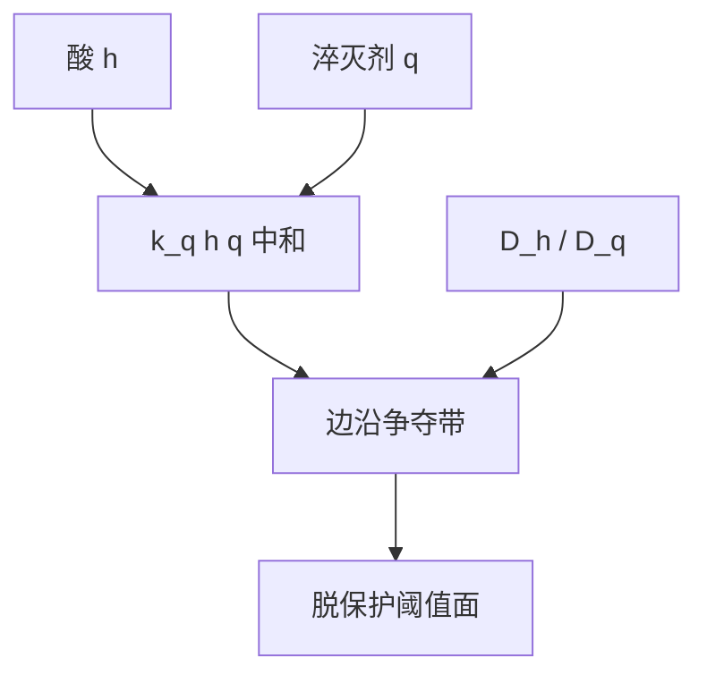

# 淬灭剂中和动力学

碱不是背景常数：它与酸双分子湮灭，边沿的争夺带宽度由中和速率与扩散一起决定。

<footer>—— 据 Mack 对产酸–中和阈值的表述；配方侧见 PAG / 淬灭剂对</footer>

[上一课](/litho/peb-reaction-diffusion)写出了酸的扩散与催化，却把汇写成省略号。[PAG 与淬灭剂](/litho/pag-quencher)和[淬灭剂负载](/litho/quencher-loading)已经把碱钉成阈值库存。缺口是动力学：中和多快、是否扩散限制、争夺带如何进衬度。本课补 $k_q h q$。显影速率如何切这张脱保护场，留给[下一课](/litho/development-rate-model)。

## 问题

有效酸「$\approx$ 生成酸 $-$ 碱」是积分守恒的口语。PEB 期间酸与淬灭剂都在走，局部湮灭

$$
\frac{\partial h}{\partial t}=\nabla\cdot(D_h\nabla h)-k_q h q,\qquad \frac{\partial q}{\partial t}=\nabla\cdot(D_q\nabla q)-k_q h q
$$

才是场方程。$k_q$ 很大时，中和几乎一遇即灭，前沿变成酸碱相遇的反应面，有效 $\ell$ 被库存比压短——负载课说过的「争夺带变窄」，现在有速率。$k_q$ 有限时，酸可以穿过碱区一段再灭，核更胖，暗区漏催化。

缺口不是再定义淬灭剂，而是：阈值轮廓是中和动力学的等值面，不是光学 $I_\mathrm{th}$ 的别名。

### 光可分解淬灭剂只改初值

某些配方让曝光区的碱自己分解，亮区 $q$ 初值低于暗区。动力学形式不变，只是 $q(x,0)$ 不再均匀。本课承认这种不对称，不写分子式。不要把它当成另一种光学对比度。

环境胺是从表面进来的额外 $q$，造成 T-top。那是边界条件，不是本体 $k_q$ 的标定。延迟 PEB 让表面淬灭有时间深入，看起来像「中和变快」，根子是等待，不是速率常数漂了。

## 方法

拟合：固定 PAG，扫负载，看 $E_0$、侧壁与 LWR；再扫 PEB $T$，看争夺带是否随 $D_h/D_q$ 变。若 CD 只随库存比走、几乎不随 PEB 时间在中和段变化，可取瞬时中和极限，方程降阶。若暗区起雾对 PEB 时间敏感，必须保留有限 $k_q$。

与酸扩散课的接口：淬灭剂缩短有效 $\ell$，是本课湮灭项的后果，不是另加一颗独立核。OPC 紧凑模型若只有一颗高斯、没有碱项，换负载等于整颗核重拟合。

## 机制

亮区中心酸远多于碱，碱先被灭光，催化按上一课的 $k_a h m$ 全速。暗区碱远多于酸，酸进得去也活不久，$m$ 几乎不动。边沿两者相当，反应面的位置随剂量（酸总量）移动——这就是化学阈值。Mack 把光学强度映射到这条面上；NILS 决定面随剂量横移多少，中和动力学决定面有多薄。

碱分子若比酸大，$D_q$ 更小，反应面更靠暗区一侧被酸「推」着走。负载升高，推到同一 CD 需要更多酸，灵敏度下降。这与配方课同一句话，本课指出执行它的是 $k_q$ 与两套 $D$。

EUV 事件稀疏时，碱分子计数本身成为随机源，连续场 $q$ 会撒谎。那是[酸与淬灭剂计数](/litho/acid-quencher-counting)的缺口；本课平均场仍然成立，作为后课抽样的均值。

## 边界

不报某配方的 $k_q$ 数值当宇宙常数。负胶交联体系碱仍在收酸，留下的区域符号相反。酸放大器会额外产酸，中和零点还在，联合标定必须重做——主干[酸放大器](/litho/acid-amplifier)已警告过，本课不重开那一节。

下一课默认脱保护场 $m(x,z)$ 已经含中和，再问溶解速率 $R(m)$。

## 小结

- 中和是双分子湮灭，争夺带宽度由 $k_q$ 与 $D_h$、$D_q$ 决定。
- 「生成酸 $-$ 碱」是守恒口语；轮廓是反应面。
- 瞬时中和极限给出更陡阈值、更短有效 $\ell$。
- 环境胺是边界 $q$，不要并进本体 $k_q$。
- 平均场 $q$ 是后课计数噪声的均值。
- 出处：Mack 对产酸–中和；[PAG 与淬灭剂](/litho/pag-quencher)的库存语言。
