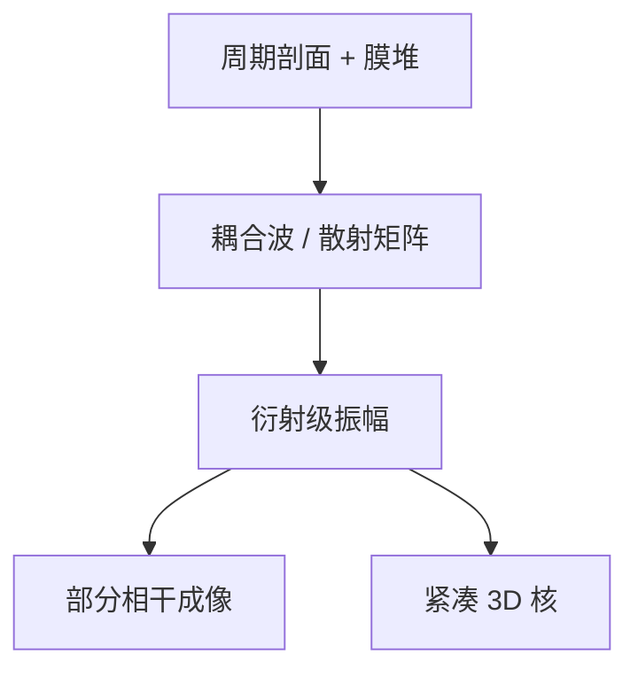

# RCWA

周期掩模是一层层傅里叶模态：RCWA 把麦克斯韦收成耦合波，线栅与接触阵列比体网格便宜。

<footer>—— 对照 Moharam 与 Gaylord 的 rigorous coupled-wave analysis（RCWA / FMM）</footer>

[上一课](/litho/fdtd-mask)用 FDTD 吃非周期 3D。缺口是 SRAM、密线、孔阵列在光学上近似周期，用体网格浪费。本课钉 RCWA。把大场拆成可算的块，留给[下一课](/litho/domain-decomposition-mask）。

## 问题

RCWA（也称傅里叶模态法）沿周期方向把场展成平面波/布洛赫模态，在分层膜堆里匹配边界，求衍射级振幅。天然适合 1D/2D 周期吸收体 + 多层。截断级次决定精度与矩阵大小：级次不够，高 NA 大角度的倏逝耦合会错；级次太多，全芯片仍不可能，但「一个节距的严格光谱」足够校准 3D 核、解释禁戒节距附近的 mask 3D。

缺口是**周期严格解**，不是再步进一次 Yee。把 RCWA 用于孤立缺陷，要靠超胞——缺陷密度被周期赝像污染，那是 FDTD 的活。

### 与 OCD 计量同族

晶圆 [OCD](/litho/ocd-mueller) 也常用 RCWA 反演周期结构。掩模侧与晶圆侧是同一数学，光学常数与剖面不同。不要把计量课的穆勒矩阵在这里重推。

收敛要用李级数或适当的傅里叶因式分解（Li 规则一类），否则金属栅的吉布斯现象会假扮成 3D 效应。

## 方法

输入：节距、占空比、侧壁角、膜堆 $n,k$、入射角与偏振。输出：各衍射级复振幅，进入 Hopkins/Abbe 成像。SMO 评估候选节距时，用 RCWA 扫一维/二维周期比 FDTD 快一个数量级以上（视维度）。EUV 斜入射与方位角必须扫，不能只正入射。

校准：把 RCWA 光谱当老师，拟合紧凑 mask 3D 边界条件或有效薄屏。

## 机制

分层结构里每层的麦克斯韦在傅里叶空间是耦合常微分方程（或特征值问题）。界面匹配给出散射矩阵。吸收体侧壁倾斜则用多层阶梯逼近——阶梯太粗，又回到剖面误差。偏振：TM 在金属/高对比栅上更难收敛，高 NA 浸没与 EUV 都不能当标量。

## 边界

RCWA 不处理真正孤立的修复补丁（除非超胞且接受赝周期）。不算胶。傅里叶截断是精度旋钮，不是物理 NA。

后课默认：周期掩模电磁有模态法；下一课处理既非纯周期也非全 FDTD 的大场——域分解。

## 小结

- RCWA 用傅里叶模态解周期掩模 EMF，适合线栅/阵列校准。
- 孤立缺陷用 FDTD 或小心超胞；金属 TM 要检查傅里叶收敛。
- 输出是衍射级，供成像与紧凑 3D 当老师。
- 出处：Moharam & Gaylord RCWA；傅里叶模态法在光刻掩模中的应用。
