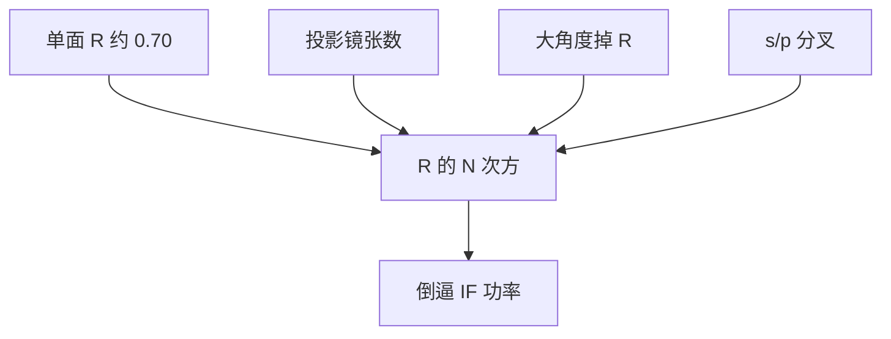

# 反射率与镜数预算

单面约 70% 看起来体面；六面一乘只剩约一成。镜数是光源功率的放大器，也是 High-NA 光学布局的第一约束。

<footer>—— 据 ASML / Zeiss 对 EUV 多层反射率与投影镜张数；Bakshi 系统透过率</footer>

[上一课](/litho/msfr)把中频粗糙从面形里拆出。缺口是能量账：无论 PSD 多干净，每一面仍只有约 70% 的峰值 $R$，其余被吸收或散射。张数 $N$ 把透过率写成 $R^N$，直接倒逼 [IF 功率路线](/litho/euv-power-roadmap)。光如何被切成扫描用的弧形狭缝，留给[下一课](/litho/ring-field)。

## 问题

[多层膜](/litho/euv-multilayer-mirror)课已经给出单面布拉格反射。进阶课序补的是预算乘法。NXE 一类 0.33 NA 投影公开为六面反射镜量级；再加上收集、照明、掩模（双程还要过 pellicle），硅片上只剩很小一份带内功率。$R$ 从 0.70 掉到 0.65，六镜透过率从约 0.12 掉到约 0.075，产能或激光墙插立刻见血。

缺口是把 $N$ 当成设计变量，而不是抱怨「EUV 镜子不够亮」。加镜可以校正像差、抬 NA、做变形光学；每加一面就乘一次 $R$，并加一份吸收热与一份 MSFR。High-NA 的光学布局必须在「像差自由度」和「光子」之间取点，半场、变形倍率都是这张账的解，不是单独的市场名词。

$$
T_{\mathrm{POB}} \sim R^{N},\qquad P_{\mathrm{wafer}} \sim P_{\mathrm{IF}}\cdot T_{\mathrm{ill}}\cdot R_{\mathrm{mask}}\cdot T_{\mathrm{pell}}^2\cdot T_{\mathrm{POB}}.
$$

70% 是近正入射峰值量级，随角度和偏振掉。大 NA 下 s/p 分叉，有效 $R$ 低于小样品的法向测量。不要用实验室单镜纪录当六镜系统透过率。

## 方法

预算表逐面列：设计角、周期、带宽重叠、偏振、污染余量。收集镜 $R_{\mathrm{col}}(t)$ 单独成列，因为寿命斜率最大。照明镜组张数随光瞳整形变，FlexPupil 一类可编程照明用的反射面同样进乘法。掩模多层是「镜子 + 图形」，吸收体区域不反射，开孔率进平均功率。

工程判据：在目标 NA 与场尺寸下，选最小 $N$ 使波前可收。$N$ 减不下来，就减场（环形场、半场）或上变形，把掩模侧角度压回多层能维持高 $R$ 的窗。[变形光学](/litho/anamorphic-projection) 是镜数–角度–场的联合解。

### 带宽重叠随角走，有效 $R$ 再打折

每一面的布拉格通带必须与锡 UTA 和上游镜子的角谱重叠。大 NA 下入射角范围变宽，重叠面积缩小，峰值 $R$ 量到了也进不了系统。预算表要写有效带内 $R(\theta)$，不能写样品法向峰值。这是环形场限制瞬时视场的能量理由之一。

## 机制

每面吸收的 $(1-R)$ 变成热。$N$ 越大，总吸收越大，面形热漂越难管。同时每面贡献一份 TIS/MSFR，对比底座随 $N$ 涨。所以「多加两面把像差做漂亮」会在光子和 flare 上同时罚款。锡 UTA 与多层 2% 通带必须在每一面的角谱下仍重叠；角一宽，有效 $R$ 掉，等效于 $N$ 又加了一面。

吸收热在真空里只能靠传导和辐射。镜数预算也是热预算。功率路线往 1 kW 走时，照明与投影的吸收瓦数一起涨。

## 边界

本课不讲环形场为什么是弧，下一课才讲场几何。不重写 Mo/Si 周期公式。出处：ASML/Zeiss 反射率与镜数；Bakshi 能量流；多层膜课的 0.70⁶ 数量级账。

## 小结

- 系统透过率按 $R^N$ 掉；镜数是 IF 功率和 High-NA 布局的硬约束。
- 有效 $R$ 随入射角和偏振变，峰值样品数不能代入整机。
- 下一课：在这张能量账下，扫描场为什么做成环形。
- 出处：ASML、Zeiss、Bakshi；[多层膜](/litho/euv-multilayer-mirror)。
