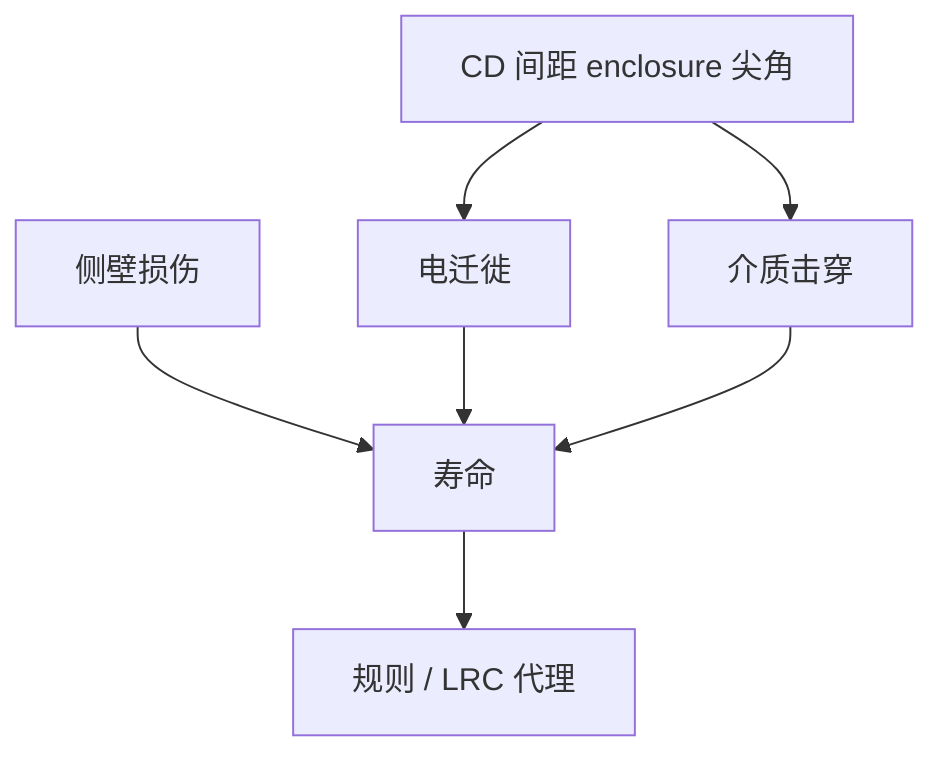

# 可靠性与图形化缺陷

探针绿灯的管芯仍可能在电迁徙、击穿或经时击穿上死：尖角、via 覆盖不足、侧壁损伤把图形化误差写成寿命。

<footer>—— 对照 BEOL 可靠性（EM、TDDB）与图形化几何的公开讨论</footer>

[上一课](/litho/parametric-yield-cd)处理出厂参数。缺口是时间：尖的金属线端、via 落在金属边、刻蚀损伤的栅侧壁，出货时电学可过，寿命不够。本课钉图形化缺陷的可靠性面。TEM/FIB 如何取证，留给[下一课](/litho/failure-analysis-tem-fib）。

## 问题

电迁徙（EM）吃电流密度，线窄、via 偏、尖角会局部加热和空洞。TDDB 吃介质厚度与电场，金属间距与线边缘粗糙等效减薄。栅氧化或 HKMG 侧壁损伤来自过刻与离子。这些很少被光学缺陷检测当 killer，因为「还连着」。

缺口是**可靠性规格要回写设计规则与 OPC 目标**，不是再讲失效物理全书。tip-to-tip 与 via enclosure 有一截就是寿命，不只是可印。LRC 覆盖检查是可靠性代理。

### 筛选盖不住几何

HTOL 筛选能抓早期夭折，吃不掉整批系统性的偏 via。系统图形问题应用 OPC/规则消灭，不能靠老化筛选当良率工具。

EPE 预算若只对准功能连通，可靠性余量可能已被吃光。签核要声明寿命目标是否在 PV-band 内。

## 方法

把 EM/TDDB 设计规则映射到 CD、间距、enclosure、侧壁角。热区：线端、via 链、最小间距密布。计量：AEI 剖面、覆盖、LER 低频。与钝化课：弓形侧壁改电场。与助推器：BPR 深槽的填充虚空是可靠性，不只是刻蚀。

PV-band 签核若不含寿命代理，功能绿灯会在 HTOL 上翻车。规则修订应同时请可靠性签字，而不是只请光刻。BEOL 可靠性公开讨论把几何当场强与电流密度的前置，本课把前置写进 LRC。

## 机制

功能良率看开/短路阈值；可靠性看场强与电流密度的连续函数。PV-band 外沿的几何可能功能过、寿命短。随机缺孔若「勉强打开」，电阻高且 EM 弱。故随机窗与可靠性窗可能比均值 CD 窗更严——要交三张窗。

功能连通的 PV-band 外沿仍可能寿命不够。enclosure 与 tip 是可靠性代理，要写进 LRC。

## 边界

不写 JEDEC 试验矩阵全文。不把某节点寿命年数当公开规格。封装机械应力只点名与芯片台阶的关系。

后课默认：寿命把几何代理写进规则与 PV-band。下一课用 TEM/FIB 验证代理是否对应真实剖面。

## 小结

- 图形化通过功能测试后仍可在 EM/TDDB/损伤上死。
- enclosure、tip、侧壁是可靠性规则，不只是可印。
- 筛选不能替代系统几何修复。
- 出处：BEOL EM/TDDB 与几何关系公开讨论；EPE 作为寿命代理。
