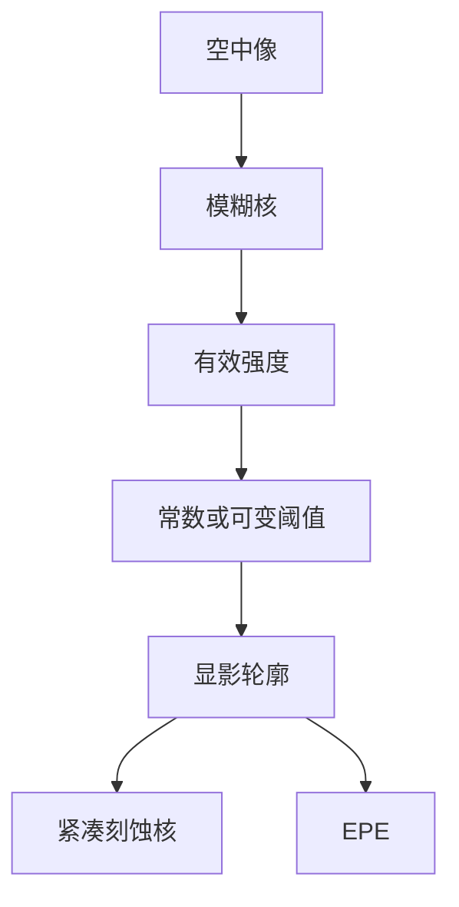

# 胶紧凑模型

全芯片 OPC 不能每步解反应–扩散；紧凑胶模型把空中像收成可移动的边，CM1 一类就是这条工程近似。

<footer>—— 对照 Mack 对紧凑抗蚀剂模型与阈值 / 显影的论述；EDA 公开的 CM1 族通称</footer>

[上一课](/litho/etch-in-opc)把刻蚀核接到显影边上。缺口是这条边从哪来：空中像是连续强度，OPC 要的是多边形轮廓。本课钉胶紧凑模型（CM1 一类）。严格电磁对掩模开口，不在本课；那是后课 [紧凑对严格](/litho/compact-vs-rigorous) 的分工。

## 问题

Mack 的反应–扩散与溶解速率能解释实验室 FEM，但每个碎片迭代解三维胶动力学，全芯片 TAPOUT 过不去。必须把胶收成：空中像 →（扩散/模糊核）→ 有效强度 → 阈值或可变阈值 → 轮廓。CM1 一类（compact model，可变阈值 + 加载项）是 EDA 公开叙述里这条链的代表，不是某一家的秘密公式名考试。

[PW-OPC](/litho/pw-opc) 和刻蚀核都假定 ADI 边可微、可重复。胶模型若只在标定线上准，二维拐角和助条附近会系统性偏，优化会把误差修进掩模。问题是模型阶次与校准集，不是再推导一次酸扩散方程。

### 常数阈值是一阶，往往不够

常数阈值假定某等强度线即轮廓。部分相干、薄膜栈和化学放大让「印出 CD」对局部环境依赖，同一强度在密线与孤立线上不是同一条边。可变阈值把环境（斜率、加载、密度）写进阈值，CM1 族走这条路。再往上是更多经验项，过拟合风险一起涨。

紧凑胶模型校准在特定胶、特定 PEB、特定显影上。换胶或换后烘等于新模型。OPC 版本号必须与胶批次资格认证绑定。

## 方法

光学核给出空中像（TCC 或等效）；胶核做模糊（代表酸扩散、二次电子、测量模糊）再映射到边。校准用 FEM、CD-SEM、有时散射测量。项数以能收残差、又不在 SRAM 外推炸为准。EUV 还要把光子统计的**均值**效应与模糊写进核；泊松尾仍不是紧凑均值模型的对象，见 [随机效应](/litho/euv-stochastics)。

与刻蚀核的接口：胶模型输出 ADI，刻蚀模型输出 AEI。两个核分开校准、联合签核。把刻蚀负荷塞进胶阈值，短期能拟合，换腔体时胶模型一起坏，不可维护。

### Mack 溶解与 CM 的关系

Mack 溶解速率给出物理图像：抑制剂浓度 → 速率 → 显影前沿。紧凑模型不积这部微分方程，只用其启示选特征（斜率、剂量对数等）。PROLITH 一类工具跑较完整的胶；OPC 引擎跑 CM。两者要对得上标定结构，差在全芯片速度。

## 机制

碎片移动改掩模频谱 → 空中像局部变化 → 模糊后有效强度 → 阈值（可能随环境）→ EPE。可变阈值让「看起来该动的边」在孤立/密环境下用不同灵敏度，否则 PW-OPC 会在一类图形上过修、另一类欠修。模糊核把 OPC 能用的最高空间频率钉死：比核更锐的衬线在胶里看不见，只会折磨 MRC。

过拟合：校准集全是一维线，模型在二维热区撒谎。必须把拐角、线端、助条、孔放进训练集，并用保留图形做签核。这和机器学习 OPC 的域外问题是同一类，只是 CM1 的参数更少、撒谎方式更平滑。

CM1 是一类紧凑胶模型的通称，不要写成唯一标准实现。VT5 等其它公开族名同理：课标是「可变阈值紧凑胶」，不是商标考据。

## 边界

本课不把 CAR 化学写进 OPC 循环，也不用紧凑模型预测随机断线。严格 FDTD 掩模模型若与胶核级联，计算预算要另算，见紧凑对严格课。后课默认：说到 ADI，先问胶核是哪一版、校准集是否含二维。

不要发明 arXiv 或内部系数表。引用 Mack 教材与 EDA 对 compact resist model / CM1 的公开说明。

阈值模型没有「胶厚」。High-NA 胶厚预算是工艺窗，不是 CM1 里的一个 z 参数；薄膜栈光学要进成像核，不要塞进阈值多项式凑出来。

## 小结

- 全芯片用紧凑胶模型把空中像变成 ADI 边；CM1 一类是可变阈值代表。
- 常数阈值收不住密孤立差；环境项必须校准到二维。
- 胶核与刻蚀核分开，接口在 ADI。
- 模糊核限制有用的掩模高频；更锐的衬线只换 MRC 违例。
- 出处：Mack, *Fundamental Principles of Optical Lithography*；EDA 公开的 compact / CM1 族叙述。
