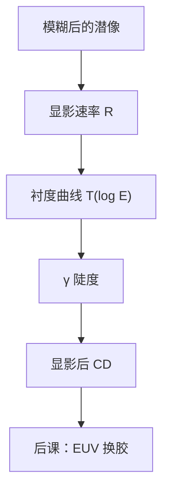

# 显影与衬度曲线

衬度曲线问的是：剂量的对数变一点，留下的胶厚变多少；$\gamma$ 是这条曲线的陡度，不是空中像的 $C$。

<footer>—— 据 Mack 对显影速率、衬度 $\gamma$ 与剩余厚度曲线的定义整理</footer>

[上一课](/litho/acid-diffusion-lwr)把潜像收成被酸扩散模糊过的脱保护分布。缺口是：还没有把这张潜像切成浮雕——显影液按极性（或交联密度）溶胶，留下随剂量变化的剩余厚度。本课钉衬度曲线与 $\gamma$。EUV 上是否仍用 CAR、要不要换金属氧化物，留给[下一课](/litho/euv-resist)。

## 问题

光学对比度 $C$ 在空中像课已经定义，当时明确禁止借用胶的 $\gamma$。现在化学链走完，缺口正是这个 $\gamma$：在均匀曝光的大垫上，改变剂量 $E$，测显影后剩余厚度 $T(E)$（或归一化 $T/T_0$）。正胶从某一剂量起开始掉厚，曲线中段的斜率就是产线说的衬度。

没有这条曲线，阈值模型只是「$I>I_\mathrm{th}$ 则胶消失」的几何口令，无法谈曝光宽容度，也无法解释为什么同样的空中像换胶 CD 会变。上一课的 $\ell$ 决定潜像边有多糊；本课的 $\gamma$ 决定糊边被切得有多狠。

### γ 不是越大越好到无限

极陡的 $\gamma$ 把剂量噪声和 LWR 一起切锐：平均边可以很直看，局部崩边更像台阶。极钝的 $\gamma$ 则吃掉本来就不多的光学调制。窗口课要用的是与剂量轴匹配的斜率，不是把 $\gamma$ 当分辨率竞赛。

衬度曲线是大面积均匀曝光的一维实验，不含衍射、不含密线旁瓣。把它直接当成密栅的工艺窗口会乐观。密栅仍要回到空中像剖线加显影速率模型。

## 方法

实验：开口板或大垫曝光矩阵，显影固定时间，测剩余厚度对 $\log E$。定义随教材略有出入，核心是中段

$$
\gamma \sim \left|\frac{d(T/T_0)}{d\ln E}\right|
$$

一类的无量纲陡度。正胶还有 $E_0$（开始掉厚）与 $E_1$ 或 $E_{100}$（清底）两个剂量锚点，两者的比进入曝光宽容度。

机理模型用显影速率 $R$ 对保护基分数（或酸浓度）的函数，沿胶厚积分到给定显影时间，得到剖面。Mack 显影模型是产线紧凑形式之一。OPC 里的「阈值」是这条曲线在目标厚度处的工作点，不是光学 $I_\mathrm{max}$ 的百分之五十。

### 清底与残胶

曲线还读出：未曝光区是否有暗侵蚀，曝光区能否在不伤底层的时间内清底。残胶和底部圆角会进刻蚀偏置，不属于光学 $k_1$。本课只要求把「显影像」从「潜像」分开计量。

## 机制

极性够了，碱性显影液（正胶）把链段溶进溶液，溶解前沿从表面往下走。前沿在边沿停在「速率刚好积不够时间」的那条等剂量面上。$\gamma$ 高，等剂量面挤在很窄的剂量间隔里，CD 对空中像斜率敏感、对剂量绝对量也敏感——这就是曝光宽容度与 NILS 相乘的地方。

酸扩散已经把等剂量面推离光学阈值；显影再按 $R$ 的非线性搬一次。两步都叫「切锐」，物理不同：一个是横向模糊核，一个是速率对比。后课谈 EUV 胶时，金属氧化物的「显影」可能是配体溶解或负胶留膜，曲线形状要重测，但「$T(\log E)$ 仍是接口」这一句保留。

## 边界

本课不讲喷雾显影的流体力学，不讲轨道碗的缺陷。也不把某胶数据表上的 $\gamma=12$ 写进所有层：胶厚、PEB、显影液浓度都会改曲线。空中像对比 $C$ 与 $\gamma$ 禁止再混名。下一课进入 EUV 记录介质分叉，不再重推导显影速率。

## 小结

- 衬度曲线是剩余厚度对对数剂量；$\gamma$ 是其陡度。
- $\gamma$ 切的是潜像，不是空中像 $C$ 的别名。
- 阈值模型是曲线上的工作点；真模型用显影速率沿厚度积分。
- 过陡的 $\gamma$ 放大 LWR 与剂量噪声。
- 下一课用这套语言比较 CAR 与金属氧化物胶。
- 出处：Mack, *Fundamental Principles of Optical Lithography*；Levinson, *Principles of Lithography*。
