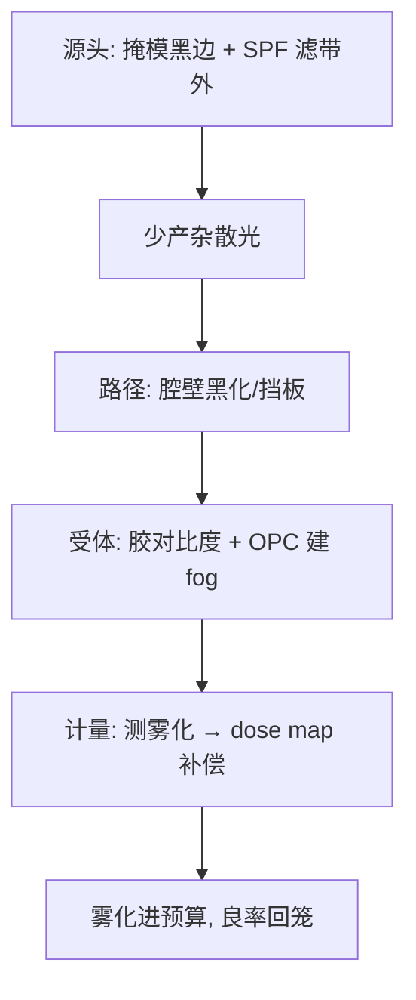
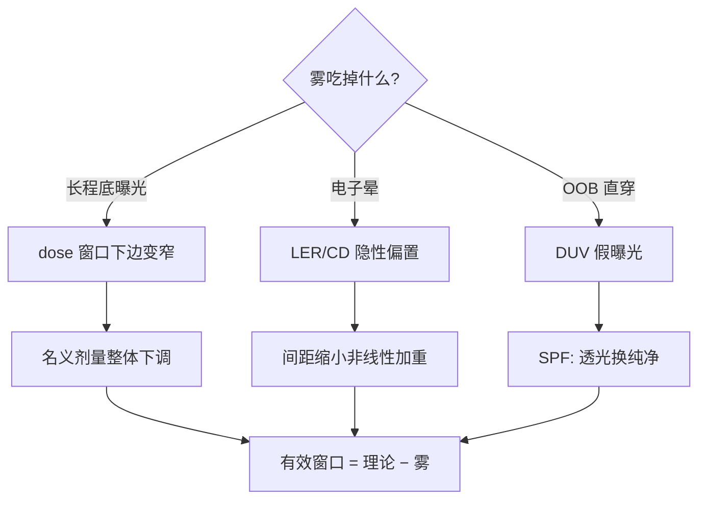

# 光刻胶雾化

不该曝光的地方莫名曝光了：EUV 的杂散光子在真空腔里弹来弹去——雾化（fogging）是整套系统的影子税。

<footer>—— 据 EUV fogging 与杂散光文献（ASML/Zeiss）；IEC/SEMI EUV 掩模规范讨论</footer>

[Offner 中继](/litho/offner-relay)讲成像光学的主路，本课讲主路之外的光：**光刻胶雾化**——设计图形之外的区域被杂散 EUV 曝光，隐约显影、悄悄改形。它是 EUV 独有的系统级副产物：多层膜反射率不到 70%，每一次反射都漏光，漏掉的光在腔内多次弹射后落在「不该在的地方」。本课不做杂散光的辐射输运计算。

## 问题

三种来源汇成雾。**掩模外反射**：EUV 掩模的多层膜在图形区外是全反射面，反射的杂散光进入投影光路。**真空腔弹射**：从掩模/晶圆散射的光在反射镜组、腔壁间多次反射，一部分落在晶圆上，无方向性、长程。**光电子与二次电子**：EUV 光子在胶中打出光电子，电子迁移范围数十纳米——邻近图形的「电子串扰」。缺口：量化雾化的空间结构与对策。

术语翻译：fogging（雾化）= 长程杂散光造成的均匀底曝光； flare（炫光）= 光学系统的短程杂散；out-of-band（OOB，带外光）= 光源里混入的 DUV 成分，反射镜对它不拦；electron blur = 光电子/二次电子的迁移模糊。

数字实例：掩模反射率 ~65%、每个反射镜 ~64.4%，7 镜投影 + 掩模 = 8 次反射，到晶圆的能量只有入射的 ~2%；其余 98% 变成腔内杂散能量，其中一部分返回晶圆成为 fog——多层膜反射率每提升 1%，雾化预算就松动一大截。

## 方法

对策按「来源→路径→受体」分层。**源头**：掩模黑边（black border / LTEM 吸收材料）与 mask backside coating 压掉图形外反射；带外滤镜（spectral purity filter, SPF）拦 OOB。**路径**：腔壁黑化涂层、挡板与快门设计减少弹射次数；投影光学的 flare 指标逐代收紧。**受体**：胶侧抗雾化设计（更快的显影对比度让底曝光不显影）、OPC 里把 fog 当背景剂量建模进校准、曝光后烘烤参数调优。计量：用「开放图形 + 大块暗区」的测试掩模测雾化分布，进 dose map 补偿。

直觉类比：像深夜房间里开着一台强光手电——就算灯头朝墙（掩模黑边），白墙（多层膜）照样把光弹得满屋都是（腔内弹射）；对策是墙刷成黑色（黑化涂层）、手电加滤光片（SPF）、眼睛适应暗处（胶对比度），最后还要给房间「暗角手动补光」（dose map 补偿）。

## 机制

长程机制：腔内光子经镜面散射与腔壁反射形成「均匀底 + 缓变梯度」的剂量本底，它直接吃掉 dose-to-size 窗口的下边——雾化强的地方名义剂量要整体下调，窗口变窄。短程机制（electron blur）：EUV 光电子在胶中迁移 10–50nm，邻近图形边缘获得亚分辨率剂量的「晕」——LER 与 CD 偏置的隐性来源，且随特征间距缩小非线性加重。带外机制：光源的 DUV 成分不被多层膜拦截（反射镜对 13.5nm 之外不挑），直接穿过系统曝光胶的 DUV 响应——SPF 滤片以透光损失换纯净度，又是预算里的一笔汇率。三者叠加的后果：EUV 的「有效剂量窗口」比理论窄，fogging 校准成为工艺整合的固定动作。

常见误区：把 fogging 与 flare 混用——flare 是光学系统近场杂散、随光圈结构变化，fogging 是腔级长程本底+电子晕，对策不同；另一误区是「黑边贴上就完事」——黑边材料的反射率与边缘散射仍非零，黑边宽度本身要进 OPC 模型。

## 边界

雾化对图形密度的敏感性使它与[虚拟填充与密度规则](/litho/dummy-fill-density)再度相遇：填充图形改变局部散射环境，fog 模型要按密度分层校准。High-NA 的变化：成像光路减少一面镜（7→6），效率提升让杂散能量比例下降——但数值孔径增大让电子晕相对特征尺寸的占比上升，短程机制反而吃紧。检测端：雾化在 EUV 掩模缺陷检测（actinic）里是底噪的重要成分，检测工具自己的 fog 管理决定最小可检缺陷。与[EUV 剂量预算](/litho/euv-dose-budget)的关系收束：雾是「看不见的剂量支出」，剂量预算表里必须给它留一行。

直觉类比：雾化像「全屋的背景噪音」——长程雾是空调的嗡嗡底噪（均匀、吃掉听力余量），电子晕是邻座耳语（近距离、越来越烦），带外光是隔壁装修的电钻（完全不同的频段、直接穿透）；房子的「安静标准」（剂量窗口）要同时给三者扣分。

## 小结

- 雾化三源：掩模/腔弹射的长程本底、光电子晕、带外直穿。
- 代价统一表现为剂量窗口变窄；对策分源头/路径/受体三层。
- High-NA 长程改善、短程吃紧；检测工具的底噪也由它定。
- 出处：ASML/Zeiss 杂散光文献；imec EUV stochastics 研究；SEMI EUV 掩模规范讨论稿。
