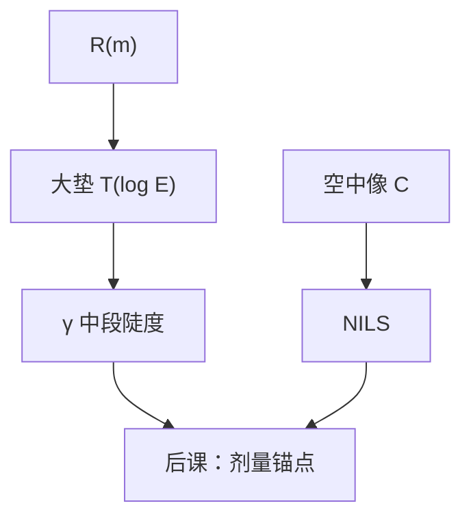

# 胶的 γ 与对比度

光学对比度问空中像亮暗差了多少；胶的 $\gamma$ 问对数剂量变一点，剩余厚度掉多陡。两个词不能互换。

<footer>—— 据 Mack 对显影衬度 $\gamma$ 与光学对比 $C$ 的区分整理</footer>

[上一课](/litho/resist-profile-simulation)在三维里切出浮雕。缺口是把产线常说的「胶对比度」收回一个数：均匀曝光垫上剩余厚度对 $\log E$ 的陡度 $\gamma$。主干[衬度曲线](/litho/resist-contrast-curve)已经定义过它。本课补的差是：与 Dill / RD / $R(m)$ 链的关系，以及为何不能跟空中像 $C$、NILS 混名。两个剂量锚点 $E_0$ 与 $E_\mathrm{size}$，留给[下一课](/litho/e0-esize)。

## 问题

大垫实验没有衍射图形，剩余厚度 $T(E)$ 只反映材料与显影时间。中段

$$
\gamma \sim \left|\frac{d(T/T_0)}{d\ln E}\right|
$$

是胶的规格语言。光学 $C=(I_\mathrm{max}-I_\mathrm{min})/(I_\mathrm{max}+I_\mathrm{min})$ 在[空中像对比度](/litho/aerial-image-contrast)里，对象是 $I(x)$。把「这层对比不够」说成胶 $\gamma$ 低，可能其实是照明让 $C$ 掉了。

轮廓仿真在横向有结构时给出侧壁；$\gamma$ 是同一套 $R(m)$ 在无结构极限的读出。$R(m)$ 越开关，$\gamma$ 越大。缺口是让后课引用「胶对比度」时默认指 $\gamma$，不是 $C$。

### γ 过大同样有害

极陡的 $\gamma$ 把剂量噪声和 LWR 切成台阶。主干已经警告。接到本课链上：Notch 很深、$n$ 很大、中和面很薄，都会抬 $\gamma$，同时抬边缘对计数噪声的增益。随机单元会把这句话变成缺陷率；本课先记下「$\gamma$ 不是越大越好」。

报 $\gamma$ 必须声明胶厚、是否去驻波、PEB 与显影时间。带 swing 的曲线斜率不是材料本征 $\gamma$。

## 方法

实验：开口板剂量矩阵，固定显影，测 $T(\log E)$。从曲线同时读出后课要用的 $E_0$（开始掉厚或清场，定义要写清）以及本课的中段斜率。模拟：关掉横向变化，只跑 $z$ 向 Dill + RD + $R$，应能复现这条曲线——这是对 ABC 与 $R(m)$ 联合标定的检查。复现不了大垫，就不要信图形上的轮廓仿真。

与 NILS：曝光宽容度大致随光学 NILS 与胶 $\gamma$ 同向变，但公式系数依赖如何切 CD。本课不把 EL 写完，只禁止用 $\gamma$ 替代 NILS。

## 机制

$m$ 随剂量经 $C$ 与 PEB 下降；$R(m)$ 的非线性把缓变的 $m$ 变成陡变的剩余厚度。Dill $A$ 漂白会让厚胶的 $T(E)$ 形状扭曲，因为沿 $z$ 的有效剂量不均匀——看起来像 $\gamma$ 在变，其实是吸收在变。CAR 的 $\gamma$ 对 PEB 极敏感：催化不足时曲线变钝，过催化时暗区泄漏把肩抬起来。

光学对比 $C$ 再高，若 $\gamma$ 钝，显影切不狠；$\gamma$ 再陡，若 $C$ 为零级偏置抬死，也没有剂量间隔可切。两者相乘，不是可替换。

负胶曲线上下翻转，$\gamma$ 仍取绝对值陡度。不要把「负」理解成另一种光学 $C$。

## 边界

不重推 $\gamma$ 的每一种教材定义变体；产线对表时写明用的是哪一种归一化。不把数据表 $\gamma=12$ 抄到所有层。下一课把曲线上的两个剂量点命名为 $E_0$ 与 $E_\mathrm{size}$，斜率 $\gamma$ 已经假定可测。

## 小结

- 胶 $\gamma$ 是大垫 $T(\log E)$ 的陡度；光学 $C$ / NILS 是空中像的量。
- $\gamma$ 来自 $R(m)$ 与 RD，可用无图形仿真复现来做标定检查。
- 过陡放大噪声；报 $\gamma$ 必须声明厚、PEB、驻波。
- 下一课用同一条曲线上的剂量锚点。
- 出处：Mack 对 $\gamma$ 与 $C$ 的区分；主干[衬度曲线](/litho/resist-contrast-curve)。
