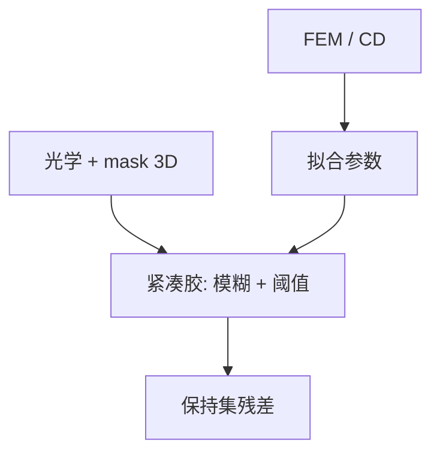

# 紧凑胶模型校准

CM 族把空中像收成边；校准是把 FEM 与 gauge 上的残差压进可外推的几项，而不是把实验室 Mack 方程塞进全芯片。

<footer>—— 对照 Mack 紧凑抗蚀剂模型与 EDA CM1 族校准通称</footer>

[上一课](/litho/domain-decomposition-mask)让严格近场可以按窗存在。缺口是 OPC 迭代仍要毫秒级前向：[胶紧凑模型](/litho/resist-compact-model) 必须在本层胶、本 PEB、本显影上标定。本课钉校准。用哪些图形当样本，留给[下一课](/litho/test-patterns-gauges）。

## 问题

紧凑模型有模糊核、阈值（常变阈值）、加载项。参数若不在本工艺的测量上拟合，SRAM 拐角会系统性偏，优化把误差修进掩模。校准的问题是：选代价函数（CD、EPE、通过焦点）、选正则（防项数爆炸）、选保持集（防只拟合标定线）。严格 EMF 教师改善的是光学输入；胶参数仍要晶圆或显影实验。

缺口是**拟合协议**，不是再推导酸扩散。把「模型版本号」当物理常数，换胶批次会在不知情时把全库 OPC 作废。

### 光学、胶、刻蚀必须分校准

把刻蚀负载塞进胶阈值，短期残差好看，换腔体时胶模型一起坏。[刻蚀进 OPC](/litho/etch-in-opc) 已警告。本课只标定 ADI。AEI 留给后课刻蚀校准。

EUV 紧凑模型标定的是均值轮廓。泊松缺孔不在最小二乘 CD 里，见随机课。

## 方法

数据：FEM 晶圆、CD-SEM、有时 OCD；覆盖通过节距、孤立/密集、二维。优化：非线性最小二乘或正则化反演。验收：保持集残差、热点 clips、跨剂量焦点。版本绑定：胶批次、扫描机照明文件、掩模 3D 核版本。

与严格电磁：先锁光学（含 mask 3D），再锁胶，避免两项互吞。

## 机制

变阈值把「同一强度不同环境印出不同 CD」收成几个图像特征（斜率、密度）。特征若与真实失效模式不正交，会出现补偿：光学错用胶来背。残差空间相关（下一课分析）是诊断：通过节距的系统正弦往往是光学核，而不是少一个胶项。

## 边界

校准不创造光子，不保证未抽样图形。过拟合的 20 项模型在 TAPOUT 后热区爆炸，比 5 项略差但稳定的模型更危险。不写某 EDA 的秘密项公式。

后课默认：ADI 模型有版本与保持集；下一课把 gauge 设计本身当成会污染拟合的实验设计问题。

## 小结

- 紧凑胶校准绑定胶、PEB、显影与光学核版本。
- 光学/胶/刻蚀分拟合；EUV 均值模型不含随机尾。
- 保持集与热点 clips 比标定线 RMSE 更重要。
- 出处：Mack 紧凑抗蚀剂论述；CM1 族产线校准通称。
